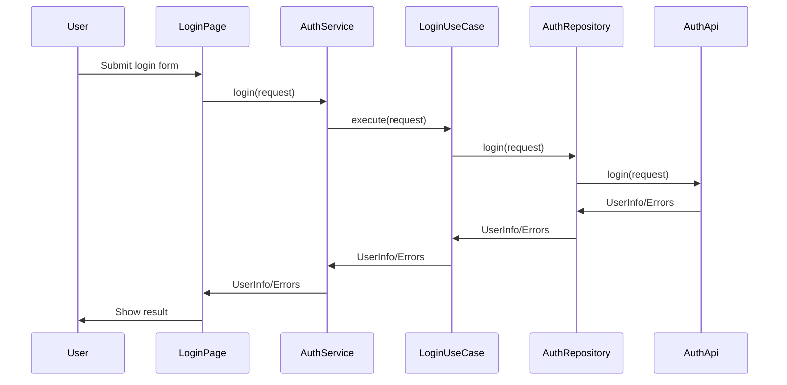
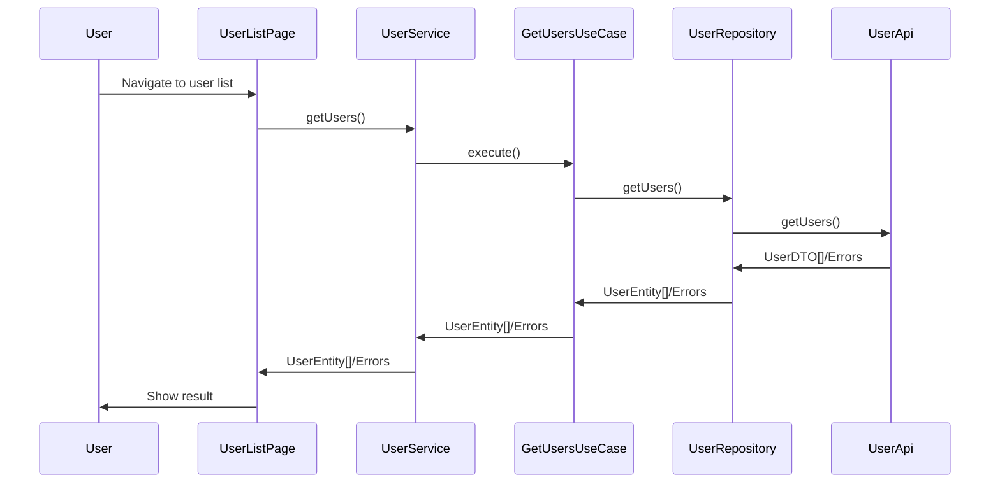

# Project Workflow Documentation

**Generated:** August 8, 2025

---

## Workflow 1: User Login

### 1. Workflow Overview
- **Name:** User Login
- **Purpose:** Authenticate a user and establish a session
- **Trigger:** User submits login form in the frontend
- **Files/Classes Involved:**
  - `src/app/presentation/auth/pages/login-page.ts`
  - `src/app/core/services/auth.service.ts`
  - `src/app/application/use-cases/auth/login.use-case.ts`
  - `src/app/domain/repositories/auth.repository.ts`
  - `src/app/infrastructure/repositories/auth.repository.impl.ts`
  - `src/app/infrastructure/api/auth.api.ts`
  - `src/app/domain/models/auth/login-request.dto.ts`
  - `src/app/domain/models/auth/user-info.dto.ts`

### 2. Entry Point Implementation
- **Component:** `login-page.ts` handles form submission
- **Event Handler:** Calls `authService.login(request)`
- **API Client:** `authService` delegates to `LoginUseCase`
- **State Management:** Signals/computed properties track loading/auth state

### 3. Service Layer Implementation
- **Service:** `AuthService` injects `LoginUseCase`
- **Use Case:** `LoginUseCase.execute(request: LoginRequest): Observable<UserInfo>`
- **DI:** Angular's `@Injectable` and DI tokens

### 4. Data Mapping Patterns
- **DTO:** `LoginRequest` constructed from form data
- **Mapping:** API response mapped to `UserInfo` domain model
- **Validation:** Form validation in component, API validation in backend

### 5. Data Access Implementation
- **Repository Interface:** `AuthRepository.login(request: LoginRequest): Observable<UserInfo>`
- **Implementation:** `AuthRepositoryImpl` calls `AuthApi.login()`
- **API Client:** `AuthApi` sends HTTP request to backend

### 6. Response Construction
- **Response DTO:** `UserInfo` returned to frontend
- **Mapping:** API response mapped to domain model
- **Status Codes:** Handled by backend, error mapped to UI state

### 7. Error Handling Patterns
- **Exception Types:** API errors, validation errors
- **Try/Catch:** RxJS `catchError` in service/component
- **Global Handler:** Angular error boundary, notification service
- **Logging:** Notification service logs/display errors

### 8. Asynchronous Processing Patterns
- **Async:** RxJS observables for async API calls
- **Loading State:** Signals track loading

### 9. Sequence Diagram

### 10. Naming Conventions
- **Component:** `login-page.ts`
- **Service:** `auth.service.ts`
- **Use Case:** `login.use-case.ts`
- **Repository:** `auth.repository.ts`, `auth.repository.impl.ts`
- **API Client:** `auth.api.ts`
- **DTOs:** `login-request.dto.ts`, `user-info.dto.ts`
- **Method Names:** `login`, `execute`, `catchError`

### 11. Implementation Templates
- **New API Endpoint:** Add method to `auth.api.ts`, update repository and use case
- **New Service Method:** Add to `auth.service.ts`, inject use case
- **New Repository Method:** Define in interface, implement in `.impl.ts`
- **New Domain Model:** Add to `domain/models/auth/`
- **Error Handling:** Use RxJS `catchError`, notification service

---

## Workflow 2: Fetch User List

### 1. Workflow Overview
- **Name:** Fetch User List
- **Purpose:** Retrieve and display a list of users
- **Trigger:** User navigates to user list page
- **Files/Classes Involved:**
  - `src/app/presentation/users-module/pages/user-list-page.ts`
  - `src/app/core/services/user.service.ts`
  - `src/app/application/use-cases/user/get-users.use-case.ts`
  - `src/app/domain/repositories/user.repository.ts`
  - `src/app/infrastructure/repositories/user.repository.impl.ts`
  - `src/app/infrastructure/api/user.api.ts`
  - `src/app/domain/models/user/user.dto.ts`
  - `src/app/domain/entities/user.entity.ts`

### 2. Entry Point Implementation
- **Component:** `user-list-page.ts` triggers fetch on init
- **Event Handler:** Calls `userService.getUsers()`
- **API Client:** `userService` delegates to `GetUsersUseCase`
- **State Management:** Signals/computed properties track loading/data state

### 3. Service Layer Implementation
- **Service:** `UserService` injects `GetUsersUseCase`
- **Use Case:** `GetUsersUseCase.execute(): Observable<UserEntity[]>`
- **DI:** Angular's `@Injectable` and DI tokens

### 4. Data Mapping Patterns
- **DTO:** API returns array of user DTOs
- **Mapping:** DTOs mapped to `UserEntity` domain models
- **Validation:** API validation, domain model construction

### 5. Data Access Implementation
- **Repository Interface:** `UserRepository.getUsers(): Observable<UserEntity[]>`
- **Implementation:** `UserRepositoryImpl` calls `UserApi.getUsers()`
- **API Client:** `UserApi` sends HTTP request to backend

### 6. Response Construction
- **Response DTO:** Array of `UserEntity` returned to frontend
- **Mapping:** API DTOs mapped to domain models
- **Status Codes:** Handled by backend, error mapped to UI state

### 7. Error Handling Patterns
- **Exception Types:** API errors, network errors
- **Try/Catch:** RxJS `catchError` in service/component
- **Global Handler:** Angular error boundary, notification service
- **Logging:** Notification service logs/display errors

### 8. Asynchronous Processing Patterns
- **Async:** RxJS observables for async API calls
- **Loading State:** Signals track loading

### 9. Sequence Diagram

### 10. Naming Conventions
- **Component:** `user-list-page.ts`
- **Service:** `user.service.ts`
- **Use Case:** `get-users.use-case.ts`
- **Repository:** `user.repository.ts`, `user.repository.impl.ts`
- **API Client:** `user.api.ts`
- **DTOs:** `user.dto.ts`
- **Entity:** `user.entity.ts`
- **Method Names:** `getUsers`, `execute`, `catchError`

### 11. Implementation Templates
- **New API Endpoint:** Add method to `user.api.ts`, update repository and use case
- **New Service Method:** Add to `user.service.ts`, inject use case
- **New Repository Method:** Define in interface, implement in `.impl.ts`
- **New Domain Model:** Add to `domain/entities/`
- **Error Handling:** Use RxJS `catchError`, notification service

---

## Implementation Guidelines

### Step-by-Step Implementation Process
1. Define domain model and DTOs in `domain/models/` and `domain/entities/`
2. Add repository interface in `domain/repositories/`
3. Implement repository in `infrastructure/repositories/` and API client in `infrastructure/api/`
4. Create use case in `application/use-cases/[feature]/`
5. Add service in `core/services/` to orchestrate use case
6. Implement UI component in `presentation/[feature]/pages/`
7. Handle errors with RxJS and notification service
8. Update DI tokens/providers as needed

### Common Pitfalls to Avoid
- Tight coupling between layers
- Missing error handling in service/repository
- Inconsistent naming conventions
- Not mapping DTOs to domain models
- Forgetting to update DI providers

### Extension Mechanisms
- Add new features by following the layer and naming conventions
- Use DI tokens for extensibility
- Add new API endpoints and update repository/use case/service/component accordingly
- Use configuration-driven patterns for feature toggles

---

## Conclusion

Follow these patterns for implementing new features to maintain consistency, scalability, and testability in the codebase. Adhere to Clean Architecture principles, use RxJS for async flows, and leverage Angular's DI and modular structure for maintainable development.

