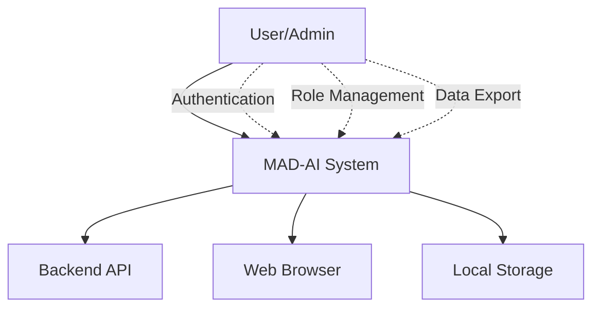
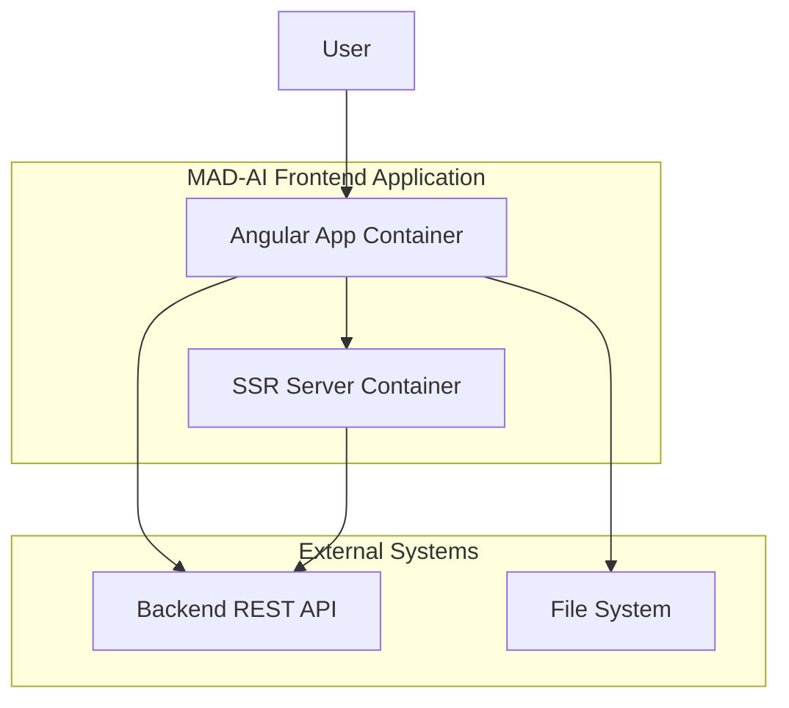
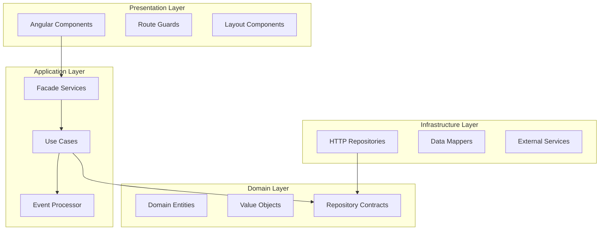
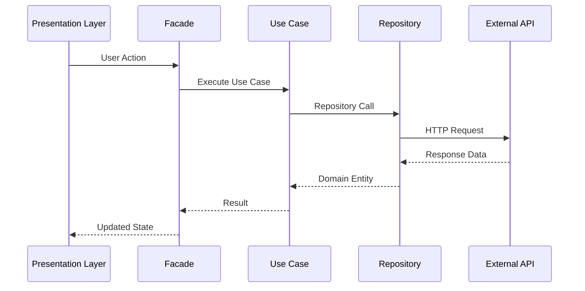
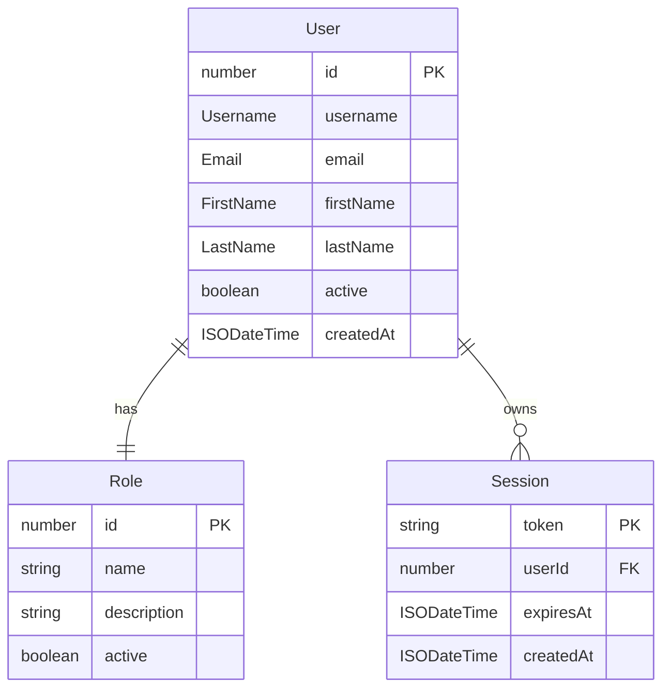

# MAD-AI Project Architecture Blueprint

> **Generated on:** August 23, 2025  
> **Version:** 1.0.0  
> **Project:** MAD-AI - Angular Application with Clean Architecture  
> **Technology Stack:** Angular 20.x, TypeScript, RxJS, TailwindCSS  

## Table of Contents

- [1. Architecture Detection and Analysis](#1-architecture-detection-and-analysis)
- [2. Architectural Overview](#2-architectural-overview)
- [3. Architecture Visualization](#3-architecture-visualization)
- [4. Core Architectural Components](#4-core-architectural-components)
- [5. Architectural Layers and Dependencies](#5-architectural-layers-and-dependencies)
- [6. Data Architecture](#6-data-architecture)
- [7. Cross-Cutting Concerns Implementation](#7-cross-cutting-concerns-implementation)
- [8. Service Communication Patterns](#8-service-communication-patterns)
- [9. Angular-Specific Architectural Patterns](#9-angular-specific-architectural-patterns)
- [10. Implementation Patterns](#10-implementation-patterns)
- [11. Testing Architecture](#11-testing-architecture)
- [12. Deployment Architecture](#12-deployment-architecture)
- [13. Extension and Evolution Patterns](#13-extension-and-evolution-patterns)
- [14. Architectural Pattern Examples](#14-architectural-pattern-examples)
- [15. Architecture Governance](#15-architecture-governance)
- [16. Blueprint for New Development](#16-blueprint-for-new-development)

## 1. Architecture Detection and Analysis

### Technology Stack Detection

**Primary Framework:** Angular 20.1.6 with Server-Side Rendering (SSR)
- **Build System:** Angular CLI with @angular/build
- **Language:** TypeScript with strict mode enabled
- **Styling:** TailwindCSS 4.1.11 with PostCSS
- **State Management:** RxJS 7.8.0 with reactive patterns
- **Testing:** Jasmine with Karma
- **Additional Libraries:** 
  - Chart.js with ng2-charts for data visualization
  - jsPDF for document generation
  - PapaParse for CSV processing
  - Express.js for SSR server

**Development Tools:**
- Custom icon linting system
- Path mapping for clean imports
- Strict TypeScript configuration
- Custom build processes

### Architectural Pattern Analysis

**Primary Pattern:** Clean Architecture with Domain-Driven Design (DDD)

The project demonstrates a sophisticated implementation of Clean Architecture principles with:

1. **Clear layer separation** with dependency inversion
2. **Domain-centric design** with rich entities and value objects
3. **Use case orchestration** in the application layer
4. **Infrastructure isolation** with repository pattern
5. **Angular-specific adaptations** for web UI concerns

**Secondary Patterns:**
- **Facade Pattern** for simplified application layer interfaces
- **Repository Pattern** for data access abstraction
- **Command Query Responsibility Segregation (CQRS)** tendencies
- **Event-Driven Architecture** with domain events
- **Dependency Injection** throughout all layers

## 2. Architectural Overview

### Guiding Principles

The MAD-AI architecture is built on these core principles:

1. **Dependency Inversion:** Higher-level modules do not depend on lower-level modules
2. **Single Responsibility:** Each component has one reason to change
3. **Interface Segregation:** Dependencies use focused, minimal interfaces
4. **Separation of Concerns:** Business logic is isolated from technical concerns
5. **Testability:** All components can be tested in isolation
6. **Extensibility:** New features can be added without modifying existing code

### Architectural Boundaries

**Layer Boundaries:**
- **Domain Layer:** Contains business entities, value objects, and contracts
- **Application Layer:** Orchestrates use cases and manages application state
- **Infrastructure Layer:** Implements external concerns (HTTP, storage, etc.)
- **Presentation Layer:** Handles UI concerns and user interactions
- **Core Layer:** Provides shared technical utilities and cross-cutting concerns

**Boundary Enforcement:**
- TypeScript path mapping prevents inappropriate cross-layer imports
- Dependency injection tokens enforce interface contracts
- Strict folder organization with clear naming conventions
- Angular guards and interceptors maintain separation of concerns

### Hybrid Architectural Adaptations

The architecture adapts Clean Architecture for web applications:

1. **Angular Integration:** Uses Angular's DI system instead of pure dependency injection
2. **Reactive Programming:** Integrates RxJS streams with use case patterns
3. **Component Architecture:** Adapts presentation layer for Angular component model
4. **Route-Based Features:** Organizes features around Angular routing patterns

## 3. Architecture Visualization

### System Context Diagram (C4 Level 1)



### Container Diagram (C4 Level 2)



### Component Diagram (C4 Level 3)



### Data Flow Diagram



## 4. Core Architectural Components

### Domain Layer Components

#### Purpose and Responsibility
The Domain layer represents the core business logic and rules of the MAD-AI system. It contains:
- **Business Entities:** User, Role, Session, Notification
- **Value Objects:** Email, Username, FirstName, LastName, UserStatus
- **Domain Contracts:** Repository interfaces and service contracts
- **Business Rules:** Validation logic and domain invariants
- **Domain Events:** Business event definitions and handlers

#### Internal Structure
```typescript
domain/
├── entities/           # Rich domain entities with behavior
├── value-objects/      # Immutable value objects
├── contracts/          # Repository and service interfaces
├── events/            # Domain event definitions
├── errors/            # Domain-specific errors
├── enums/             # Domain enumerations
└── repositories/      # Repository interface definitions
```

#### Key Design Patterns
- **Entity Pattern:** Rich objects with identity and behavior
- **Value Object Pattern:** Immutable objects representing concepts
- **Repository Pattern:** Abstract data access interfaces
- **Domain Events Pattern:** Decoupled business event handling
- **Specification Pattern:** Encapsulated business rules

#### Evolution Patterns
- **New Entity Types:** Add to entities/ with corresponding value objects
- **New Business Rules:** Implement as domain services or entity methods
- **New Repository Contracts:** Define in contracts/ and implement in infrastructure

### Application Layer Components

#### Purpose and Responsibility
The Application layer orchestrates business workflows and manages application state:
- **Facades:** Simplified interfaces for presentation layer
- **Use Cases:** Business workflow implementations
- **Application Services:** Cross-cutting application concerns
- **Error Handling:** Application-level error transformation
- **State Management:** Reactive state management with signals

#### Internal Structure
```typescript
application/
├── facades/           # Presentation layer interfaces
├── use-cases/         # Business workflow implementations
├── services/          # Application-level services
├── errors/            # Application error handling
└── types/             # Application-specific types
```

#### Interaction Patterns
- **Facade Coordination:** Facades orchestrate multiple use cases
- **Use Case Execution:** Single-purpose workflow implementations
- **Error Transformation:** Convert domain errors to application errors
- **Event Processing:** Handle domain events at application level

### Infrastructure Layer Components

#### Purpose and Responsibility
The Infrastructure layer implements external concerns and technical details:
- **HTTP Repositories:** API communication implementations
- **Data Mappers:** Transform between DTOs and domain entities
- **External Services:** Third-party service integrations
- **Technical Services:** File handling, export services

#### Internal Structure
```typescript
infrastructure/
├── repositories/      # Repository implementations
├── mappers/           # DTO to entity mappers
├── services/          # External service implementations
├── http/              # HTTP utilities and interceptors
├── dtos/              # Data transfer objects
└── errors/            # Infrastructure error handling
```

### Presentation Layer Components

#### Purpose and Responsibility
The Presentation layer handles user interface concerns:
- **Feature Components:** Business feature implementations
- **Layout Components:** Application layout structures
- **Shared Components:** Reusable UI components
- **Forms:** Reactive form implementations
- **Navigation:** Route configuration and navigation

#### Internal Structure
```typescript
presentation/
├── features/          # Business feature implementations
├── layouts/           # Application layouts
├── navigation/        # Navigation components
├── shell/             # Application shell
└── shared/            # Shared UI components
```

## 5. Architectural Layers and Dependencies

### Layer Structure

**1. Presentation Layer (outermost)**
- Angular components, forms, and UI concerns
- Depends on: Application layer only
- Responsibilities: User interaction, form validation, routing

**2. Application Layer**
- Use cases, facades, and application services
- Depends on: Domain layer only
- Responsibilities: Workflow orchestration, state management

**3. Infrastructure Layer**
- Repository implementations and external services
- Depends on: Domain layer contracts
- Responsibilities: Data persistence, external API calls

**4. Domain Layer (innermost)**
- Business entities, value objects, and contracts
- Depends on: Nothing (no dependencies)
- Responsibilities: Business logic, domain rules

**5. Core Layer (cross-cutting)**
- Guards, interceptors, utilities
- Depends on: Application and domain layers
- Responsibilities: Technical concerns, security

### Dependency Rules

**Strict Dependency Flow:**
```
Presentation → Application → Domain ← Infrastructure
                    ↑              ↑
                   Core ←----------
```

**Enforced Through:**
- TypeScript path mappings prevent reverse dependencies
- Dependency injection tokens ensure interface contracts
- Code review processes check architectural compliance

### Abstraction Mechanisms

**Repository Pattern:**
```typescript
// Domain contract
export interface UserRepository {
    getById(id: number): Promise<User>;
    save(user: User): Promise<void>;
}

// Infrastructure implementation
@Injectable()
export class HttpUserRepository implements UserRepository {
    // Implementation details...
}
```

**Dependency Injection:**
```typescript
// Token definition
export const USER_REPOSITORY = new InjectionToken<UserRepository>('UserRepository');

// Provider configuration
providers: [
    { provide: USER_REPOSITORY, useClass: HttpUserRepository }
]
```

## 6. Data Architecture

### Domain Model Structure

The domain model follows DDD principles with rich entities and value objects:

#### Core Entities

**User Entity:**
- Encapsulates user identity and behavior
- Contains value objects for type safety
- Implements domain invariants and validation
- Publishes domain events for state changes

**Role Entity:**
- Represents user roles and permissions
- Implements role-based access control logic
- Contains hierarchical permission structures

**Session Entity:**
- Manages user authentication sessions
- Handles session lifecycle and security
- Contains metadata for audit trails

#### Value Objects

**Email, Username, FirstName, LastName:**
- Immutable objects with validation
- Encapsulate formatting and business rules
- Provide type safety at compile time

### Entity Relationships



### Data Access Patterns

**Repository Pattern Implementation:**
- Abstract repository interfaces in domain layer
- Concrete implementations in infrastructure layer
- Consistent error handling and transformation
- Automatic mapping between DTOs and entities

**Data Transformation Pipeline:**
```
API Response → DTO → Mapper → Domain Entity → Use Case → Facade → Component
```

### Caching Strategies

**Session Caching:**
- Browser local storage for user sessions
- Automatic session refresh with interceptors
- Secure token storage with expiration handling

**Application State:**
- Angular signals for reactive state management
- Computed values for derived state
- Minimal state persistence in session storage

## 7. Cross-Cutting Concerns Implementation

### Authentication & Authorization

#### Security Model Implementation
```typescript
// Authentication facade provides centralized auth state
@Injectable()
export class AuthFacade {
    private readonly _user = signal<User | null>(null);
    private readonly _isAuthenticated = computed(() => !!this._user());
    
    // Reactive authentication state
    public readonly user = this._user.asReadonly();
    public readonly isAuthenticated = this._isAuthenticated;
}
```

#### Permission Enforcement Patterns
- **Route Guards:** Protect routes based on authentication status
- **Component Guards:** Control UI element visibility
- **API Interceptors:** Automatically attach authentication tokens
- **Role-Based Access:** Granular permission checking

#### Security Boundary Patterns
```typescript
// Auth guard prevents unauthorized access
export const authGuard: CanActivateFn = () => {
    const authFacade = inject(AuthFacade);
    const router = inject(Router);
    
    return authFacade.isAuthenticated() || router.parseUrl('/auth/login');
};
```

### Error Handling & Resilience

#### Exception Handling Patterns
```typescript
// Centralized error transformation
@Injectable()
export class ApplicationErrorTransformer {
    transform(error: unknown): ApplicationError {
        if (error instanceof DomainError) {
            return ApplicationError.fromDomain(error);
        }
        // Handle other error types...
    }
}
```

#### Retry and Circuit Breaker Implementation
- **HTTP Interceptors:** Automatic retry for failed requests
- **Exponential Backoff:** Progressive retry delays
- **Circuit Breaker:** Prevent cascading failures
- **Graceful Degradation:** Fallback to cached data

#### Error Reporting Patterns
- **Global Error Handler:** Centralized error logging
- **User Notifications:** Friendly error messages
- **Error Boundaries:** Prevent application crashes
- **Diagnostic Information:** Detailed error context

### Logging & Monitoring

#### Instrumentation Patterns
```typescript
// Domain event logging
@Injectable()
export class DomainEventProcessor {
    process(event: DomainEvent): void {
        this.logger.info('Domain event processed', { 
            type: event.type, 
            aggregateId: event.aggregateId 
        });
    }
}
```

#### Observability Implementation
- **Performance Metrics:** Angular performance monitoring
- **User Activity Tracking:** Navigation and interaction logging
- **Error Tracking:** Automatic error reporting
- **Business Metrics:** Domain event analytics

### Validation

#### Input Validation Strategies
```typescript
// Value object validation
export class Email {
    private constructor(private readonly value: string) {}
    
    static create(value: string): Email {
        if (!this.isValid(value)) {
            throw new ValidationError('Invalid email format');
        }
        return new Email(value);
    }
}
```

#### Business Rule Validation
- **Domain Entity Invariants:** Validated in entity constructors
- **Use Case Preconditions:** Validated before business logic
- **Cross-Entity Validation:** Handled by domain services
- **Form Validation:** Angular reactive forms with custom validators

### Configuration Management

#### Configuration Source Patterns
```typescript
// Environment-specific configuration
export const environment = {
    production: false,
    apiUrl: 'http://localhost:3000/api',
    features: {
        enableAdvancedExport: true,
        enableNotifications: true
    }
};
```

#### Feature Flag Implementation
- **Environment Variables:** Build-time feature flags
- **Runtime Configuration:** Dynamic feature enablement
- **User-Specific Flags:** Role-based feature access
- **A/B Testing Support:** Experimental feature rollouts

## 8. Service Communication Patterns

### Service Boundary Definitions

Services in MAD-AI are organized by business capability:

**Authentication Services:**
- User authentication and session management
- Password reset and email confirmation
- Session refresh and token management

**User Management Services:**
- User profile management
- User listing and search
- User status and activity tracking

**Role Management Services:**
- Role definition and assignment
- Permission management
- Role-based access control

**Notification Services:**
- System notification delivery
- User notification preferences
- Notification history and tracking

### Communication Protocols

**HTTP REST API:**
- Standardized REST endpoints for all external communication
- JSON payload format with consistent error responses
- HTTP status codes for operation results

**Internal Service Communication:**
- Direct method calls within the same process
- Reactive streams with RxJS for asynchronous operations
- Domain events for decoupled communication

### Synchronous vs. Asynchronous Patterns

**Synchronous Operations:**
- User authentication (immediate response required)
- Form validation (real-time feedback)
- Data retrieval (blocking operations)

**Asynchronous Operations:**
- Email notifications (fire-and-forget)
- Data export operations (long-running tasks)
- Domain event processing (eventual consistency)

### API Versioning Strategies

**URL-Based Versioning:**
```typescript
const API_BASE_URL = environment.apiUrl + '/v1';
```

**Header-Based Versioning:**
```typescript
// HTTP interceptor adds version headers
headers = headers.set('API-Version', '1.0');
```

### Resilience Patterns

**Retry Logic:**
```typescript
// Automatic retry with exponential backoff
return this.http.get(url).pipe(
    retry({
        count: 3,
        delay: (error, retryCount) => timer(retryCount * 1000)
    })
);
```

**Circuit Breaker:**
- Monitor API failure rates
- Open circuit after threshold failures
- Fallback to cached data or degraded functionality

## 9. Angular-Specific Architectural Patterns

### Module Organization Strategy

**Feature Module Pattern:**
```typescript
// Each feature is self-contained
presentation/
└── features/
    ├── auth/           # Authentication feature
    ├── dashboard/      # Dashboard feature
    ├── roles/          # Role management feature
    └── users/          # User management feature
```

**Lazy Loading Implementation:**
```typescript
export const routes: Routes = [
    {
        path: 'auth',
        loadComponent: () => import('./layouts/auth-layout').then(m => m.AuthLayout),
        children: authRoutes
    }
];
```

### Component Hierarchy Design

**Container/Presenter Pattern:**
- **Smart Components:** Connect to facades and manage state
- **Dumb Components:** Pure presentation components
- **Form Components:** Handle user input and validation

**Component Structure:**
```typescript
@Component({
    selector: 'app-login',
    templateUrl: './login.html',
    styleUrl: './login.css',
    changeDetection: ChangeDetectionStrategy.OnPush,
    imports: [LoginForm]
})
export class Login implements OnInit {
    auth = inject(AuthFacade);
    
    ngOnInit(): void {
        this.auth.clearAuthStateCompletely();
    }
}
```

### Service and Dependency Injection Patterns

**Hierarchical Injection:**
```typescript
// Application-level services
export const appConfig: ApplicationConfig = {
    providers: [
        provideAuth(),
        provideNotifications(),
        provideUsers(),
        ...
    ]
};
```

**Token-Based Injection:**
```typescript
// Repository injection with interfaces
export const USER_REPOSITORY = new InjectionToken<UserRepository>('UserRepository');

providers: [
    { provide: USER_REPOSITORY, useClass: HttpUserRepository }
]
```

### State Management Approach

**Signal-Based State:**
```typescript
@Injectable()
export class AuthFacade {
    private readonly _user = signal<User | null>(null);
    private readonly _loading = signal<boolean>(false);
    private readonly _error = signal<string | null>(null);
    
    // Read-only computed state
    public readonly isAuthenticated = computed(() => !!this._user());
    public readonly userRole = computed(() => this._user()?.role);
}
```

**Reactive Programming Patterns:**
```typescript
// Use case returns observables
async execute(request: LoginRequest): Promise<Session> {
    this.setLoading(true);
    try {
        const session = await this.loginUseCase.execute(request);
        this.setSession(session);
        return session;
    } finally {
        this.setLoading(false);
    }
}
```

### Route Guard Implementation

**Functional Guards:**
```typescript
export const authGuard: CanActivateFn = () => {
    const authFacade = inject(AuthFacade);
    return authFacade.isAuthenticated();
};

export const guestOnly: CanMatchFn = () => {
    const authFacade = inject(AuthFacade);
    return !authFacade.isAuthenticated();
};
```

**Composition Guards:**
```typescript
// Multiple guards can be composed
{
    path: '',
    canMatch: [authOnly, emailConfirmedOnly],
    loadComponent: () => import('./main-layout')
}
```

## 10. Implementation Patterns

### Interface Design Patterns

#### Interface Segregation Approaches
```typescript
// Focused repository interfaces
export interface UserRepository {
    getById(id: number): Promise<User>;
    save(user: User): Promise<void>;
    delete(id: number): Promise<void>;
}

// Separate read and write concerns
export interface UserQueryRepository {
    findByEmail(email: string): Promise<User | null>;
    findByUsername(username: string): Promise<User | null>;
    list(criteria: UserSearchCriteria): Promise<User[]>;
}
```

#### Generic vs. Specific Interface Patterns
```typescript
// Generic repository base
export interface Repository<T, ID> {
    getById(id: ID): Promise<T>;
    save(entity: T): Promise<void>;
}

// Specific business interfaces
export interface AuthRepository {
    login(credentials: LoginCredentials): Promise<Session>;
    logout(sessionToken: string): Promise<void>;
    refreshSession(token: string): Promise<Session>;
}
```

### Service Implementation Patterns

#### Service Lifetime Management
```typescript
// Singleton services for shared state
@Injectable({ providedIn: 'root' })
export class AuthFacade { }

// Scoped services for specific features
providers: [
    { provide: ExportService, useClass: CsvExportService }
]
```

#### Service Composition Patterns
```typescript
// Facade composes multiple use cases
@Injectable()
export class AuthFacade {
    private readonly loginUseCase = inject(LoginWithCredentials);
    private readonly logoutUseCase = inject(Logout);
    private readonly profileUseCase = inject(GetProfile);
    
    async login(request: LoginRequest): Promise<void> {
        const session = await this.loginUseCase.execute(request);
        this.setSession(session);
    }
}
```

### Repository Implementation Patterns

#### Query Pattern Implementations
```typescript
// Repository with query methods
export class HttpUserRepository implements UserRepository {
    async findByEmail(email: string): Promise<User | null> {
        const params = new HttpParams().set('email', email);
        const response = await firstValueFrom(
            this.http.get<UserDTO[]>(this.baseUrl, { params })
        );
        return response.length > 0 ? this.mapper.toDomain(response[0]) : null;
    }
}
```

#### Transaction Management
```typescript
// Transaction coordination in use cases
@Injectable()
export class CreateUserWithRole {
    async execute(request: CreateUserRequest): Promise<User> {
        // Coordinate multiple repository operations
        const user = await this.userRepo.save(newUser);
        await this.roleRepo.assignRole(user.id, request.roleId);
        return user;
    }
}
```

### Controller/API Implementation Patterns

#### Request Handling Patterns
```typescript
// HTTP interceptor for authentication
export const authInterceptor: HttpInterceptorFn = (req, next) => {
    const authStore = inject(AUTH_USER_STORE_PORT);
    const token = authStore.getToken();
    
    if (token) {
        req = req.clone({
            setHeaders: { Authorization: `Bearer ${token}` }
        });
    }
    
    return next(req);
};
```

#### Response Formatting
```typescript
// Consistent error response handling
export const httpErrorInterceptor: HttpInterceptorFn = (req, next) => {
    return next(req).pipe(
        catchError((error: HttpErrorResponse) => {
            const appError = this.transformHttpError(error);
            return throwError(() => appError);
        })
    );
};
```

### Domain Model Implementation

#### Entity Implementation Patterns
```typescript
export class User {
    private _domainEvents: DomainEvent[] = [];
    
    static create(props: UserCreateProps): User {
        const user = new User(/* ... */);
        user.addDomainEvent(new UserCreatedEvent(user.id));
        return user;
    }
    
    updateProfile(firstName: FirstName, lastName: LastName): void {
        this._firstName = firstName;
        this._lastName = lastName;
        this.addDomainEvent(new UserProfileUpdatedEvent(this.id));
    }
}
```

#### Value Object Patterns
```typescript
export class Email {
    private constructor(private readonly value: string) {}
    
    static create(value: string): Email {
        if (!this.isValid(value)) {
            throw new ValidationError('Invalid email format');
        }
        return new Email(value);
    }
    
    static isValid(value: string): boolean {
        return EMAIL_REGEX.test(value);
    }
    
    toString(): string {
        return this.value;
    }
}
```

#### Domain Event Implementation
```typescript
export class DomainEvent {
    constructor(
        public readonly type: DomainEventType,
        public readonly aggregateId: number,
        public readonly data: Record<string, unknown>,
        public readonly occurredAt: Date = new Date()
    ) {}
}

@Injectable()
export class DomainEventProcessor {
    process(events: DomainEvent[]): void {
        events.forEach(event => this.handleEvent(event));
    }
}
```

## 11. Testing Architecture

### Testing Strategy Alignment

The testing architecture follows the same clean architecture principles:

**Unit Testing by Layer:**
- **Domain Layer:** Test entities, value objects, and business rules
- **Application Layer:** Test use cases and facades in isolation
- **Infrastructure Layer:** Test repository implementations with mocks
- **Presentation Layer:** Test components with shallow rendering

### Test Boundary Patterns

**Domain Testing:**
```typescript
describe('User Entity', () => {
    it('should create user with valid data', () => {
        const user = User.create({
            id: 1,
            username: Username.create('johndoe'),
            email: Email.create('john@example.com'),
            // ...
        });
        
        expect(user.username.toString()).toBe('johndoe');
    });
});
```

**Use Case Testing:**
```typescript
describe('LoginWithCredentials', () => {
    let useCase: LoginWithCredentials;
    let mockAuthRepo: jasmine.SpyObj<AuthRepository>;
    
    beforeEach(() => {
        const spy = jasmine.createSpyObj('AuthRepository', ['login']);
        mockAuthRepo = spy;
        useCase = new LoginWithCredentials(mockAuthRepo, /* ... */);
    });
});
```

**Component Testing:**
```typescript
describe('LoginComponent', () => {
    let component: LoginComponent;
    let mockAuthFacade: jasmine.SpyObj<AuthFacade>;
    
    beforeEach(() => {
        const spy = jasmine.createSpyObj('AuthFacade', ['login']);
        TestBed.configureTestingModule({
            providers: [{ provide: AuthFacade, useValue: spy }]
        });
    });
});
```

### Test Double Strategies

**Repository Mocking:**
```typescript
const mockUserRepository = jasmine.createSpyObj<UserRepository>('UserRepository', {
    getById: Promise.resolve(testUser),
    save: Promise.resolve(),
    delete: Promise.resolve()
});
```

**Facade Mocking:**
```typescript
const mockAuthFacade = jasmine.createSpyObj<AuthFacade>('AuthFacade', {
    login: Promise.resolve(),
    logout: Promise.resolve(),
    isAuthenticated: true
});
```

### Test Data Strategies

**Test Builders:**
```typescript
export class UserTestBuilder {
    private id = 1;
    private username = 'testuser';
    private email = 'test@example.com';
    
    withId(id: number): UserTestBuilder {
        this.id = id;
        return this;
    }
    
    build(): User {
        return User.create({
            id: this.id,
            username: Username.create(this.username),
            email: Email.create(this.email),
            // ...
        });
    }
}
```

## 12. Deployment Architecture

### Deployment Topology

**Single Page Application with SSR:**
- Angular application compiled to static assets
- Server-side rendering for improved SEO and performance
- Express.js server for SSR and API proxy

**Build Pipeline:**
```json
{
    "scripts": {
        "build": "ng build",
        "build:ssr": "ng build --ssr",
        "serve:ssr": "node dist/server/server.mjs"
    }
}
```

### Environment-Specific Adaptations

**Environment Configuration:**
```typescript
// environment.prod.ts
export const environment = {
    production: true,
    apiUrl: 'https://api.madai.com',
    features: {
        enableAdvancedExport: true,
        enableNotifications: true
    }
};
```

**Build-Time Optimization:**
- Tree shaking for unused code removal
- Lazy loading for route-based code splitting
- Ahead-of-time compilation for performance

### Runtime Configuration

**Dynamic Configuration Loading:**
```typescript
// Configuration service
@Injectable()
export class ConfigurationService {
    private config = signal<AppConfig | null>(null);
    
    async loadConfiguration(): Promise<void> {
        const config = await this.http.get<AppConfig>('/api/config').toPromise();
        this.config.set(config);
    }
}
```

### Containerization Patterns

**Docker Configuration:**
```dockerfile
FROM node:18-alpine
WORKDIR /app
COPY package*.json ./
RUN npm ci --only=production
COPY dist/ ./dist/
EXPOSE 4000
CMD ["node", "dist/server/server.mjs"]
```

## 13. Extension and Evolution Patterns

### Feature Addition Patterns

#### New Business Feature Implementation

**1. Domain Layer Extension:**
```typescript
// Add new entity
export class Report {
    // Domain logic for reports
}

// Add repository contract
export interface ReportRepository {
    generate(criteria: ReportCriteria): Promise<Report>;
}
```

**2. Application Layer Extension:**
```typescript
// Add use case
@Injectable()
export class GenerateReport {
    constructor(
        @Inject(REPORT_REPOSITORY) private reportRepo: ReportRepository
    ) {}
}

// Add facade
@Injectable()
export class ReportsFacade {
    // Orchestrate report operations
}
```

**3. Infrastructure Layer Extension:**
```typescript
// Implement repository
@Injectable()
export class HttpReportRepository implements ReportRepository {
    // HTTP implementation
}
```

**4. Presentation Layer Extension:**
```typescript
// Add feature module
presentation/features/reports/
├── pages/
├── components/
├── forms/
└── reports.routes.ts
```

#### Dependency Introduction Guidelines

**New Repository Integration:**
```typescript
// 1. Define token in di/tokens.ts
export const REPORT_REPOSITORY = new InjectionToken<ReportRepository>('ReportRepository');

// 2. Create provider in di/provide-reports.ts
export function provideReports(): Provider[] {
    return [
        { provide: REPORT_REPOSITORY, useClass: HttpReportRepository }
    ];
}

// 3. Add to app configuration
export const appConfig: ApplicationConfig = {
    providers: [
        // ...existing providers
        ...provideReports()
    ]
};
```

### Modification Patterns

#### Safe Component Modification

**Entity Extension:**
```typescript
export class User {
    // Add new properties with defaults for compatibility
    constructor(
        // ...existing properties
        public readonly preferences?: UserPreferences
    ) {}
    
    // Add new methods without breaking existing ones
    updatePreferences(preferences: UserPreferences): void {
        // Implementation
    }
}
```

**Repository Extension:**
```typescript
export interface UserRepository {
    // Existing methods remain unchanged
    getById(id: number): Promise<User>;
    save(user: User): Promise<void>;
    
    // New methods added
    findByPreferences(preferences: UserPreferences): Promise<User[]>;
}
```

#### Backward Compatibility Strategies

**API Versioning:**
```typescript
// Support multiple API versions
export class HttpUserRepository implements UserRepository {
    private readonly apiVersion = environment.apiVersion;
    
    async getById(id: number): Promise<User> {
        const url = `${this.baseUrl}/v${this.apiVersion}/users/${id}`;
        // Implementation
    }
}
```

### Integration Patterns

#### External System Integration

**Adapter Implementation:**
```typescript
// Create adapter for external service
@Injectable()
export class ExternalNotificationAdapter implements NotificationPort {
    constructor(private externalService: ExternalNotificationService) {}
    
    async send(notification: Notification): Promise<void> {
        // Adapt internal notification to external format
        const externalFormat = this.adaptToExternal(notification);
        await this.externalService.send(externalFormat);
    }
}
```

**Anti-Corruption Layer:**
```typescript
// Protect domain from external changes
@Injectable()
export class ExternalUserAdapter {
    toDomain(externalUser: ExternalUserDTO): User {
        return User.create({
            id: externalUser.user_id,
            username: Username.create(externalUser.login_name),
            email: Email.create(externalUser.email_address),
            // Map other fields with validation
        });
    }
}
```

## 14. Architectural Pattern Examples

### Layer Separation Examples

#### Interface Definition and Implementation Separation

**Domain Contract:**
```typescript
// Domain layer - pure interface
export interface UserRepository {
    getById(id: number): Promise<User>;
    save(user: User): Promise<void>;
    findByEmail(email: string): Promise<User | null>;
}
```

**Infrastructure Implementation:**
```typescript
// Infrastructure layer - HTTP implementation
@Injectable()
export class HttpUserRepository implements UserRepository {
    constructor(
        private readonly http: HttpClient,
        private readonly mapper: UserMapper
    ) {}
    
    async getById(id: number): Promise<User> {
        const response = await firstValueFrom(
            this.http.get<UserDTO>(`${this.baseUrl}/${id}`)
        );
        return this.mapper.toDomain(response);
    }
}
```

**Dependency Injection Configuration:**
```typescript
// DI configuration - binds interface to implementation
providers: [
    { provide: USER_REPOSITORY, useClass: HttpUserRepository }
]
```

#### Cross-Layer Communication Patterns

**Presentation to Application:**
```typescript
@Component({
    selector: 'app-user-profile',
    template: `<form [formGroup]="profileForm" (ngSubmit)="onSubmit()">`,
    changeDetection: ChangeDetectionStrategy.OnPush
})
export class UserProfileComponent {
    private readonly usersFacade = inject(UsersFacade);
    private readonly formBuilder = inject(FormBuilder);
    
    profileForm = this.formBuilder.group({
        firstName: ['', [Validators.required]],
        lastName: ['', [Validators.required]]
    });
    
    async onSubmit(): Promise<void> {
        if (this.profileForm.valid) {
            const updateRequest = this.createUpdateRequest();
            await this.usersFacade.updateProfile(updateRequest);
        }
    }
}
```

**Application to Domain:**
```typescript
@Injectable()
export class UpdateUserProfile {
    constructor(
        @Inject(USER_REPOSITORY) private readonly userRepo: UserRepository
    ) {}
    
    async execute(request: UpdateProfileRequest): Promise<User> {
        // Get domain entity
        const user = await this.userRepo.getById(request.userId);
        
        // Execute domain logic
        user.updateProfile(
            FirstName.create(request.firstName),
            LastName.create(request.lastName)
        );
        
        // Persist changes
        await this.userRepo.save(user);
        return user;
    }
}
```

### Component Communication Examples

#### Service Invocation Patterns

**Facade Coordination:**
```typescript
@Injectable()
export class AuthFacade {
    private readonly loginUseCase = inject(LoginWithCredentials);
    private readonly logoutUseCase = inject(Logout);
    private readonly refreshUseCase = inject(RefreshSession);
    
    async login(request: LoginRequest): Promise<void> {
        try {
            this.setLoading(true);
            const session = await this.loginUseCase.execute(request);
            this.setSession(session);
            this.notificationsFacade.showSuccess('Login successful');
        } catch (error) {
            this.handleError(error);
        } finally {
            this.setLoading(false);
        }
    }
}
```

#### Event Publication and Handling

**Domain Event Publication:**
```typescript
export class User {
    private _domainEvents: DomainEvent[] = [];
    
    updateProfile(firstName: FirstName, lastName: LastName): void {
        this._firstName = firstName;
        this._lastName = lastName;
        
        // Publish domain event
        this.addDomainEvent(new UserProfileUpdatedEvent({
            userId: this.id,
            firstName: firstName.toString(),
            lastName: lastName.toString(),
            updatedAt: new Date()
        }));
    }
    
    private addDomainEvent(event: DomainEvent): void {
        this._domainEvents.push(event);
    }
}
```

**Event Processing:**
```typescript
@Injectable()
export class DomainEventProcessor {
    process(events: DomainEvent[]): void {
        events.forEach(event => {
            switch (event.type) {
                case DomainEventType.UserProfileUpdated:
                    this.handleUserProfileUpdated(event);
                    break;
                case DomainEventType.UserLoggedIn:
                    this.handleUserLoggedIn(event);
                    break;
            }
        });
    }
    
    private handleUserProfileUpdated(event: DomainEvent): void {
        // Update caches, send notifications, etc.
        this.logger.info('User profile updated', event.data);
    }
}
```

### Extension Point Examples

#### Plugin Registration and Discovery

**Icon Registration System:**
```typescript
// Icon provider configuration
export function provideIcons(config: IconConfig): Provider[] {
    return [
        { provide: ICON_CONFIG, useValue: config },
        { provide: ICON_REGISTRY, useClass: IconRegistry },
        // Auto-discovery of icon providers
        ...discoverIconProviders()
    ];
}

// Dynamic icon loading
@Injectable()
export class IconRegistry {
    private icons = new Map<string, string>();
    
    register(name: string, svgContent: string): void {
        this.icons.set(name, svgContent);
    }
    
    get(name: string): string | undefined {
        return this.icons.get(name);
    }
}
```

#### Extension Interface Implementation

**Export Service Extension:**
```typescript
// Extension interface
export interface ExportPort {
    export<T>(data: T[], format: ExportFormat): Promise<Blob>;
    getSupportedFormats(): ExportFormat[];
}

// CSV implementation
@Injectable()
export class CsvExportService implements ExportPort {
    async export<T>(data: T[], format: ExportFormat): Promise<Blob> {
        if (format !== ExportFormat.CSV) {
            throw new Error('Unsupported format');
        }
        
        const csv = this.convertToCsv(data);
        return new Blob([csv], { type: 'text/csv' });
    }
    
    getSupportedFormats(): ExportFormat[] {
        return [ExportFormat.CSV];
    }
}

// PDF implementation
@Injectable()
export class PdfExportService implements ExportPort {
    async export<T>(data: T[], format: ExportFormat): Promise<Blob> {
        if (format !== ExportFormat.PDF) {
            throw new Error('Unsupported format');
        }
        
        const pdf = await this.convertToPdf(data);
        return new Blob([pdf], { type: 'application/pdf' });
    }
    
    getSupportedFormats(): ExportFormat[] {
        return [ExportFormat.PDF];
    }
}
```

#### Configuration-Driven Extension

**Feature Flag System:**
```typescript
// Feature configuration
export interface FeatureConfig {
    enableAdvancedExport: boolean;
    enableNotifications: boolean;
    enableRoleHierarchy: boolean;
}

// Feature-driven component loading
@Component({
    selector: 'app-dashboard',
    template: `
        <div class="dashboard">
            @if (features.enableAdvancedExport) {
                <app-advanced-export />
            }
            @if (features.enableNotifications) {
                <app-notification-center />
            }
        </div>
    `
})
export class DashboardComponent {
    features = inject(FEATURE_CONFIG);
}
```

## 15. Architecture Governance

### Architectural Consistency Maintenance

#### Automated Architectural Compliance

**TypeScript Path Mapping Enforcement:**
```json
// tsconfig.json enforces proper imports
{
    "compilerOptions": {
        "paths": {
            "@domain/*": ["src/app/domain/*"],
            "@application/*": ["src/app/application/*"],
            "@infrastructure/*": ["src/app/infrastructure/*"],
            "@presentation/*": ["src/app/presentation/*"]
        }
    }
}
```

**Custom Linting Rules:**
```javascript
// scripts/lint-icons.cjs - Custom architectural validation
module.exports = function validateIcons() {
    // Ensure icon usage follows architectural patterns
    // Validate import paths
    // Check for proper abstraction usage
};
```

#### Dependency Analysis

**Build-Time Validation:**
```json
{
    "scripts": {
        "prebuild": "npm run lint:icons",
        "lint:icons": "node scripts/lint-icons.cjs",
        "validate:architecture": "npm run lint:icons && npm run test"
    }
}
```

### Architectural Review Processes

#### Code Review Guidelines

**Layer Violation Detection:**
- Domain layer should not import from other layers
- Application layer should only import from domain
- Infrastructure should implement domain contracts
- Presentation should only depend on application facades

**Pattern Compliance:**
- New repositories must implement domain contracts
- Use cases should be single-purpose
- Facades should coordinate, not implement business logic
- Components should be presentation-only

#### Architecture Decision Documentation

**Implicit Decision Records:**
Based on code analysis, key architectural decisions include:

**Decision: Clean Architecture with DDD**
- **Context:** Need for maintainable, testable, and scalable application
- **Decision:** Implement Clean Architecture with Domain-Driven Design
- **Consequences:** Clear separation of concerns, testability, but increased complexity

**Decision: Angular Signals for State Management**
- **Context:** Need for reactive state management without external dependencies
- **Decision:** Use Angular's signal-based state management
- **Consequences:** Native Angular integration, performance benefits, learning curve

**Decision: Facade Pattern for Application Layer**
- **Context:** Need to simplify complex use case interactions
- **Decision:** Implement facade pattern for coordinating use cases
- **Consequences:** Simplified presentation layer, but additional abstraction

### Documentation Practices

#### Living Documentation

**Code-First Documentation:**
- TypeScript interfaces serve as contracts
- JSDoc comments provide business context
- Unit tests document expected behavior
- Integration tests document system interactions

**Architectural Annotations:**
```typescript
/**
 * Authentication Facade - Clean Orchestrator Following MAD-AI Patterns
 *
 * @description
 * Pure orchestrator that delegates all business logic to robust use cases.
 * This facade focuses solely on:
 * - Coordinating between use cases
 * - Managing reactive application state (loading, user, errors)
 * - Providing a clean API for the presentation layer
 *
 * @architecture Application Layer
 * @pattern Facade Pattern
 * @responsibility State Management, Use Case Coordination
 */
```

## 16. Blueprint for New Development

### Development Workflow

#### Starting Points for Different Feature Types

**1. User Management Feature:**
```bash
# 1. Create domain entities and contracts
src/app/domain/entities/new-entity.entity.ts
src/app/domain/contracts/new-entity.contract.ts

# 2. Implement use cases
src/app/application/use-cases/new-feature/

# 3. Create facade
src/app/application/facades/new-feature.facade.ts

# 4. Implement infrastructure
src/app/infrastructure/repositories/http-new-entity.repository.ts

# 5. Create presentation components
src/app/presentation/features/new-feature/
```

**2. Cross-Cutting Concern Feature:**
```bash
# 1. Define in core layer
src/app/core/cross-cutting/new-concern/

# 2. Implement in infrastructure
src/app/infrastructure/services/new-concern.service.ts

# 3. Configure in DI
src/app/di/provide-new-concern.ts

# 4. Update app configuration
src/app/app.config.ts
```

#### Component Creation Sequence

**1. Domain First:**
```typescript
// Step 1: Define entity
export class NewEntity {
    static create(props: NewEntityProps): NewEntity {
        // Domain logic and validation
    }
}

// Step 2: Define repository contract
export interface NewEntityRepository {
    save(entity: NewEntity): Promise<void>;
    getById(id: number): Promise<NewEntity>;
}
```

**2. Application Layer:**
```typescript
// Step 3: Implement use case
@Injectable()
export class CreateNewEntity {
    constructor(
        @Inject(NEW_ENTITY_REPOSITORY) private repo: NewEntityRepository
    ) {}
    
    async execute(request: CreateNewEntityRequest): Promise<NewEntity> {
        // Use case logic
    }
}

// Step 4: Create facade
@Injectable()
export class NewEntityFacade {
    private readonly createUseCase = inject(CreateNewEntity);
    
    async create(request: CreateNewEntityRequest): Promise<void> {
        // Facade coordination
    }
}
```

**3. Infrastructure:**
```typescript
// Step 5: Implement repository
@Injectable()
export class HttpNewEntityRepository implements NewEntityRepository {
    // HTTP implementation
}

// Step 6: Configure DI
export const NEW_ENTITY_REPOSITORY = new InjectionToken<NewEntityRepository>('NewEntityRepository');

export function provideNewEntity(): Provider[] {
    return [
        { provide: NEW_ENTITY_REPOSITORY, useClass: HttpNewEntityRepository }
    ];
}
```

**4. Presentation:**
```typescript
// Step 7: Create component
@Component({
    selector: 'app-new-entity',
    template: `<form [formGroup]="form" (ngSubmit)="onSubmit()">`,
    changeDetection: ChangeDetectionStrategy.OnPush
})
export class NewEntityComponent {
    private readonly facade = inject(NewEntityFacade);
    
    async onSubmit(): Promise<void> {
        await this.facade.create(this.getFormValue());
    }
}
```

### Implementation Templates

#### Base Repository Template

```typescript
import { Injectable, Inject } from '@angular/core';
import { HttpClient, HttpParams } from '@angular/common/http';
import { firstValueFrom, catchError } from 'rxjs';

@Injectable()
export class Http{EntityName}Repository implements {EntityName}Repository {
    private readonly baseUrl = `${environment.apiUrl}/{entity-path}`;
    
    constructor(
        private readonly http: HttpClient,
        private readonly mapper: {EntityName}Mapper,
        @Inject(CLOCK_PORT) private readonly clock: ClockPort
    ) {}
    
    async getById(id: number): Promise<{EntityName}> {
        const response = await firstValueFrom(
            this.http.get<{EntityName}DTO>(`${this.baseUrl}/${id}`)
                .pipe(catchError(this.handleHttpError))
        );
        return this.mapper.toDomain(response);
    }
    
    async save(entity: {EntityName}): Promise<void> {
        const dto = this.mapper.toDTO(entity);
        if (entity.id) {
            await firstValueFrom(
                this.http.put(`${this.baseUrl}/${entity.id}`, dto)
                    .pipe(catchError(this.handleHttpError))
            );
        } else {
            await firstValueFrom(
                this.http.post(this.baseUrl, dto)
                    .pipe(catchError(this.handleHttpError))
            );
        }
    }
    
    private handleHttpError = (error: HttpErrorResponse): Observable<never> => {
        // Standard error handling
        throw new InfrastructureError(error.message, error.status);
    };
}
```

#### Use Case Template

```typescript
import { Injectable, Inject } from '@angular/core';
import { {ENTITY_NAME}_REPOSITORY } from '@di/tokens';
import type { {EntityName}Repository } from '@domain/repositories/{entity-name}.repository';
import { ApplicationError } from '@application/errors/application-error';

@Injectable({ providedIn: 'root' })
export class {ActionName}{EntityName} {
    constructor(
        @Inject({ENTITY_NAME}_REPOSITORY) private readonly repo: {EntityName}Repository
    ) {}
    
    async execute(request: {ActionName}{EntityName}Request): Promise<{EntityName}> {
        try {
            // Validate request
            this.validateRequest(request);
            
            // Execute business logic
            const entity = await this.performAction(request);
            
            // Return result
            return entity;
        } catch (error) {
            if (error instanceof DomainError) {
                throw ApplicationError.fromDomain(error);
            }
            throw new ApplicationError('Unexpected error', 'UNKNOWN_ERROR');
        }
    }
    
    private validateRequest(request: {ActionName}{EntityName}Request): void {
        // Application-level validation
    }
    
    private async performAction(request: {ActionName}{EntityName}Request): Promise<{EntityName}> {
        // Implementation
    }
}
```

#### Component Template

```typescript
import { Component, ChangeDetectionStrategy, inject, OnInit } from '@angular/core';
import { FormBuilder, FormGroup, Validators, ReactiveFormsModule } from '@angular/forms';
import { {EntityName}Facade } from '@application/facades/{entity-name}.facade';

@Component({
    selector: 'app-{entity-name}-{action}',
    templateUrl: './{entity-name}-{action}.html',
    styleUrl: './{entity-name}-{action}.css',
    changeDetection: ChangeDetectionStrategy.OnPush,
    imports: [ReactiveFormsModule]
})
export class {EntityName}{Action}Component implements OnInit {
    private readonly facade = inject({EntityName}Facade);
    private readonly formBuilder = inject(FormBuilder);
    
    form: FormGroup = this.createForm();
    
    // Reactive state from facade
    loading = this.facade.loading;
    error = this.facade.error;
    
    ngOnInit(): void {
        this.facade.clearErrors();
    }
    
    async onSubmit(): Promise<void> {
        if (this.form.valid) {
            const request = this.createRequest();
            await this.facade.{action}(request);
        }
    }
    
    private createForm(): FormGroup {
        return this.formBuilder.group({
            // Form controls with validation
        });
    }
    
    private createRequest(): {ActionName}{EntityName}Request {
        const formValue = this.form.value;
        return {
            // Map form to request
        };
    }
}
```

### Common Pitfalls

#### Architecture Violations to Avoid

**1. Layer Violations:**
```typescript
// ❌ DON'T: Domain importing from infrastructure
import { HttpClient } from '@angular/common/http'; // In domain layer

// ✅ DO: Domain defines contracts, infrastructure implements
export interface UserRepository {
    save(user: User): Promise<void>;
}
```

**2. Business Logic in Presentation:**
```typescript
// ❌ DON'T: Business logic in component
export class UserComponent {
    async updateUser(userData: any): Promise<void> {
        // Complex business logic here
        if (userData.age < 18 && userData.role === 'admin') {
            throw new Error('Minors cannot be admins');
        }
    }
}

// ✅ DO: Delegate to application layer
export class UserComponent {
    async updateUser(userData: any): Promise<void> {
        await this.usersFacade.updateUser(userData);
    }
}
```

**3. Direct Repository Usage in Components:**
```typescript
// ❌ DON'T: Inject repositories in components
export class UserComponent {
    constructor(
        @Inject(USER_REPOSITORY) private userRepo: UserRepository
    ) {}
}

// ✅ DO: Use facades for coordination
export class UserComponent {
    private readonly usersFacade = inject(UsersFacade);
}
```

#### Performance Considerations

**1. OnPush Change Detection:**
```typescript
// ✅ Always use OnPush for performance
@Component({
    changeDetection: ChangeDetectionStrategy.OnPush
})
```

**2. Lazy Loading:**
```typescript
// ✅ Use lazy loading for feature modules
{
    path: 'feature',
    loadComponent: () => import('./feature/feature.component')
}
```

**3. Signal-Based State:**
```typescript
// ✅ Use signals for reactive state
private readonly _users = signal<User[]>([]);
public readonly users = this._users.asReadonly();
```

#### Testing Considerations

**1. Test Layer Boundaries:**
```typescript
// ✅ Test each layer in isolation
describe('UserFacade', () => {
    let facade: UserFacade;
    let mockCreateUserUseCase: jasmine.SpyObj<CreateUser>;
    
    beforeEach(() => {
        const spy = jasmine.createSpyObj('CreateUser', ['execute']);
        // Test facade without testing use case implementation
    });
});
```

**2. Mock External Dependencies:**
```typescript
// ✅ Mock infrastructure in application tests
const mockUserRepository = jasmine.createSpyObj<UserRepository>('UserRepository', {
    save: Promise.resolve(),
    getById: Promise.resolve(testUser)
});
```

---

## Blueprint Maintenance

This architecture blueprint was generated on August 23, 2025, based on the current state of the MAD-AI codebase. To keep this document accurate and useful:

### Update Triggers
- **New architectural patterns introduced**
- **Significant refactoring of existing components**
- **Addition of new layers or cross-cutting concerns**
- **Changes to dependency injection patterns**
- **Updates to testing strategies**

### Maintenance Schedule
- **Monthly:** Review for accuracy with current codebase
- **Quarterly:** Update examples and templates
- **Major releases:** Comprehensive review and updates
- **Architectural changes:** Immediate updates to affected sections

### Validation Process
1. **Code Analysis:** Regular automated analysis of architectural compliance
2. **Team Review:** Quarterly architectural review sessions
3. **Documentation Sync:** Ensure code comments align with blueprint
4. **Template Testing:** Validate that templates produce working code

This blueprint serves as the definitive architectural reference for the MAD-AI project, providing both current state documentation and guidance for future development.
