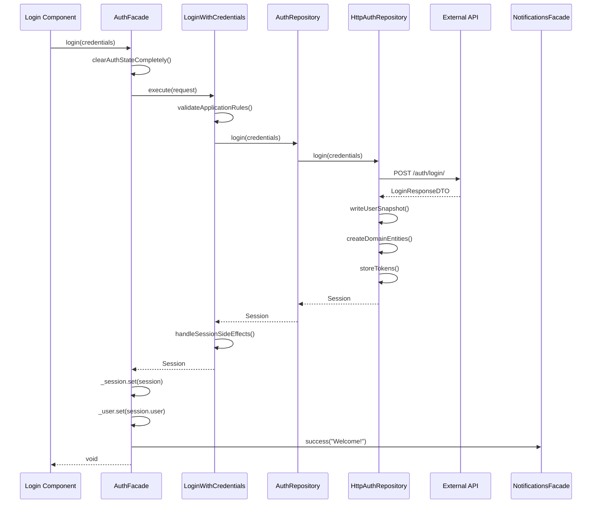
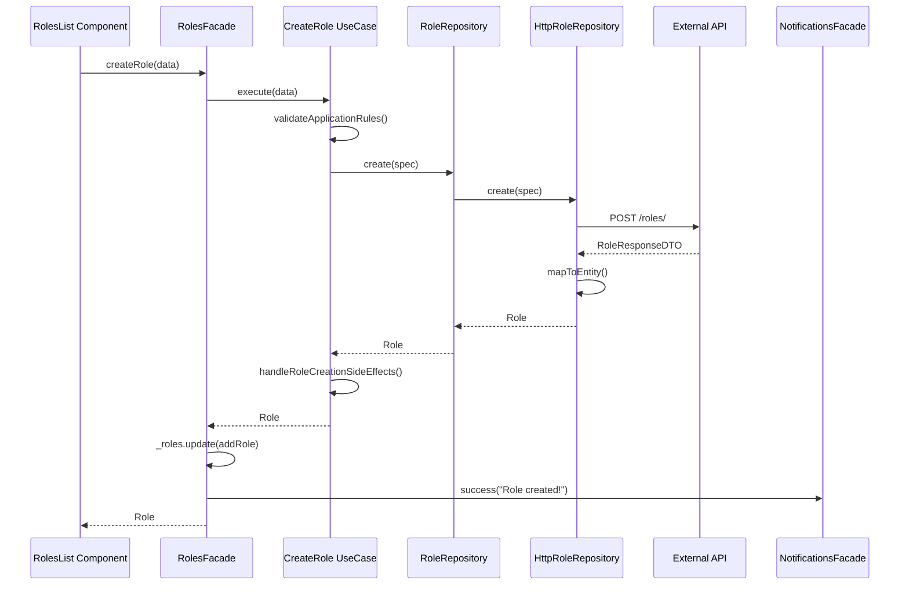

# Project Workflow Analysis Blueprint

**Document Version:** 1.0  
**Generated:** August 2025  
**Project:** MAD-AI (Angular + Clean Architecture + DDD)  
**Purpose:** Comprehensive end-to-end workflow documentation serving as implementation templates

---

## Table of Contents

1. [Executive Summary](#executive-summary)
2. [Technology Stack Detection](#technology-stack-detection)
3. [Workflow 1: User Authentication (Login)](#workflow-1-user-authentication-login)
4. [Workflow 2: Role Management (CRUD)](#workflow-2-role-management-crud)
5. [Workflow 3: User Management (CRUD)](#workflow-3-user-management-crud)
6. [Workflow 4: Notification System](#workflow-4-notification-system)
7. [Workflow 5: Dashboard Navigation & State](#workflow-5-dashboard-navigation--state)
8. [Sequence Diagrams](#sequence-diagrams)
9. [Testing Patterns](#testing-patterns)
10. [Implementation Templates](#implementation-templates)
11. [Common Pitfalls & Best Practices](#common-pitfalls--best-practices)

---

## Executive Summary

This blueprint documents 5 representative end-to-end workflows in the MAD-AI Angular application, following Clean Architecture with Domain-Driven Design principles. Each workflow provides implementation-ready templates covering entry points, service orchestration, data mapping, error handling, and testing approaches.

**Key Findings:**
- **Architecture**: Clean Architecture + DDD with clear layer separation
- **Technology**: Angular 20.1.6 + TypeScript 5.8.2 + TailwindCSS 4.1.11
- **State Management**: Angular Signals with reactive facades
- **Pattern**: Frontend → Facade → Use Case → Repository → HTTP API

---

## Technology Stack Detection

### Primary Technologies
- **Frontend Framework**: Angular 20.1.6 with standalone components
- **Language**: TypeScript 5.8.2 with strict configuration
- **State Management**: Angular Signals for reactive programming
- **HTTP Client**: Angular HttpClient for API communication
- **UI Framework**: TailwindCSS 4.1.11 with custom component system
- **Testing**: Karma + Jasmine for unit tests
- **Build System**: Angular CLI with Vite integration

### Architecture Pattern
- **Clean Architecture**: Clear separation between presentation, application, domain, and infrastructure layers
- **Domain-Driven Design**: Rich domain entities with business logic
- **Dependency Injection**: Angular DI container with custom tokens
- **Repository Pattern**: Abstract data access through domain contracts

### Entry Point Characteristics
- **Primary Entry Point**: Frontend components initiating API calls
- **State Management**: Reactive facades orchestrating use cases
- **Navigation**: Angular Router with guards and resolvers
- **Forms**: Reactive forms with custom validation

### Persistence Mechanisms
- **Primary**: External REST API via HttpClient
- **Secondary**: Browser localStorage for tokens and user data
- **Caching**: In-memory state management via signals
- **Error Handling**: Centralized error transformation and logging

---

## Workflow 1: User Authentication (Login)

### Overview
**Purpose**: Complete user authentication flow from login form submission to session establishment  
**Business Value**: Secure user access with comprehensive error handling and state management  
**Trigger**: User submits login form credentials  

### Files Involved
```
src/app/presentation/features/auth/pages/login.page.ts
src/app/application/facades/auth.facade.ts
src/app/application/use-cases/auth/login.usecase.ts
src/app/domain/repositories/business/auth.repository.ts
src/app/infrastructure/repositories/http-auth.repository.ts
src/app/domain/entities/user.entity.ts
src/app/domain/entities/session.entity.ts
```

### Entry Point Implementation

**Login Component (Presentation Layer)**
```typescript
@Component({
  selector: 'app-login',
  templateUrl: './login.html',
  styleUrl: './login.css',
  changeDetection: ChangeDetectionStrategy.OnPush,
  imports: [LoginForm]
})
export class Login implements OnInit {
  auth = inject(AuthFacade);
  
  ngOnInit(): void {
    this.auth.clearAuthStateCompletely();
  }
  
  async onLogin(credentials: LoginRequest): Promise<void> {
    await this.auth.login(credentials);
  }
}
```

### Service Layer Implementation

**AuthFacade (Application Layer)**
```typescript
@Injectable({ providedIn: 'root' })
export class AuthFacade {
  private readonly loginUC = inject(LoginWithCredentials);
  private readonly notifications = inject(NotificationsFacade);
  private readonly errorTransformer = inject(ApplicationErrorTransformer);
  
  private readonly _loading = signal(false);
  private readonly _user = signal<User | null>(null);
  private readonly _session = signal<Session | null>(null);
  private readonly _authError = signal<string | null>(null);
  
  readonly user = computed(() => this._user());
  readonly session = computed(() => this._session());
  readonly loading = computed(() => this._loading());
  readonly error = computed(() => this._authError());
  
  async login(request: LoginRequest, opts?: FacadeOpts): Promise<void> {
    if (!opts?.skipLoading) {
      this._loading.set(true);
    }
    
    this.clearAuthStateCompletely();
    
    try {
      const session = await this.loginUC.execute(request);
      
      this._session.set(session);
      this._user.set(session.user);
      
      await this.notifications.success(
        'Welcome back!',
        `Hello ${session.user.firstName}, you've successfully logged in.`
      );
    } catch (error: any) {
      const errorMessage = this.errorTransformer.transformError(error as Error, {
        feature: 'auth',
        operation: 'login',
      });
      
      this._authError.set(errorMessage);
      this._session.set(null);
      this._user.set(null);
    } finally {
      if (!opts?.skipLoading) {
        this._loading.set(false);
      }
    }
  }
}
```

**LoginWithCredentials Use Case (Application Layer)**
```typescript
@Injectable({ providedIn: 'root' })
export class LoginWithCredentials {
  private readonly authRepo = inject<AuthRepository>(AUTH_REPOSITORY);
  private readonly sessionStore = inject<SessionStorePort>(SESSION_STORE_PORT);
  private readonly clock = inject<ClockPort>(CLOCK_PORT);
  private readonly eventProcessor = inject(DomainEventProcessor);
  
  async execute(request: LoginRequest): Promise<Session> {
    try {
      // 1. Validate application rules
      await this.validateApplicationRules(request);
      
      // 2. Execute authentication through domain repository
      const session = await this.authRepo.login(request);
      
      // 3. Handle side effects - persist session state
      await this.handleSessionSideEffects(session, request);
      
      return session;
    } catch (error) {
      // Re-throw the original error - let facade handle transformation
      throw error;
    }
  }
  
  private async validateApplicationRules(request: LoginRequest): Promise<void> {
    const currentTime = new Date(this.clock.nowEpochSeconds() * 1000);
    
    // Check maintenance mode
    if (await this.checkMaintenanceMode(currentTime)) {
      throw new ApplicationError(
        'login',
        'MAINTENANCE_MODE',
        'System is currently under maintenance. Please try again later.'
      );
    }
  }
  
  private async handleSessionSideEffects(session: Session, request: LoginRequest): Promise<void> {
    // Process domain events from the session entity
    await this.eventProcessor.processEntityEvents(session);
    
    // Log successful login for security auditing
    console.log(`User logged in: ${session.user.email} at ${new Date().toISOString()}`);
  }
}
```

### Data Access Implementation

**AuthRepository Interface (Domain Layer)**
```typescript
export interface AuthRepository {
  /**
   * Authenticates a user with provided credentials.
   * @param creds - User credentials including identifier and password
   * @returns Promise resolving to an authenticated Session entity
   * @throws {UnauthorizedError} When credentials are invalid
   * @throws {AccountLockedError} When account is temporarily locked
   * @throws {EmailNotConfirmedError} When email verification is required
   */
  login(creds: CredentialsContract): Promise<Session>;
  
  me(): Promise<User>;
  refresh(): Promise<Session>;
  logout(): Promise<void>;
}
```

**HttpAuthRepository Implementation (Infrastructure Layer)**
```typescript
@Injectable()
export class HttpAuthRepository implements AuthRepository {
  private http = inject(HttpClient);
  private tokenStore = inject<TokenStorePort>(TOKEN_STORE_PORT);
  private userStore = inject<AuthUserStorePort>(AUTH_USER_STORE_PORT);
  private errorMapper = inject(InfraErrorToDomainMapper);
  
  async login(creds: CredentialsContract): Promise<Session> {
    try {
      const body: LoginRequestDTO = {
        identifier: creds.identifier.value,
        password: creds.password,
        remember_me: !!creds.rememberMe,
      };
      
      const dto = await firstValueFrom(
        this.http.post<LoginResponseDTO>(`${API}/login/`, body)
      );
      
      // Store user snapshot
      this.writeUserSnapshotFromLogin(dto.user);
      
      // Create domain entities
      const user = AuthMapper.loginUserToEntity(dto.user);
      const tokens = AuthMapper.tokensFromLogin(dto, this.clock.nowEpochSeconds());
      
      // Store tokens locally
      this.setLocalTokens({
        accessToken: tokens.accessToken,
        accessExp: tokens.accessExp,
        refreshToken: tokens.refreshToken,
      });
      
      // Create session
      const session = AuthMapper.toSession({
        accessToken: tokens.accessToken,
        refreshToken: tokens.refreshToken,
        accessExpEpochSeconds: tokens.accessExp,
        user,
      });
      
      return session;
    } catch (infraError: unknown) {
      const domainError = this.errorMapper.mapError(infraError as InfraError, {
        operation: 'LOGIN',
        entityType: 'User',
        field: 'credentials',
      });
      throw domainError;
    }
  }
}
```

### Error Handling Patterns

**Application Error Transformer**
```typescript
@Injectable({ providedIn: 'root' })
export class ApplicationErrorTransformer {
  transformError(
    error: Error,
    context?: { feature?: string; operation?: string }
  ): string {
    if (error instanceof UnauthorizedError) {
      return 'Invalid email or password. Please check your credentials.';
    }
    
    if (error instanceof AccountLockedError) {
      return 'Account temporarily locked due to multiple failed attempts.';
    }
    
    if (error instanceof EmailNotConfirmedError) {
      return 'Please confirm your email address before logging in.';
    }
    
    if (error instanceof NetworkError) {
      return 'Connection failed. Please check your internet connection.';
    }
    
    return 'An unexpected error occurred. Please try again.';
  }
}
```

---

## Workflow 2: Role Management (CRUD)

### Overview
**Purpose**: Complete role lifecycle management with RBAC operations  
**Business Value**: Secure role-based access control with comprehensive validation  
**Triggers**: Role creation, modification, deletion, assignment operations  

### Files Involved
```
src/app/presentation/features/roles/pages/roles-list/roles-list.ts
src/app/application/facades/roles.facade.ts
src/app/application/use-cases/roles/create-role.usecase.ts
src/app/application/use-cases/roles/update-role.usecase.ts
src/app/application/use-cases/roles/delete-role.usecase.ts
src/app/domain/repositories/business/role.repository.ts
src/app/infrastructure/repositories/http-role.repository.ts
src/app/domain/entities/role.entity.ts
```

### Entry Point Implementation

**RolesList Component**
```typescript
@Component({
  selector: 'app-roles-list',
  standalone: true,
  imports: [CommonModule, Icon, RoleCard, RoleTable, PageHeader, ErrorDisplay],
  templateUrl: './roles-list.html',
  styleUrl: './roles-list.css',
  changeDetection: ChangeDetectionStrategy.OnPush,
})
export class RolesList {
  protected facade = inject(RolesFacade);
  
  // Reactive state from facade
  roles = this.facade.roles;
  loading = this.facade.loading;
  error = this.facade.error;
  
  async ngOnInit(): Promise<void> {
    await this.facade.refresh();
  }
  
  async onCreateRole(data: CreateRoleContract): Promise<void> {
    await this.facade.createRole(data);
  }
  
  async onUpdateRole(id: number, data: UpdateRoleContract): Promise<void> {
    await this.facade.updateRole(id, data);
  }
  
  async onDeleteRole(id: number): Promise<void> {
    await this.facade.deleteRole(id);
  }
}
```

### Service Layer Implementation

**RolesFacade**
```typescript
@Injectable({ providedIn: 'root' })
export class RolesFacade {
  // Use Case Dependencies
  private readonly listRolesUC = inject(ListRoles);
  private readonly createRoleUC = inject(CreateRole);
  private readonly updateRoleUC = inject(UpdateRole);
  private readonly deleteRoleUC = inject(DeleteRole);
  
  // Cross-facade Dependencies
  private readonly notifications = inject(NotificationsFacade);
  private readonly errorTransformer = inject(ApplicationErrorTransformer);
  
  // Reactive State
  private readonly _loading = signal(false);
  private readonly _error = signal<string | null>(null);
  private readonly _roles = signal<RoleModel[]>([]);
  
  readonly loading = computed(() => this._loading());
  readonly error = computed(() => this._error());
  readonly roles = computed(() => this._roles());
  
  async createRole(roleData: CreateRoleContract): Promise<Role> {
    this._loading.set(true);
    this._error.set(null);
    
    try {
      const entity = await this.createRoleUC.execute(roleData);
      
      // Add to roles list
      const roleModel = RoleViewMapper.toModel(entity);
      this._roles.update((roles) => [roleModel, ...roles]);
      
      // Send success notification
      await this.notifications.success(
        'Role created successfully!',
        `Role "${entity.name}" has been created with access level ${entity.accessLevel}.`
      );
      
      return entity;
    } catch (error: any) {
      const errorMessage = this.errorTransformer.transformError(error as Error);
      this._error.set(errorMessage);
      throw error;
    } finally {
      this._loading.set(false);
    }
  }
}
```

### Domain Entity

**Role Entity**
```typescript
export class Role {
  constructor(
    public readonly id: number,
    public readonly name: string,
    public readonly accessLevel: number,
    public readonly description: string | null,
    public readonly isActive: boolean,
    public readonly canLeadProjects: boolean,
    public readonly isUniquePerTeam: boolean,
    public readonly userCount: number,
    public readonly createdAt: Date,
    public readonly updatedAt: Date | null
  ) {}
  
  static create(params: {
    id: number;
    name: RoleName;
    accessLevel: AccessLevel;
    isActive?: boolean;
    description?: string | null;
    userCount?: number;
  }): Role {
    return new Role(
      params.id,
      params.name.value,
      params.accessLevel.value,
      params.description || null,
      params.isActive ?? true,
      false, // Default values
      false,
      params.userCount || 0,
      new Date(),
      null
    );
  }
  
  /**
   * Business rule: Check if role can be assigned to users
   */
  canBeAssigned(): boolean {
    return this.isActive && this.accessLevel > 0;
  }
  
  /**
   * Business rule: Check if role has administrative privileges
   */
  hasAdminPrivileges(): boolean {
    return this.isAdministrator() && this.isActive;
  }
  
  /**
   * Business rule: Determine if role is administrator level
   */
  isAdministrator(): boolean {
    return this.accessLevel >= 90;
  }
}
```

---

## Workflow 3: User Management (CRUD)

### Overview
**Purpose**: Complete user lifecycle management with role assignments  
**Business Value**: User administration with comprehensive validation and audit logging  
**Triggers**: User creation, profile updates, role changes, deactivation  

### Files Involved
```
src/app/presentation/features/users/pages/users-list/users-list.ts
src/app/application/facades/users.facade.ts
src/app/application/use-cases/users/create-user.usecase.ts
src/app/application/use-cases/users/update-user.usecase.ts
src/app/domain/repositories/business/user.repository.ts
src/app/infrastructure/repositories/http-user.repository.ts
src/app/domain/entities/user.entity.ts
```

### Service Layer Implementation

**UsersFacade**
```typescript
@Injectable({ providedIn: 'root' })
export class UsersFacade {
  // Use Case Dependencies
  private readonly listUsersUC = inject(ListUsers);
  private readonly createUserUC = inject(CreateUser);
  private readonly updateUserUC = inject(UpdateUser);
  private readonly deleteUserUC = inject(DeleteUser);
  
  // Reactive State
  private readonly _loading = signal(false);
  private readonly _users = signal<User[]>([]);
  private readonly _selectedUser = signal<User | null>(null);
  private readonly _error = signal<string | null>(null);
  
  readonly users = computed(() => this._users());
  readonly selectedUser = computed(() => this._selectedUser());
  readonly loading = computed(() => this._loading());
  readonly error = computed(() => this._error());
  
  async updateUser(
    id: number,
    userData: UpdateUserRequest,
    opts?: FacadeOpts
  ): Promise<User> {
    if (!opts?.skipLoading) this._loading.set(true);
    this._error.set(null);
    
    try {
      const updatedUser = await this.updateUserUC.execute(id, {
        firstName: userData.firstName,
        lastName: userData.lastName,
        email: userData.email,
        roleId: userData.roleId,
        isActive: userData.isActive,
      });
      
      // Update users list
      this._users.update((users) =>
        users.map((user) => (user.id === id ? updatedUser : user))
      );
      
      // Update selected user if it's the one being updated
      if (this._selectedUser()?.id === id) {
        this._selectedUser.set(updatedUser);
      }
      
      await this.notifications.success(
        'User updated successfully!',
        `User ${updatedUser.firstName} ${updatedUser.lastName} has been updated.`
      );
      
      return updatedUser;
    } catch (error: any) {
      const errorMessage = this.errorTransformer.transformError(error as Error);
      this._error.set(errorMessage);
      throw error;
    } finally {
      if (!opts?.skipLoading) this._loading.set(false);
    }
  }
}
```

### Use Case Implementation

**UpdateUser Use Case**
```typescript
@Injectable({ providedIn: 'root' })
export class UpdateUser {
  private readonly userRepo = inject<UserRepository>(USER_REPOSITORY);
  private readonly clock = inject<ClockPort>(CLOCK_PORT);
  private readonly eventProcessor = inject(DomainEventProcessor);
  private readonly errorTransformer = inject(ApplicationErrorTransformer);
  
  async execute(
    userId: number,
    patch: UpdateUserPatchContract,
    requesterId?: number
  ): Promise<User> {
    try {
      // Step 1: Validate application rules
      this.validateApplicationRules(userId, patch);
      
      // Step 2: Delegate to domain repository
      const updatedUser = await this.userRepo.update(userId, patch);
      
      // Step 3: Handle side effects
      await this.handleUserUpdateSideEffects(updatedUser, patch, requesterId);
      
      return updatedUser;
    } catch (error: unknown) {
      throw new ApplicationError(
        'update_user',
        this.errorTransformer.transformError(error),
        'USER_UPDATE_FAILED'
      );
    }
  }
  
  private validateApplicationRules(
    userId: number,
    patch: UpdateUserPatchContract
  ): void {
    if (!userId || userId <= 0) {
      throw new ApplicationError(
        'update_user',
        'INVALID_USER_ID',
        'Valid user ID is required for update operation'
      );
    }
    
    if (!patch || Object.keys(patch).length === 0) {
      throw new ApplicationError(
        'update_user',
        'NO_UPDATE_DATA',
        'At least one field must be provided for update'
      );
    }
  }
  
  private async handleUserUpdateSideEffects(
    updatedUser: User,
    patch: UpdateUserPatchContract,
    requesterId?: number
  ): Promise<void> {
    // Process domain events from the updated user entity
    await this.eventProcessor.processEntityEvents(updatedUser);
    
    const timestamp = new Date(this.clock.nowEpochSeconds() * 1000);
    const changedFields = Object.keys(patch);
    
    // Log user update for audit trail
    console.log('[User Update] User successfully updated', {
      timestamp: timestamp.toISOString(),
      updatedUserId: updatedUser.id,
      changedFields,
      requesterId: requesterId || 'system',
      action: 'update_user',
      status: 'success',
    });
  }
}
```

---

## Workflow 4: Notification System

### Overview
**Purpose**: Centralized notification system with toast UI and action handling  
**Business Value**: User feedback and system communication with rich interactions  
**Triggers**: System events, user actions, error conditions, success confirmations  

### Files Involved
```
src/app/application/facades/notifications.facade.ts
src/app/application/use-cases/notifications/notify.usecase.ts
src/app/shared/components/toast/toast-container/toast-container.ts
src/app/shared/components/toast/toast-item/toast-item.ts
src/app/infrastructure/services/notification-gateway.service.ts
```

### Service Layer Implementation

**NotificationsFacade**
```typescript
@Injectable({ providedIn: 'root' })
export class NotificationsFacade {
  // Use Case Dependencies
  private readonly notifyUC = inject(Notify);
  private readonly dismissUC = inject(DismissNotification);
  private readonly clearUC = inject(ClearNotifications);
  
  // Private Reactive State
  private readonly _notifications = signal<Notification[]>([]);
  private readonly _loading = signal(false);
  private readonly _notificationError = signal<string | null>(null);
  private readonly _unreadCount = signal(0);
  
  // Public Reactive State
  readonly notifications = computed(() => this._notifications());
  readonly loading = computed(() => this._loading());
  readonly error = computed(() => this._notificationError());
  readonly unreadCount = computed(() => this._unreadCount());
  readonly hasNotifications = computed(() => this._notifications().length > 0);
  
  async notify(request: NotifyRequest, opts?: FacadeOpts): Promise<NotifyResult> {
    if (!opts?.skipLoading) this._loading.set(true);
    this._notificationError.set(null);
    
    try {
      const notificationId = await this.notifyUC.execute({
        type: request.type,
        message: request.message,
        title: request.description,
        userId: request.userId?.toString(),
        duration: request.duration,
        metadata: request.metadata,
      });
      
      const notification = this._notifications().find((n) => n.id === notificationId);
      
      if (notification) {
        this.emitEvent('notification-created', notification);
        return { notification, success: true };
      } else {
        throw new Error('Failed to retrieve created notification');
      }
    } catch (error: any) {
      const errorMessage = error?.message ?? 'Failed to create notification';
      this._notificationError.set(errorMessage);
      throw error;
    } finally {
      if (!opts?.skipLoading) this._loading.set(false);
    }
  }
  
  // Convenience methods
  async success(message: string, description?: string): Promise<NotifyResult> {
    return this.notify({
      type: 'success',
      message,
      description,
      duration: 5000,
    });
  }
  
  async error(message: string, description?: string): Promise<NotifyResult> {
    return this.notify({
      type: 'error',
      message,
      description,
      // No duration for errors - require manual dismissal
    });
  }
  
  async warning(message: string, description?: string): Promise<NotifyResult> {
    return this.notify({
      type: 'warning',
      message,
      description,
      duration: 8000,
    });
  }
  
  async info(message: string, description?: string): Promise<NotifyResult> {
    return this.notify({
      type: 'info',
      message,
      description,
      duration: 5000,
    });
  }
}
```

### UI Component Implementation

**Toast Container Component**
```typescript
@Component({
  selector: 'app-toast-container',
  standalone: true,
  imports: [CommonModule, ToastItem],
  templateUrl: './toast-container.html',
  styleUrls: ['./toast-container.css'],
  changeDetection: ChangeDetectionStrategy.OnPush,
})
export class ToastContainer {
  private facade = inject(NotificationsFacade);
  private cfg = inject<NotificationConfig>(NOTIFICATION_CONFIG);
  
  readonly NotificationType = {
    SUCCESS: 'success' as const,
    ERROR: 'error' as const,
    WARNING: 'warning' as const,
    INFO: 'info' as const,
  };
  
  items = this.facade.notifications;
  
  cap = () =>
    typeof window !== 'undefined' && window.matchMedia?.('(max-width: 640px)').matches
      ? this.cfg.maxVisibleMobile
      : this.cfg.maxVisibleDesktop;
  
  onItemDismiss(notificationId: string): void {
    this.facade.dismiss({ notificationId });
  }
  
  onItemAction(notification: Notification, actionId: string): void {
    // Handle notification actions
    const action = notification.actions?.find(a => a.id === actionId);
    if (action) {
      action.handler();
    }
  }
}
```

---

## Workflow 5: Dashboard Navigation & State

### Overview
**Purpose**: Application navigation, layout management, and UI state coordination  
**Business Value**: Seamless user experience with responsive design and state persistence  
**Triggers**: Route changes, user interactions, window resize, authentication state changes  

### Files Involved
```
src/app/presentation/features/dashboard/dashboard.ts
src/app/presentation/navigation/navigation.service.ts
src/app/core/cross-cutting/ui-state/layout.service.ts
src/app/core/cross-cutting/ui-state/breadcrumb.service.ts
src/app/presentation/shell/nav-rail/nav-rail.ts
```

### Entry Point Implementation

**Dashboard Component**
```typescript
@Component({
  selector: 'app-dashboard',
  templateUrl: './dashboard.html',
  styleUrl: './dashboard.css',
  changeDetection: ChangeDetectionStrategy.OnPush,
  imports: [Button, Icon],
})
export class Dashboard {
  readonly User: User | null;
  readonly username: string | undefined;
  protected readonly titlePage = 'Dashboard';
  
  constructor(
    private titleService: TitleService,
    private breadcrumbService: BreadcrumbService,
    public authFacade: AuthFacade,
    private router: Router
  ) {
    this.User = this.authFacade.user();
    this.username = this.User?.username;
  }
  
  async ngOnInit(): Promise<void> {
    this.titleService.setTitle(this.titlePage);
    this.breadcrumbService.setBreadcrumbs([
      { label: this.titlePage, icon: 'user' }
    ]);
    await this.authFacade.refreshProfile();
  }
  
  async logout() {
    await this.authFacade.logout();
    await this.router.navigateByUrl('/auth/login');
  }
  
  getGreeting(): string {
    const hour = new Date().getHours();
    if (hour < 12) return 'Buenos días';
    if (hour < 18) return 'Buenas tardes';
    return 'Buenas noches';
  }
}
```

### State Management Services

**NavigationService**
```typescript
@Injectable({ providedIn: 'root' })
export class NavigationService {
  private readonly router = inject(Router);
  private readonly authFacade = inject(AuthFacade);
  
  private readonly _currentPath = signal<string>('/');
  
  readonly currentPath = computed(() => this._currentPath());
  
  // Filter sections based on user roles
  readonly accessibleSections = computed(() => {
    const user = this.authFacade.user();
    
    if (!user) {
      return NAV_SECTIONS.map(section => ({
        ...section,
        items: section.items.filter(item => 
          !item.requireRoles || item.requireRoles.length === 0
        )
      })).filter(section => section.items.length > 0);
    }
    
    const userRoles = [user.role.name];
    const isAdmin = user.isAdministrator();
    
    return NAV_SECTIONS.map(section => ({
      ...section,
      items: section.items.filter(item => 
        !item.requireRoles || 
        item.requireRoles.length === 0 || 
        isAdmin ||
        item.requireRoles.some(role => userRoles.includes(role))
      )
    })).filter(section => section.items.length > 0);
  });
  
  constructor() {
    this.initializeRouter();
  }
  
  private initializeRouter(): void {
    this._currentPath.set(this.router.url);
    
    this.router.events
      .pipe(filter((event): event is NavigationEnd => event instanceof NavigationEnd))
      .subscribe((event: NavigationEnd) => {
        this._currentPath.set(event.url);
      });
  }
}
```

**LayoutService**
```typescript
@Injectable({ providedIn: 'root' })
export class LayoutService {
  private document = inject(DOCUMENT);
  
  // Private signals
  private _sidebarCollapsed = signal(false);
  private _mobileDrawerOpen = signal(false);
  private _hoveredItemId = signal<string | null>(null);
  private _windowWidth = signal(typeof window !== 'undefined' ? window.innerWidth : 1024);
  
  // Public computed signals
  readonly sidebarCollapsed = computed(() => this._sidebarCollapsed());
  readonly mobileDrawerOpen = computed(() => this._mobileDrawerOpen());
  readonly hoveredItemId = computed(() => this._hoveredItemId());
  readonly isMobile = computed(() => this._windowWidth() < 768);
  
  constructor() {
    this.initializeFromStorage();
    
    if (typeof window !== 'undefined') {
      this.setupWindowResize();
    }
    
    // Persist sidebar state
    effect(() => {
      if (typeof window !== 'undefined') {
        const collapsed = this._sidebarCollapsed();
        localStorage.setItem(LAYOUT_STORAGE_KEY, JSON.stringify(collapsed));
      }
    });
    
    // Auto-close mobile drawer when switching to desktop
    effect(() => {
      if (!this.isMobile() && this._mobileDrawerOpen()) {
        this._mobileDrawerOpen.set(false);
      }
    });
  }
  
  toggleSidebarCollapsed(): void {
    this._sidebarCollapsed.update((collapsed) => !collapsed);
  }
  
  onNavigate(): void {
    if (this.isMobile()) {
      this.closeMobileDrawer();
    }
    this.setHoveredItem(null);
  }
}
```

---

## Sequence Diagrams

### User Authentication Flow


### Role Management Flow


---

## Testing Patterns

### Unit Testing Facades

**AuthFacade Test Pattern**
```typescript
describe('AuthFacade', () => {
  let facade: AuthFacade;
  let mockLoginUC: jasmine.SpyObj<LoginWithCredentials>;
  let mockNotifications: jasmine.SpyObj<NotificationsFacade>;
  
  beforeEach(() => {
    const loginSpy = jasmine.createSpyObj('LoginWithCredentials', ['execute']);
    const notificationsSpy = jasmine.createSpyObj('NotificationsFacade', ['success']);
    
    TestBed.configureTestingModule({
      providers: [
        AuthFacade,
        { provide: LoginWithCredentials, useValue: loginSpy },
        { provide: NotificationsFacade, useValue: notificationsSpy },
      ],
    });
    
    facade = TestBed.inject(AuthFacade);
    mockLoginUC = TestBed.inject(LoginWithCredentials) as jasmine.SpyObj<LoginWithCredentials>;
    mockNotifications = TestBed.inject(NotificationsFacade) as jasmine.SpyObj<NotificationsFacade>;
  });
  
  it('should login successfully and update state', async () => {
    const mockSession = createMockSession();
    mockLoginUC.execute.and.returnValue(Promise.resolve(mockSession));
    
    await facade.login({ identifier: 'test@test.com', password: 'password' });
    
    expect(facade.session()).toEqual(mockSession);
    expect(facade.user()).toEqual(mockSession.user);
    expect(mockNotifications.success).toHaveBeenCalled();
  });
  
  it('should handle login errors and update error state', async () => {
    const error = new UnauthorizedError('Invalid credentials');
    mockLoginUC.execute.and.returnValue(Promise.reject(error));
    
    await facade.login({ identifier: 'test@test.com', password: 'wrong' });
    
    expect(facade.error()).toBeTruthy();
    expect(facade.session()).toBeNull();
    expect(facade.user()).toBeNull();
  });
});
```

### Integration Testing Use Cases

**Use Case Integration Test Pattern**
```typescript
describe('LoginWithCredentials Integration', () => {
  let useCase: LoginWithCredentials;
  let mockRepository: jasmine.SpyObj<AuthRepository>;
  
  beforeEach(() => {
    const repoSpy = jasmine.createSpyObj('AuthRepository', ['login']);
    
    TestBed.configureTestingModule({
      providers: [
        LoginWithCredentials,
        { provide: AUTH_REPOSITORY, useValue: repoSpy },
      ],
    });
    
    useCase = TestBed.inject(LoginWithCredentials);
    mockRepository = TestBed.inject(AUTH_REPOSITORY);
  });
  
  it('should execute login flow successfully', async () => {
    const mockSession = createMockSession();
    mockRepository.login.and.returnValue(Promise.resolve(mockSession));
    
    const result = await useCase.execute({
      identifier: { type: 'email', value: 'test@test.com' },
      password: 'password'
    });
    
    expect(result).toEqual(mockSession);
    expect(mockRepository.login).toHaveBeenCalled();
  });
});
```

### Component Testing

**Component Test Pattern**
```typescript
describe('Dashboard Component', () => {
  let component: Dashboard;
  let fixture: ComponentFixture<Dashboard>;
  let mockAuthFacade: jasmine.SpyObj<AuthFacade>;
  
  beforeEach(async () => {
    const authSpy = jasmine.createSpyObj('AuthFacade', ['refreshProfile', 'logout'], {
      user: signal(createMockUser())
    });
    
    await TestBed.configureTestingModule({
      imports: [Dashboard],
      providers: [
        { provide: AuthFacade, useValue: authSpy }
      ]
    }).compileComponents();
    
    fixture = TestBed.createComponent(Dashboard);
    component = fixture.componentInstance;
    mockAuthFacade = TestBed.inject(AuthFacade) as jasmine.SpyObj<AuthFacade>;
  });
  
  it('should initialize and refresh profile', async () => {
    await component.ngOnInit();
    
    expect(mockAuthFacade.refreshProfile).toHaveBeenCalled();
  });
});
```

---

## Implementation Templates

### Creating a New Facade

```typescript
@Injectable({ providedIn: 'root' })
export class NewFeatureFacade {
  // Use Case Dependencies
  private readonly createUC = inject(CreateNewFeature);
  private readonly updateUC = inject(UpdateNewFeature);
  private readonly deleteUC = inject(DeleteNewFeature);
  private readonly listUC = inject(ListNewFeatures);
  
  // Cross-Facade Dependencies
  private readonly notifications = inject(NotificationsFacade);
  private readonly errorTransformer = inject(ApplicationErrorTransformer);
  
  // Private State Signals
  private readonly _loading = signal(false);
  private readonly _error = signal<string | null>(null);
  private readonly _items = signal<NewFeatureModel[]>([]);
  private readonly _selectedItem = signal<NewFeatureModel | null>(null);
  
  // Public Computed Signals
  readonly loading = computed(() => this._loading());
  readonly error = computed(() => this._error());
  readonly items = computed(() => this._items());
  readonly selectedItem = computed(() => this._selectedItem());
  
  async create(data: CreateNewFeatureRequest): Promise<NewFeature> {
    this._loading.set(true);
    this._error.set(null);
    
    try {
      const entity = await this.createUC.execute(data);
      
      // Update state
      const model = NewFeatureViewMapper.toModel(entity);
      this._items.update((items) => [model, ...items]);
      
      // Show success notification
      await this.notifications.success(
        'Feature created successfully!',
        `New feature "${entity.name}" has been created.`
      );
      
      return entity;
    } catch (error: any) {
      const errorMessage = this.errorTransformer.transformError(error as Error);
      this._error.set(errorMessage);
      throw error;
    } finally {
      this._loading.set(false);
    }
  }
}
```

### Creating a New Use Case

```typescript
@Injectable({ providedIn: 'root' })
export class CreateNewFeature {
  private readonly repository = inject<NewFeatureRepository>(NEW_FEATURE_REPOSITORY);
  private readonly clock = inject<ClockPort>(CLOCK_PORT);
  private readonly eventProcessor = inject(DomainEventProcessor);
  private readonly errorTransformer = inject(ApplicationErrorTransformer);
  
  async execute(request: CreateNewFeatureRequest): Promise<NewFeature> {
    try {
      // Step 1: Validate application rules
      this.validateApplicationRules(request);
      
      // Step 2: Delegate to domain repository
      const newFeature = await this.repository.create({
        name: request.name,
        description: request.description,
        isActive: request.isActive ?? true,
      });
      
      // Step 3: Handle side effects
      await this.handleCreationSideEffects(newFeature, request);
      
      return newFeature;
    } catch (error: unknown) {
      throw new ApplicationError(
        'create_new_feature',
        this.errorTransformer.transformError(error),
        'NEW_FEATURE_CREATION_FAILED'
      );
    }
  }
  
  private validateApplicationRules(request: CreateNewFeatureRequest): void {
    if (!request.name || request.name.trim().length === 0) {
      throw new ApplicationError(
        'create_new_feature',
        'INVALID_NAME',
        'Feature name is required and cannot be empty'
      );
    }
  }
  
  private async handleCreationSideEffects(
    newFeature: NewFeature,
    request: CreateNewFeatureRequest
  ): Promise<void> {
    // Process domain events
    await this.eventProcessor.processEntityEvents(newFeature);
    
    // Audit logging
    console.log('[New Feature Created]', {
      timestamp: new Date(this.clock.nowEpochSeconds() * 1000).toISOString(),
      featureId: newFeature.id,
      featureName: newFeature.name,
      action: 'create_new_feature',
      status: 'success',
    });
  }
}
```

### Creating a New Repository Interface

```typescript
export interface NewFeatureRepository {
  /**
   * Create a new feature
   * @param spec - Feature creation specification
   * @returns Promise resolving to created feature entity
   * @throws {ValidationError} When feature data is invalid
   * @throws {ConflictError} When feature name already exists
   */
  create(spec: CreateNewFeatureContract): Promise<NewFeature>;
  
  /**
   * Get feature by ID
   * @param id - Feature identifier
   * @returns Promise resolving to feature entity
   * @throws {NotFoundError} When feature doesn't exist
   */
  getById(id: number): Promise<NewFeature>;
  
  /**
   * List features with optional filtering
   * @param filter - Optional filter criteria
   * @returns Promise resolving to array of feature entities
   */
  list(filter?: ListNewFeaturesFilterContract): Promise<NewFeature[]>;
  
  /**
   * Update existing feature
   * @param id - Feature identifier
   * @param patch - Partial update data
   * @returns Promise resolving to updated feature entity
   * @throws {NotFoundError} When feature doesn't exist
   * @throws {ValidationError} When update data is invalid
   */
  update(id: number, patch: UpdateNewFeaturePatchContract): Promise<NewFeature>;
  
  /**
   * Delete feature
   * @param id - Feature identifier
   * @returns Promise resolving when deletion is complete
   * @throws {NotFoundError} When feature doesn't exist
   * @throws {BusinessRuleError} When feature cannot be deleted
   */
  delete(id: number): Promise<void>;
}
```

### Creating HTTP Repository Implementation

```typescript
@Injectable()
export class HttpNewFeatureRepository implements NewFeatureRepository {
  private http = inject(HttpClient);
  private errorMapper = inject(InfraErrorToDomainMapper);
  
  private readonly baseUrl = `${environment.API_URL}/features`;
  
  async create(spec: CreateNewFeatureContract): Promise<NewFeature> {
    try {
      const requestDto: CreateNewFeatureRequestDTO = {
        name: spec.name,
        description: spec.description,
        is_active: spec.isActive,
      };
      
      const responseDto = await firstValueFrom(
        this.http.post<CreateNewFeatureResponseDTO>(this.baseUrl, requestDto)
          .pipe(catchError(this.handleHttpError))
      );
      
      return NewFeatureMapper.toEntityFromCreateDTO(responseDto);
    } catch (error) {
      throw this.transformError(error, 'CREATE_NEW_FEATURE');
    }
  }
  
  async getById(id: number): Promise<NewFeature> {
    try {
      const responseDto = await firstValueFrom(
        this.http.get<GetNewFeatureResponseDTO>(`${this.baseUrl}/${id}`)
          .pipe(catchError(this.handleHttpError))
      );
      
      return NewFeatureMapper.toEntityFromGetDTO(responseDto);
    } catch (error) {
      throw this.transformError(error, 'GET_NEW_FEATURE');
    }
  }
  
  private handleHttpError = (error: HttpErrorResponse) => {
    return throwError(() => ({
      status: error.status,
      message: error.message,
      body: error.error,
      headers: error.headers,
    }));
  };
  
  private transformError(error: unknown, operation: string): Error {
    const domainError = this.errorMapper.mapError(error as InfraError, {
      operation,
      entityType: 'NewFeature',
    });
    return domainError;
  }
}
```

---

## Common Pitfalls & Best Practices

### Architecture Violations to Avoid

**❌ Don't: Cross-layer imports**
```typescript
// BAD: Domain importing from infrastructure
import { HttpClient } from '@angular/common/http'; // In domain layer
```

**✅ Do: Proper layer separation**
```typescript
// GOOD: Domain depends on contracts only
import { AuthRepository } from '@domain/repositories/business/auth.repository';
```

**❌ Don't: Facade importing domain entities directly**
```typescript
// BAD: Facade working with domain entities
private _users = signal<User[]>([]);
```

**✅ Do: Use view models in presentation layer**
```typescript
// GOOD: Facade using view models
private _users = signal<UserModel[]>([]);
```

### State Management Pitfalls

**❌ Don't: Mutate signal values directly**
```typescript
// BAD: Direct mutation
this.users().push(newUser);
```

**✅ Do: Use signal update methods**
```typescript
// GOOD: Immutable updates
this._users.update(users => [...users, newUser]);
```

**❌ Don't: Forget error state cleanup**
```typescript
// BAD: Error persists across operations
async someOperation() {
  try {
    // operation
  } catch (error) {
    this._error.set(error.message);
    // Missing error cleanup in subsequent operations
  }
}
```

**✅ Do: Clear error state at operation start**
```typescript
// GOOD: Clean error state
async someOperation() {
  this._error.set(null); // Clear previous errors
  try {
    // operation
  } catch (error) {
    this._error.set(error.message);
  }
}
```

### Error Handling Best Practices

**✅ Comprehensive Error Transformation**
```typescript
@Injectable({ providedIn: 'root' })
export class ApplicationErrorTransformer {
  transformError(error: Error, context?: ErrorContext): string {
    // Domain-specific errors
    if (error instanceof UnauthorizedError) {
      return 'Invalid credentials. Please check your login information.';
    }
    
    if (error instanceof ValidationError) {
      return `Validation failed: ${error.message}`;
    }
    
    if (error instanceof NetworkError) {
      return 'Connection failed. Please check your internet connection.';
    }
    
    // Fallback for unknown errors
    console.error('[ApplicationErrorTransformer] Unexpected error:', error);
    return 'An unexpected error occurred. Please try again.';
  }
}
```

### Performance Considerations

**✅ Optimize Signal Updates**
```typescript
// Use batch updates for multiple state changes
batch(() => {
  this._loading.set(false);
  this._users.set(newUsers);
  this._error.set(null);
});
```

**✅ Implement Proper Loading States**
```typescript
async operation(skipLoading = false) {
  if (!skipLoading) this._loading.set(true);
  try {
    // operation
  } finally {
    if (!skipLoading) this._loading.set(false);
  }
}
```

### Testing Best Practices

**✅ Mock External Dependencies**
```typescript
describe('AuthFacade', () => {
  let mockLoginUC: jasmine.SpyObj<LoginWithCredentials>;
  
  beforeEach(() => {
    const loginSpy = jasmine.createSpyObj('LoginWithCredentials', ['execute']);
    
    TestBed.configureTestingModule({
      providers: [
        { provide: LoginWithCredentials, useValue: loginSpy }
      ]
    });
    
    mockLoginUC = TestBed.inject(LoginWithCredentials) as jasmine.SpyObj<LoginWithCredentials>;
  });
});
```

**✅ Test Error Scenarios**
```typescript
it('should handle network errors gracefully', async () => {
  mockLoginUC.execute.and.returnValue(Promise.reject(new NetworkError()));
  
  await facade.login(credentials);
  
  expect(facade.error()).toContain('Connection failed');
  expect(facade.user()).toBeNull();
});
```

### Extension Mechanisms

**✅ Use Dependency Injection for Extensibility**
```typescript
// Define extension points via DI tokens
export const USER_VALIDATOR = new InjectionToken<UserValidator>('UserValidator');

// Allow custom implementations
@Injectable()
export class CustomUserValidator implements UserValidator {
  validate(user: User): ValidationResult {
    // Custom validation logic
  }
}
```

**✅ Implement Observer Pattern for Cross-Cutting Concerns**
```typescript
// Event emission for cross-facade coordination
private readonly eventSubject = new Subject<DomainEvent>();
readonly events$ = this.eventSubject.asObservable();

private emitEvent(event: DomainEvent): void {
  this.eventSubject.next(event);
}
```

---

## Summary

This blueprint provides comprehensive documentation of 5 representative workflows in the MAD-AI Angular application:

1. **User Authentication**: Complete auth flow with session management
2. **Role Management**: RBAC operations with validation
3. **User Management**: User lifecycle with role assignments  
4. **Notification System**: Toast notifications with actions
5. **Dashboard Navigation**: UI state and routing management

Each workflow follows Clean Architecture principles with clear layer separation, reactive state management using Angular Signals, and comprehensive error handling. The implementation templates and best practices ensure consistency when adding new features to the system.

**Key Implementation Patterns:**
- **Facades** orchestrate use cases and manage reactive state
- **Use Cases** handle business logic orchestration and validation
- **Repositories** abstract data access through domain contracts
- **Signals** provide reactive state management throughout the application
- **Error Transformation** ensures consistent user-friendly error messages

This documentation serves as a complete reference for developers implementing similar features, maintaining architectural consistency, and following established patterns in the MAD-AI codebase.
