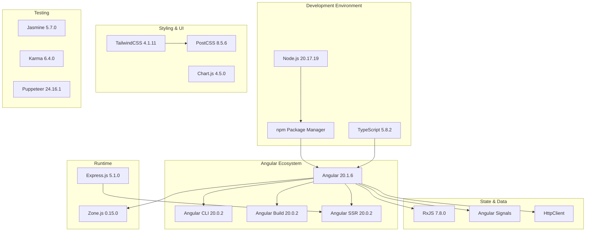
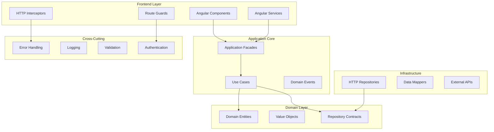
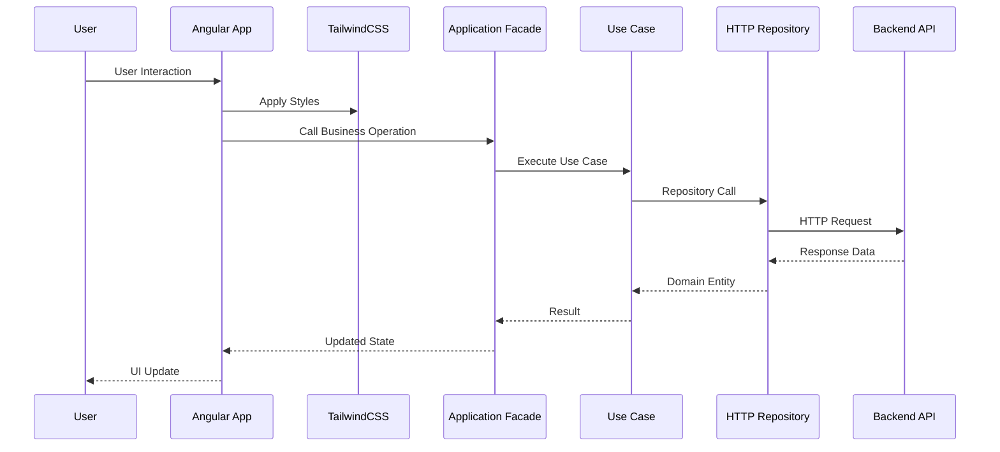
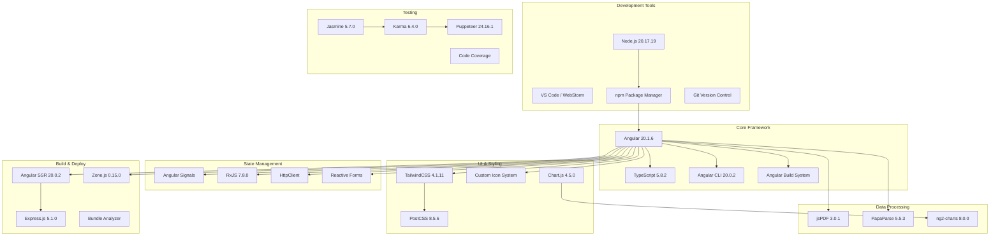
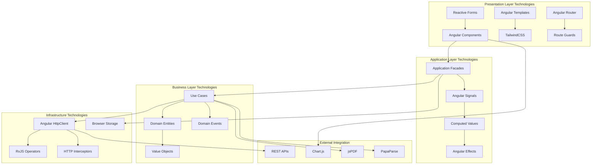
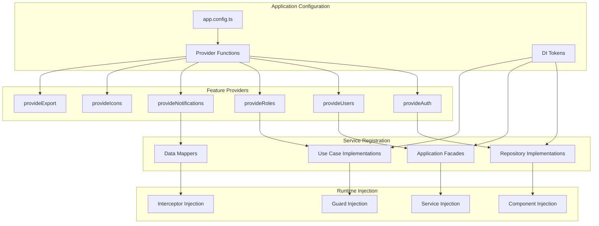

# MAD-AI Technology Stack Blueprint

> **Generated on:** August 23, 2025  
> **Version:** 1.0.0  
> **Project:** MAD-AI - Angular Enterprise Application  
> **Analysis Depth:** Implementation-Ready  
> **Configuration:** Angular + TypeScript + TailwindCSS + Clean Architecture  

## Table of Contents

- [1. Technology Identification Overview](#1-technology-identification-overview)
- [2. Core Framework Stack](#2-core-framework-stack)
- [3. Development Dependencies & Tooling](#3-development-dependencies--tooling)
- [4. Runtime Dependencies](#4-runtime-dependencies)
- [5. Implementation Patterns & Conventions](#5-implementation-patterns--conventions)
- [6. Code Organization Standards](#6-code-organization-standards)
- [7. Usage Examples & Patterns](#7-usage-examples--patterns)
- [8. Technology Stack Map](#8-technology-stack-map)
- [9. Angular-Specific Implementation Details](#9-angular-specific-implementation-details)
- [10. Blueprint for New Code Implementation](#10-blueprint-for-new-code-implementation)
- [11. Technology Relationship Diagrams](#11-technology-relationship-diagrams)
- [12. Technology Decision Context](#12-technology-decision-context)

## 1. Technology Identification Overview

### Project Metadata
- **Project Name:** mad-ai-new
- **Version:** 0.0.0 (Development)
- **Project Type:** Angular Single Page Application with SSR
- **Architecture:** Clean Architecture + Domain-Driven Design
- **Language:** TypeScript 5.8.2 with strict mode

### Technology Categories Detected

**Frontend Framework:** Angular 20.1.6 (Latest)  
**Language:** TypeScript 5.8.2 with ES2022 target  
**Styling:** TailwindCSS 4.1.11 (Latest)  
**State Management:** Angular Signals + RxJS 7.8.0  
**Build System:** Angular CLI 20.0.2 with @angular/build  
**Testing:** Jasmine + Karma with Puppeteer  
**Server:** Express.js 5.1.0 for SSR  
**Data Visualization:** Chart.js 4.5.0  
**Document Generation:** jsPDF 3.0.1  
**Data Processing:** PapaParse 5.5.3  

## 2. Core Framework Stack

### Angular Ecosystem (Version 20.1.6)

#### Core Angular Packages
```json
{
  "@angular/animations": "^20.1.6",      // Animation system
  "@angular/common": "^20.1.6",          // Common directives and pipes
  "@angular/compiler": "^20.1.6",        // Template compiler
  "@angular/core": "^20.1.6",            // Core framework
  "@angular/forms": "^20.1.6",           // Reactive and template forms
  "@angular/platform-browser": "^20.1.6", // Browser platform
  "@angular/platform-server": "^20.1.6",  // Server platform for SSR
  "@angular/router": "^20.1.6",          // Routing system
  "@angular/ssr": "^20.0.2"              // Server-side rendering
}
```

#### Angular Features Utilized
- **Standalone Components:** Modern component architecture without NgModules
- **Signal-Based State Management:** New reactive primitives
- **Server-Side Rendering (SSR):** For improved SEO and performance
- **Hydration with Event Replay:** Enhanced user experience
- **Strict Templates:** Enhanced type checking in templates
- **OnPush Change Detection:** Performance optimization strategy

#### TypeScript Configuration
```typescript
// tsconfig.json
{
  "target": "ES2022",
  "module": "preserve",
  "strict": true,
  "experimentalDecorators": true,
  "strictTemplates": true,
  "strictInjectionParameters": true
}
```

**Key TypeScript Features:**
- **Strict Mode:** Maximum type safety
- **Path Mapping:** Clean import aliases for architectural layers
- **Experimental Decorators:** Angular decorator support
- **ES2022 Target:** Modern JavaScript features

### Styling Framework

#### TailwindCSS 4.1.11 Implementation
```css
/* styles.css */
@import 'tailwindcss';
@custom-variant dark (&:where(.dark, .dark *));
```

**TailwindCSS Features:**
- **Latest Version 4.1.11:** Cutting-edge CSS framework
- **Dark Mode Support:** Custom variant implementation
- **PostCSS Integration:** @tailwindcss/postcss ^4.1.11
- **Component-Scoped Styling:** Organized in styles/ directory

**Styling Architecture:**
```
src/styles/
├── colors.css      # Color palette definitions
├── skeleton.css    # Loading skeleton styles
├── globals.css     # Global utility classes
└── components.css  # Component-specific styles
```

### State Management & Data Flow

#### Angular Signals + RxJS Hybrid
- **Angular Signals:** Primary state management for reactive UI
- **RxJS 7.8.0:** Asynchronous data streams and HTTP operations
- **Computed Values:** Derived state calculation
- **Effect System:** Side effect management

#### Reactive Programming Patterns
```typescript
// Signal-based state management
private readonly _user = signal<User | null>(null);
public readonly user = this._user.asReadonly();
public readonly isAuthenticated = computed(() => !!this._user());
```

## 3. Development Dependencies & Tooling

### Build System & CLI Tools
```json
{
  "@angular/build": "^20.0.2",           // Modern build system
  "@angular/cli": "^20.0.2",             // Command line interface
  "@angular/compiler-cli": "^20.1.6"     // AOT compiler
}
```

#### Build Configuration Features
- **Application Builder:** @angular/build:application
- **Server-Side Rendering:** Integrated SSR setup
- **Bundle Optimization:** Tree shaking and code splitting
- **Asset Processing:** SVG loader with text format
- **Bundle Budgets:** 500kB warning, 1MB error limits

### Testing Framework
```json
{
  "jasmine-core": "~5.7.0",                    // Test framework
  "karma": "~6.4.0",                          // Test runner
  "karma-chrome-launcher": "~3.2.0",          // Chrome browser launcher
  "karma-coverage": "~2.2.0",                 // Code coverage
  "karma-jasmine": "~5.1.0",                  // Jasmine integration
  "karma-jasmine-html-reporter": "~2.1.0",    // HTML reporting
  "puppeteer": "^24.16.1"                     // Headless browser
}
```

#### Testing Configuration
```javascript
// karma.conf.cjs
{
  browsers: ['ChromeHeadless'],
  customLaunchers: {
    ChromeHeadlessCI: {
      base: 'ChromeHeadless',
      flags: ['--no-sandbox', '--disable-gpu', '--disable-dev-shm-usage']
    }
  }
}
```

### Development Utilities
```json
{
  "@inquirer/editor": "^4.2.15",        // Interactive CLI editor
  "@inquirer/prompts": "^7.8.0",        // CLI prompts
  "@types/express": "^5.0.1",           // Express type definitions
  "@types/jasmine": "~5.1.0",           // Jasmine type definitions
  "@types/node": "^20.17.19",           // Node.js type definitions
  "external-editor": "^3.1.0"           // External editor integration
}
```

### Custom Development Tools

#### Icon Linting System
```javascript
// scripts/lint-icons.cjs
// Custom SVG linter and fixer for Angular 20 + Tailwind v4
// Features:
// - Validates viewBox requirements
// - Removes fixed width/height when viewBox exists
// - Normalizes fill/stroke to currentColor/none
// - Supports --fix, --dry, --backup modes
```

**Build Integration:**
```json
{
  "prebuild": "npm run lint:icons",
  "lint:icons": "node scripts/lint-icons.cjs",
  "fix:icons": "node scripts/lint-icons.cjs --fix"
}
```

## 4. Runtime Dependencies

### HTTP & Communication
```json
{
  "express": "^5.1.0",           // SSR server
  "rxjs": "~7.8.0",              // Reactive programming
  "zone.js": "~0.15.0"           // Angular change detection
}
```

### Data Visualization & Processing
```json
{
  "chart.js": "^4.5.0",          // Chart rendering
  "ng2-charts": "^8.0.0",        // Angular Chart.js integration
  "papaparse": "^5.5.3",         // CSV parsing
  "@types/papaparse": "^5.3.16"  // Type definitions
}
```

### Document Generation
```json
{
  "jspdf": "^3.0.1",             // PDF generation
  "jspdf-autotable": "^5.0.2"    // PDF table generation
}
```

### Build & Styling
```json
{
  "@tailwindcss/postcss": "^4.1.11",  // PostCSS plugin
  "postcss": "^8.5.6",                // CSS post-processor
  "tailwindcss": "^4.1.11",           // Utility-first CSS
  "tslib": "^2.3.0"                   // TypeScript runtime library
}
```

### License Information

#### MIT Licensed Dependencies
- **Angular Framework:** MIT License
- **TailwindCSS:** MIT License
- **RxJS:** Apache 2.0 License
- **Chart.js:** MIT License
- **jsPDF:** MIT License
- **Express.js:** MIT License
- **PapaParse:** MIT License

#### Development Dependencies
- **Jasmine:** MIT License
- **Karma:** MIT License
- **Puppeteer:** Apache 2.0 License
- **TypeScript:** Apache 2.0 License

## 5. Implementation Patterns & Conventions

### Naming Conventions

#### File and Folder Naming
```typescript
// Files: kebab-case with type suffixes
user.entity.ts           // Domain entities
auth.facade.ts           // Application facades
http-user.repository.ts  // Infrastructure repositories
login.page.ts            // Presentation pages
error.interceptor.ts     // Core interceptors
```

#### Class and Interface Naming
```typescript
// Classes: PascalCase
export class UserEntity { }
export class AuthFacade { }
export class HttpUserRepository { }

// Interfaces: PascalCase with descriptive names
export interface UserRepository { }
export interface AuthContract { }
export interface NotificationPort { }

// Types: PascalCase with Type suffix
export type LoginRequest = { };
export type UserUpdateRequest = { };
```

#### Variable and Method Naming
```typescript
// Variables: camelCase
private readonly _user = signal<User | null>(null);
public readonly isAuthenticated = computed(() => !!this._user());

// Methods: camelCase with descriptive verbs
async login(request: LoginRequest): Promise<void> { }
updateProfile(data: ProfileData): void { }
clearAuthStateCompletely(): void { }
```

#### Component Naming
```typescript
// Components: PascalCase without suffix
export class Login { }           // Login page
export class Dashboard { }       // Dashboard page
export class UserProfile { }     // User profile component

// Component files: kebab-case
login.ts
dashboard.ts
user-profile.ts
```

### Code Organization Patterns

#### Import Organization
```typescript
// 1. Angular core imports
import { Component, inject, ChangeDetectionStrategy } from '@angular/core';

// 2. Angular feature imports
import { FormBuilder, Validators } from '@angular/forms';

// 3. Third-party imports
import { firstValueFrom } from 'rxjs';

// 4. Application imports (by layer)
import { AuthFacade } from '@application/facades/auth.facade';
import { User } from '@domain/entities/user.entity';
import { HttpUserRepository } from '@infrastructure/repositories/http-user.repository';
import { LoginForm } from '@presentation/features/auth/forms/login-form';
```

#### Path Alias Usage
```typescript
// TypeScript path mapping for clean imports
"@/*": ["src/*"]
"@app/*": ["src/app/*"]
"@domain/*": ["src/app/domain/*"]
"@application/*": ["src/app/application/*"]
"@infrastructure/*": ["src/app/infrastructure/*"]
"@presentation/*": ["src/app/presentation/*"]
"@core/*": ["src/app/core/*"]
"@shared/*": ["src/app/shared/*"]
"@di/*": ["src/app/di/*"]
```

### Component Architecture Patterns

#### Standalone Component Pattern
```typescript
@Component({
    selector: 'app-login',
    templateUrl: './login.html',
    styleUrl: './login.css',
    changeDetection: ChangeDetectionStrategy.OnPush,
    imports: [LoginForm, ReactiveFormsModule]  // Direct imports
})
export class Login implements OnInit {
    // Implementation
}
```

#### Dependency Injection Pattern
```typescript
// Functional injection (preferred)
export class UserProfileComponent {
    private readonly usersFacade = inject(UsersFacade);
    private readonly formBuilder = inject(FormBuilder);
}

// Token-based injection for repositories
@Injectable()
export class CreateUser {
    constructor(
        @Inject(USER_REPOSITORY) private readonly userRepo: UserRepository
    ) {}
}
```

## 6. Code Organization Standards

### Architectural Layer Organization

#### Domain Layer Structure
```
src/app/domain/
├── entities/          # Business entities with behavior
│   ├── user.entity.ts
│   ├── role.entity.ts
│   └── session.entity.ts
├── value-objects/     # Immutable value objects
│   ├── email.ts
│   ├── username.ts
│   └── user-status.ts
├── contracts/         # Repository and service interfaces
│   ├── auth.contract.ts
│   └── user.contract.ts
├── events/           # Domain event definitions
├── errors/           # Domain-specific errors
├── enums/            # Domain enumerations
└── repositories/     # Repository interface definitions
```

#### Application Layer Structure
```
src/app/application/
├── facades/          # Simplified interfaces for presentation
│   ├── auth.facade.ts
│   ├── users.facade.ts
│   └── notifications.facade.ts
├── use-cases/        # Business workflow implementations
│   ├── auth/
│   ├── users/
│   └── notifications/
├── services/         # Application-level services
├── errors/          # Application error handling
└── types/           # Application-specific types
```

#### Infrastructure Layer Structure
```
src/app/infrastructure/
├── repositories/     # Repository implementations
│   ├── http-auth.repository.ts
│   ├── http-user.repository.ts
│   └── http-role.repository.ts
├── mappers/         # DTO to entity mappers
├── services/        # External service implementations
├── http/           # HTTP utilities and interceptors
├── dtos/           # Data transfer objects
└── errors/         # Infrastructure error handling
```

#### Presentation Layer Structure
```
src/app/presentation/
├── features/        # Business feature implementations
│   ├── auth/
│   ├── dashboard/
│   ├── roles/
│   └── users/
├── layouts/         # Application layouts
├── navigation/      # Navigation components
├── shell/          # Application shell
└── shared/         # Shared presentation components
```

### Dependency Injection Organization

#### Provider Configuration Structure
```
src/app/di/
├── tokens.ts              # DI token definitions
├── provide-auth.ts        # Authentication providers
├── provide-users.ts       # User management providers
├── provide-roles.ts       # Role management providers
├── provide-notifications.ts # Notification providers
├── provide-domain-events.ts # Domain event providers
├── provide-export.ts      # Export service providers
└── provide-icons.ts       # Icon system providers
```

#### Token Definition Pattern
```typescript
// tokens.ts
export const USER_REPOSITORY = new InjectionToken<UserRepository>('UserRepository');
export const AUTH_REPOSITORY = new InjectionToken<AuthRepository>('AuthRepository');
export const SESSION_STORE_PORT = new InjectionToken<SessionStorePort>('SessionStorePort');
```

#### Provider Factory Pattern
```typescript
// provide-users.ts
export function provideUsers(): Provider[] {
    return [
        { provide: USER_REPOSITORY, useClass: HttpUserRepository },
        { provide: USER_MAPPER, useClass: UserMapper },
        UsersFacade,
        CreateUser,
        UpdateUser,
        DeleteUser
    ];
}
```

## 7. Usage Examples & Patterns

### Component Implementation Examples

#### Standard Page Component
```typescript
@Component({
    selector: 'app-login',
    templateUrl: './login.html',
    styleUrl: './login.css',
    changeDetection: ChangeDetectionStrategy.OnPush,
    imports: [LoginForm]
})
export class Login implements OnInit {
    auth = inject(AuthFacade);

    ngOnInit(): void {
        // Clear any previous auth errors and loading state
        this.auth.clearAuthStateCompletely();
    }
}
```

#### Form Component Pattern
```typescript
@Component({
    selector: 'app-login-form',
    templateUrl: './login-form.html',
    styleUrl: './login-form.css',
    changeDetection: ChangeDetectionStrategy.OnPush,
    imports: [ReactiveFormsModule, NgOptimizedImage]
})
export class LoginForm {
    private readonly authFacade = inject(AuthFacade);
    private readonly formBuilder = inject(FormBuilder);

    loginForm = this.formBuilder.group({
        identifier: ['', [Validators.required]],
        password: ['', [Validators.required]],
        rememberMe: [false]
    });

    async onSubmit(): Promise<void> {
        if (this.loginForm.valid) {
            const request = this.createLoginRequest();
            await this.authFacade.login(request);
        }
    }
}
```

### Service Layer Examples

#### Facade Implementation Pattern
```typescript
@Injectable({ providedIn: 'root' })
export class AuthFacade {
    private readonly loginUseCase = inject(LoginWithCredentials);
    private readonly logoutUseCase = inject(Logout);
    private readonly profileUseCase = inject(GetProfile);
    
    // Signal-based state management
    private readonly _user = signal<User | null>(null);
    private readonly _loading = signal<boolean>(false);
    private readonly _error = signal<string | null>(null);
    
    // Read-only computed state
    public readonly user = this._user.asReadonly();
    public readonly isAuthenticated = computed(() => !!this._user());
    public readonly loading = this._loading.asReadonly();
    public readonly error = this._error.asReadonly();

    async login(request: LoginRequest): Promise<void> {
        try {
            this.setLoading(true);
            this.clearError();
            
            const session = await this.loginUseCase.execute(request);
            this.setSession(session);
            
        } catch (error) {
            this.handleError(error);
        } finally {
            this.setLoading(false);
        }
    }
}
```

#### Use Case Implementation Pattern
```typescript
@Injectable({ providedIn: 'root' })
export class LoginWithCredentials {
    private readonly authRepo = inject<AuthRepository>(AUTH_REPOSITORY);
    private readonly sessionStore = inject<SessionStorePort>(SESSION_STORE_PORT);
    private readonly clock = inject<ClockPort>(CLOCK_PORT);

    async execute(request: LoginRequest): Promise<Session> {
        try {
            // Application-level validation
            this.validateRequest(request);
            
            // Execute domain logic
            const session = await this.authRepo.login({
                identifier: request.identifier,
                password: request.password,
                rememberMe: request.rememberMe
            });
            
            // Handle session persistence
            await this.sessionStore.save(session);
            
            return session;
        } catch (error) {
            throw ApplicationError.fromDomain(error);
        }
    }
}
```

### Repository Implementation Examples

#### HTTP Repository Pattern
```typescript
@Injectable()
export class HttpUserRepository implements UserRepository {
    private readonly baseUrl = `${environment.API_URL}/users`;
    
    constructor(
        private readonly http: HttpClient,
        private readonly mapper: UserMapper
    ) {}

    async getById(id: number): Promise<User> {
        const response = await firstValueFrom(
            this.http.get<UserDTO>(`${this.baseUrl}/${id}`)
                .pipe(catchError(this.handleHttpError))
        );
        return this.mapper.toDomain(response);
    }

    async save(user: User): Promise<void> {
        const dto = this.mapper.toDTO(user);
        
        if (user.id) {
            await firstValueFrom(
                this.http.put(`${this.baseUrl}/${user.id}`, dto)
                    .pipe(catchError(this.handleHttpError))
            );
        } else {
            await firstValueFrom(
                this.http.post(this.baseUrl, dto)
                    .pipe(catchError(this.handleHttpError))
            );
        }
    }
}
```

### Domain Entity Examples

#### Rich Domain Entity Pattern
```typescript
export class User {
    private _domainEvents: DomainEvent[] = [];

    private constructor(
        public readonly id: number,
        private _username: Username,
        private _email: Email,
        private _firstName: FirstName,
        private _lastName: LastName,
        private _active: boolean,
        private _role: Role,
        public readonly createdAt?: ISODateTime
    ) {}

    static create(props: UserCreateProps): User {
        const user = new User(/* ... */);
        user.addDomainEvent(new UserCreatedEvent(user.id));
        return user;
    }

    updateProfile(firstName: FirstName, lastName: LastName): void {
        this._firstName = firstName;
        this._lastName = lastName;
        this.addDomainEvent(new UserProfileUpdatedEvent(this.id));
    }

    // Business logic methods
    activate(): void {
        if (this._active) {
            throw new DomainError('User is already active');
        }
        this._active = true;
        this.addDomainEvent(new UserActivatedEvent(this.id));
    }
}
```

### Routing Examples

#### Route Configuration Pattern
```typescript
export const routes: Routes = [
    {
        path: 'auth',
        canMatch: [guestOnly],
        loadComponent: () =>
            import('@presentation/layouts/auth-layout/auth-layout').then(m => m.AuthLayout),
        children: authRoutes
    },
    {
        path: '',
        canMatch: [authOnly, emailConfirmedOnly],
        loadComponent: () =>
            import('@presentation/layouts/main-layout/main-layout').then(m => m.MainLayout),
        children: securedRoutes
    }
];
```

#### Guard Implementation Pattern
```typescript
export const authGuard: CanActivateFn = async () => {
    const router = inject(Router);
    const authFacade = inject(AuthFacade);

    if (!authFacade.sessionRestoreAttempted()) {
        await authFacade.initializeAuth();
    }

    const isAuthenticated = authFacade.isAuthenticated();
    
    if (isAuthenticated) {
        return true;
    }

    authFacade.clearAuthStateCompletely();
    return router.parseUrl('/auth/login');
};
```

## 8. Technology Stack Map

### Core Technology Dependencies



### Integration Architecture



### Technology Interaction Flow



## 9. Angular-Specific Implementation Details

### Component Architecture Patterns

#### Standalone Component Implementation
```typescript
// Modern Angular 20 standalone component
@Component({
    selector: 'app-user-profile',
    templateUrl: './user-profile.html',
    styleUrl: './user-profile.css',
    changeDetection: ChangeDetectionStrategy.OnPush,
    imports: [
        ReactiveFormsModule,
        NgOptimizedImage,
        ProfileForm,
        LoadingSpinner
    ]
})
export class UserProfile implements OnInit {
    private readonly usersFacade = inject(UsersFacade);
    private readonly route = inject(ActivatedRoute);
    
    // Signal-based reactive state
    protected readonly user = this.usersFacade.selectedUser;
    protected readonly loading = this.usersFacade.loading;
    protected readonly error = this.usersFacade.error;
}
```

#### Signal-Based State Management
```typescript
// Facade with signal-based state
@Injectable({ providedIn: 'root' })
export class UsersFacade {
    // Private signals for internal state
    private readonly _users = signal<User[]>([]);
    private readonly _selectedUser = signal<User | null>(null);
    private readonly _loading = signal<boolean>(false);
    private readonly _error = signal<ApplicationError | null>(null);
    
    // Public read-only signals
    public readonly users = this._users.asReadonly();
    public readonly selectedUser = this._selectedUser.asReadonly();
    public readonly loading = this._loading.asReadonly();
    public readonly error = this._error.asReadonly();
    
    // Computed signals for derived state
    public readonly activeUsers = computed(() => 
        this._users().filter(user => user.active)
    );
    
    public readonly userCount = computed(() => this._users().length);
}
```

### Dependency Injection Patterns

#### Provider Configuration Strategy
```typescript
// app.config.ts - Application configuration
export const appConfig: ApplicationConfig = {
    providers: [
        // Core Angular providers
        { provide: ErrorHandler, useClass: GlobalErrorHandler },
        provideAnimations(),
        provideHttpClient(withInterceptors([
            authInterceptor, 
            httpErrorInterceptor, 
            enhancedErrorInterceptor
        ])),
        provideRouter(routes),
        provideClientHydration(withEventReplay()),
        
        // Feature providers
        provideAuth(),
        provideNotifications(),
        provideUsers(),
        provideDomainEventsForDevelopment(),
        ...provideRoles(),
        provideExportServices(),
        ...provideIcons({
            missingStrategy: 'warn',
            defaultVariant: 'outline'
        })
    ]
};
```

#### Token-Based Repository Injection
```typescript
// Token definition
export const USER_REPOSITORY = new InjectionToken<UserRepository>('UserRepository');

// Provider factory
export function provideUsers(): Provider[] {
    return [
        { provide: USER_REPOSITORY, useClass: HttpUserRepository },
        { provide: USER_MAPPER, useClass: UserMapper },
        UsersFacade,
        CreateUser,
        UpdateUser,
        DeleteUser
    ];
}

// Usage in use case
@Injectable({ providedIn: 'root' })
export class CreateUser {
    constructor(
        @Inject(USER_REPOSITORY) private readonly userRepo: UserRepository,
        @Inject(CLOCK_PORT) private readonly clock: ClockPort
    ) {}
}
```

### Reactive Programming Integration

#### RxJS + Signals Hybrid Pattern
```typescript
@Injectable({ providedIn: 'root' })
export class DataService {
    private readonly http = inject(HttpClient);
    private readonly _data = signal<any[]>([]);
    
    // RxJS for HTTP operations
    private readonly dataStream$ = this.http.get<any[]>('/api/data').pipe(
        retry(3),
        catchError(this.handleError)
    );
    
    // Signals for state management
    readonly data = this._data.asReadonly();
    
    async loadData(): Promise<void> {
        try {
            const data = await firstValueFrom(this.dataStream$);
            this._data.set(data);
        } catch (error) {
            this.handleError(error);
        }
    }
}
```

### Route Configuration Patterns

#### Lazy Loading with Guards
```typescript
export const routes: Routes = [
    {
        path: 'auth',
        canMatch: [guestOnly],
        loadComponent: () => 
            import('@presentation/layouts/auth-layout/auth-layout')
                .then(m => m.AuthLayout),
        children: [
            {
                path: 'login',
                loadComponent: () => 
                    import('@presentation/features/auth/pages/login/login')
                        .then(m => m.Login),
                title: 'Iniciar Sesión'
            }
        ]
    },
    {
        path: '',
        canMatch: [authOnly, emailConfirmedOnly],
        loadComponent: () => 
            import('@presentation/layouts/main-layout/main-layout')
                .then(m => m.MainLayout),
        children: securedRoutes
    }
];
```

#### Functional Guards Implementation
```typescript
// Authentication guard
export const authGuard: CanActivateFn = async (route, state) => {
    const router = inject(Router);
    const authFacade = inject(AuthFacade);
    
    if (!authFacade.sessionRestoreAttempted()) {
        await authFacade.initializeAuth();
    }
    
    return authFacade.isAuthenticated() || router.parseUrl('/auth/login');
};

// Role-based guard
export const roleGuard = (requiredRole: string): CanActivateFn => {
    return (route, state) => {
        const authFacade = inject(AuthFacade);
        const userRole = authFacade.user()?.role?.name;
        return userRole === requiredRole;
    };
};
```

### HTTP Interceptor Patterns

#### Authentication Interceptor
```typescript
export const authInterceptor: HttpInterceptorFn = (req, next) => {
    const authStore = inject(AUTH_USER_STORE_PORT);
    const token = authStore.getToken();
    
    if (token && !req.url.includes('/auth/')) {
        req = req.clone({
            setHeaders: {
                Authorization: `Bearer ${token}`
            }
        });
    }
    
    return next(req);
};
```

#### Error Handling Interceptor
```typescript
export const httpErrorInterceptor: HttpInterceptorFn = (req, next) => {
    const notificationsFacade = inject(NotificationsFacade);
    
    return next(req).pipe(
        catchError((error: HttpErrorResponse) => {
            if (error.status === 401) {
                // Handle unauthorized
                const authFacade = inject(AuthFacade);
                authFacade.clearAuthStateCompletely();
            } else if (error.status >= 500) {
                notificationsFacade.showError('Server error occurred');
            }
            
            return throwError(() => error);
        })
    );
};
```

## 10. Blueprint for New Code Implementation

### File and Class Templates

#### Standard Component Template
```typescript
import { ChangeDetectionStrategy, Component, inject, OnInit } from '@angular/core';
import { FormBuilder, FormGroup, Validators, ReactiveFormsModule } from '@angular/forms';
import { {EntityName}Facade } from '@application/facades/{entity-name}.facade';

@Component({
    selector: 'app-{entity-name}-{action}',
    templateUrl: './{entity-name}-{action}.html',
    styleUrl: './{entity-name}-{action}.css',
    changeDetection: ChangeDetectionStrategy.OnPush,
    imports: [ReactiveFormsModule]
})
export class {EntityName}{Action} implements OnInit {
    private readonly facade = inject({EntityName}Facade);
    private readonly formBuilder = inject(FormBuilder);
    
    form: FormGroup = this.createForm();
    
    // Reactive state from facade
    readonly data = this.facade.data;
    readonly loading = this.facade.loading;
    readonly error = this.facade.error;
    
    ngOnInit(): void {
        this.facade.clearErrors();
    }
    
    async onSubmit(): Promise<void> {
        if (this.form.valid) {
            const request = this.createRequest();
            await this.facade.{action}(request);
        }
    }
    
    private createForm(): FormGroup {
        return this.formBuilder.group({
            // Form controls with validation
        });
    }
    
    private createRequest(): {Action}{EntityName}Request {
        // Map form to request
        return {
            // Request properties
        };
    }
}
```

#### Facade Template
```typescript
import { Injectable, signal, computed, inject } from '@angular/core';
import { {EntityName}UseCases } from '../use-cases/{entity-name}';
import { ApplicationErrorTransformer } from '../errors/application-error.transformer';
import type { {EntityName} } from '@domain/entities/{entity-name}.entity';

@Injectable({ providedIn: 'root' })
export class {EntityName}Facade {
    private readonly useCases = inject({EntityName}UseCases);
    private readonly errorTransformer = inject(ApplicationErrorTransformer);
    
    // State signals
    private readonly _items = signal<{EntityName}[]>([]);
    private readonly _selectedItem = signal<{EntityName} | null>(null);
    private readonly _loading = signal<boolean>(false);
    private readonly _error = signal<string | null>(null);
    
    // Public read-only state
    readonly items = this._items.asReadonly();
    readonly selectedItem = this._selectedItem.asReadonly();
    readonly loading = this._loading.asReadonly();
    readonly error = this._error.asReadonly();
    
    // Computed state
    readonly itemCount = computed(() => this._items().length);
    readonly hasItems = computed(() => this._items().length > 0);
    
    async load{EntityName}s(): Promise<void> {
        try {
            this.setLoading(true);
            this.clearError();
            
            const items = await this.useCases.getAll.execute();
            this._items.set(items);
            
        } catch (error) {
            this.handleError(error);
        } finally {
            this.setLoading(false);
        }
    }
    
    private setLoading(loading: boolean): void {
        this._loading.set(loading);
    }
    
    private clearError(): void {
        this._error.set(null);
    }
    
    private handleError(error: unknown): void {
        const appError = this.errorTransformer.transform(error);
        this._error.set(appError.message);
    }
}
```

#### Use Case Template
```typescript
import { Injectable, Inject } from '@angular/core';
import { {ENTITY_NAME}_REPOSITORY } from '@di/tokens';
import type { {EntityName}Repository } from '@domain/repositories/{entity-name}.repository';
import type { {EntityName} } from '@domain/entities/{entity-name}.entity';
import { ApplicationError } from '@application/errors/application-error';

@Injectable({ providedIn: 'root' })
export class {Action}{EntityName} {
    constructor(
        @Inject({ENTITY_NAME}_REPOSITORY) private readonly repo: {EntityName}Repository
    ) {}
    
    async execute(request: {Action}{EntityName}Request): Promise<{EntityName}> {
        try {
            // Validate request
            this.validateRequest(request);
            
            // Execute business logic
            const result = await this.performAction(request);
            
            return result;
        } catch (error) {
            if (error instanceof DomainError) {
                throw ApplicationError.fromDomain(error);
            }
            throw new ApplicationError('Unexpected error', 'UNKNOWN_ERROR');
        }
    }
    
    private validateRequest(request: {Action}{EntityName}Request): void {
        // Application-level validation
        if (!request) {
            throw new ApplicationError('Request is required', 'VALIDATION_ERROR');
        }
    }
    
    private async performAction(request: {Action}{EntityName}Request): Promise<{EntityName}> {
        // Implementation
        return await this.repo.{action}(request);
    }
}

export interface {Action}{EntityName}Request {
    // Request properties
}
```

#### Repository Implementation Template
```typescript
import { Injectable, Inject } from '@angular/core';
import { HttpClient, HttpParams } from '@angular/common/http';
import { firstValueFrom, catchError } from 'rxjs';
import type { {EntityName}Repository } from '@domain/repositories/{entity-name}.repository';
import type { {EntityName} } from '@domain/entities/{entity-name}.entity';
import { {EntityName}Mapper } from '../mappers/{entity-name}.mapper';
import { environment } from '@env/environment';

@Injectable()
export class Http{EntityName}Repository implements {EntityName}Repository {
    private readonly baseUrl = `${environment.API_URL}/{entity-path}`;
    
    constructor(
        private readonly http: HttpClient,
        private readonly mapper: {EntityName}Mapper
    ) {}
    
    async getById(id: number): Promise<{EntityName}> {
        const response = await firstValueFrom(
            this.http.get<{EntityName}DTO>(`${this.baseUrl}/${id}`)
                .pipe(catchError(this.handleHttpError))
        );
        return this.mapper.toDomain(response);
    }
    
    async save(entity: {EntityName}): Promise<void> {
        const dto = this.mapper.toDTO(entity);
        
        if (entity.id) {
            await firstValueFrom(
                this.http.put(`${this.baseUrl}/${entity.id}`, dto)
                    .pipe(catchError(this.handleHttpError))
            );
        } else {
            await firstValueFrom(
                this.http.post(this.baseUrl, dto)
                    .pipe(catchError(this.handleHttpError))
            );
        }
    }
    
    async delete(id: number): Promise<void> {
        await firstValueFrom(
            this.http.delete(`${this.baseUrl}/${id}`)
                .pipe(catchError(this.handleHttpError))
        );
    }
    
    private handleHttpError = (error: HttpErrorResponse): Observable<never> => {
        throw new InfrastructureError(error.message, error.status);
    };
}

interface {EntityName}DTO {
    // DTO properties
}
```

### Implementation Checklist

#### New Feature Implementation Steps

**1. Domain Layer First**
- [ ] Create domain entity in `domain/entities/`
- [ ] Define value objects in `domain/value-objects/`
- [ ] Create repository contract in `domain/contracts/`
- [ ] Add domain events if needed in `domain/events/`

**2. Application Layer**
- [ ] Create use cases in `application/use-cases/{feature}/`
- [ ] Implement facade in `application/facades/`
- [ ] Define application types in `application/types/`
- [ ] Add error handling in `application/errors/`

**3. Infrastructure Layer**
- [ ] Implement repository in `infrastructure/repositories/`
- [ ] Create data mappers in `infrastructure/mappers/`
- [ ] Define DTOs in `infrastructure/dtos/`

**4. Dependency Injection**
- [ ] Define tokens in `di/tokens.ts`
- [ ] Create provider in `di/provide-{feature}.ts`
- [ ] Add to app configuration in `app.config.ts`

**5. Presentation Layer**
- [ ] Create feature directory in `presentation/features/`
- [ ] Implement pages/components
- [ ] Add routing configuration
- [ ] Create forms if needed

**6. Testing**
- [ ] Unit tests for domain entities
- [ ] Use case tests with mocks
- [ ] Component tests
- [ ] Integration tests

### Integration Points

#### Connecting with Authentication
```typescript
// Guard integration
{
    path: 'new-feature',
    canActivate: [authGuard, roleGuard('ADMIN')],
    loadComponent: () => import('./new-feature.component')
}

// Service integration
@Injectable()
export class NewFeatureService {
    private readonly authFacade = inject(AuthFacade);
    
    async performAction(): Promise<void> {
        const user = this.authFacade.user();
        if (!user) {
            throw new Error('User not authenticated');
        }
        // Implementation
    }
}
```

#### Connecting with Notifications
```typescript
@Injectable()
export class NewFeatureFacade {
    private readonly notifications = inject(NotificationsFacade);
    
    async createItem(request: CreateItemRequest): Promise<void> {
        try {
            await this.createUseCase.execute(request);
            this.notifications.showSuccess('Item created successfully');
        } catch (error) {
            this.notifications.showError('Failed to create item');
            throw error;
        }
    }
}
```

## 11. Technology Relationship Diagrams

### Complete Technology Stack Visualization



### Application Layer Technology Flow



### Dependency Injection Flow



## 12. Technology Decision Context

### Framework Selection Rationale

#### Angular 20.x Selection
**Context:** Need for enterprise-grade frontend framework with strong TypeScript support
**Decision:** Angular 20.1.6 with standalone components
**Rationale:**
- **Enterprise Readiness:** Comprehensive framework with built-in solutions
- **TypeScript Integration:** Native TypeScript support with strict typing
- **Standalone Components:** Modern architecture without NgModules overhead
- **Signal-Based State:** New reactive primitives for better performance
- **SSR Support:** Built-in server-side rendering capabilities
- **Long-term Support:** Predictable release cycle and enterprise backing

#### TailwindCSS 4.x Selection
**Context:** Need for maintainable, performant styling solution
**Decision:** TailwindCSS 4.1.11 (latest version)
**Rationale:**
- **Utility-First Approach:** Rapid development with consistent design system
- **Performance:** Optimized CSS output with unused style elimination
- **Developer Experience:** IntelliSense support and design system consistency
- **Dark Mode Support:** Built-in dark mode capabilities
- **Customization:** Extensive customization options without CSS bloat

#### TypeScript 5.8.x Selection
**Context:** Need for type safety and modern JavaScript features
**Decision:** TypeScript 5.8.2 with strict configuration
**Rationale:**
- **Type Safety:** Compile-time error detection and prevention
- **Modern Features:** Latest ECMAScript features with compatibility
- **IDE Support:** Enhanced development experience with IntelliSense
- **Refactoring Safety:** Reliable code refactoring capabilities
- **Team Productivity:** Improved code maintainability and collaboration

### Architectural Pattern Decisions

#### Clean Architecture Implementation
**Context:** Need for maintainable, testable, and scalable application structure
**Decision:** Clean Architecture with Domain-Driven Design
**Rationale:**
- **Separation of Concerns:** Clear boundaries between business and technical concerns
- **Testability:** Easy unit testing through dependency inversion
- **Framework Independence:** Business logic independent of Angular specifics
- **Scalability:** Structure supports growing complexity
- **Team Development:** Clear guidelines for feature implementation

#### Signal-Based State Management
**Context:** Need for reactive state management without external dependencies
**Decision:** Angular Signals with RxJS for async operations
**Rationale:**
- **Performance:** Fine-grained reactivity with minimal change detection
- **Native Integration:** Built into Angular framework
- **Simplicity:** Reduced complexity compared to external state management
- **Future-Proof:** Angular's recommended approach going forward
- **Developer Experience:** Intuitive API with TypeScript support

### Technology Constraints & Boundaries

#### Version Constraints
- **Angular:** Locked to 20.x for latest features and performance
- **TypeScript:** Must support Angular compiler requirements
- **Node.js:** Minimum 18.x for Angular 20 compatibility
- **TailwindCSS:** Latest 4.x for modern features and performance

#### Browser Support
- **Modern Browsers:** Chrome 90+, Firefox 88+, Safari 14+, Edge 90+
- **ES2022 Features:** Native support required
- **CSS Grid/Flexbox:** Modern layout features required
- **Web APIs:** Local Storage, Fetch API, Intersection Observer

#### Development Constraints
- **Package Manager:** npm (not yarn or pnpm) for consistency
- **Module System:** ES Modules with Angular's module preservation
- **Build Target:** ES2022 for optimal performance
- **Bundle Size:** Maximum 1MB for main bundle

### Technology Upgrade Paths

#### Angular Framework
- **Current:** Angular 20.1.6
- **Upgrade Path:** Follow Angular's 6-month release cycle
- **Breaking Changes:** Use Angular Update Guide for migrations
- **Strategy:** Update minor versions immediately, major versions after stabilization

#### Dependencies
- **Security Updates:** Immediate application of security patches
- **Feature Updates:** Quarterly review of dependency updates
- **Major Versions:** Annual review with impact assessment
- **Legacy Dependencies:** Migration plan for deprecated packages

#### Browser Support Evolution
- **Current Target:** ES2022 with modern browser support
- **Future Target:** ES2023+ as browser support improves
- **Legacy Support:** Maintain compatibility through transpilation
- **Feature Detection:** Progressive enhancement for new features

### Legacy Technology Considerations

#### Deprecated Features
- **NgModules:** Migrated to standalone components
- **ViewEngine:** Using Ivy renderer (default in Angular 9+)
- **Legacy Forms:** Using reactive forms exclusively
- **Legacy HTTP:** Using new HttpClient with interceptors

#### Migration Strategies
- **Gradual Migration:** Feature-by-feature upgrade approach
- **Compatibility Layer:** Maintain interfaces during transitions
- **Testing Strategy:** Comprehensive testing during migrations
- **Rollback Plan:** Ability to revert problematic changes

---

## Technology Stack Maintenance

This technology stack blueprint was generated on August 23, 2025, reflecting the current state of the MAD-AI project's technology choices and implementation patterns.

### Update Schedule
- **Monthly:** Dependency security updates and minor version bumps
- **Quarterly:** Framework updates and technology stack review
- **Annually:** Major version upgrades and technology evaluation
- **As Needed:** Security patches and critical bug fixes

### Validation Process
1. **Automated Checks:** CI/CD pipeline validation of dependency compatibility
2. **Security Scanning:** Regular vulnerability assessment of dependencies
3. **Performance Monitoring:** Bundle size and runtime performance tracking
4. **Documentation Sync:** Keep blueprint aligned with actual implementation

### Maintenance Responsibilities
- **Lead Developer:** Technology stack decisions and upgrade planning
- **DevOps Team:** Build system and deployment technology maintenance
- **Security Team:** Vulnerability monitoring and patch management
- **Development Team:** Feature implementation following established patterns

This blueprint provides the foundation for consistent technology choices and implementation patterns across the MAD-AI project, ensuring maintainable and scalable development practices.
