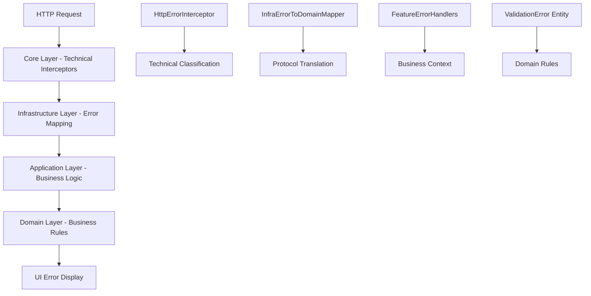
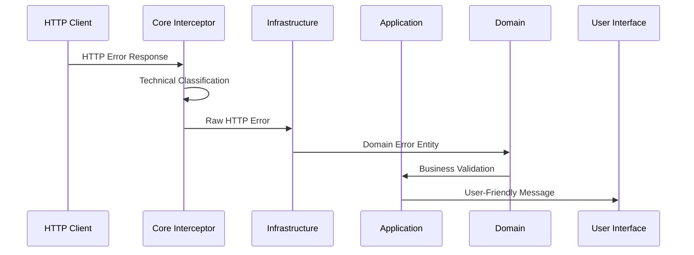
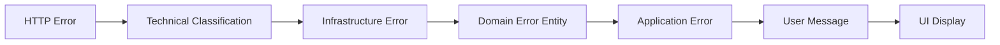

# Error Handling Analysis

> **Comprehensive analysis of error handling architecture and patterns in MAD-AI**

## Summary

This document analyzes the sophisticated multi-layer error handling system implemented in the MAD-AI project, which follows Clean Architecture principles with clear separation of concerns across Domain, Application, Infrastructure, and Core layers.

## Error Handling Architecture Overview

### Layer-Based Error Handling Strategy

The error handling system follows a **Four-Layer Architecture** with clear responsibilities:



### Error Flow and Transformation



## Core Layer - Technical Error Processing

### 1. HTTP Error Interceptor

**Pure Technical Processing (No Business Logic):**

```typescript
// src/app/core/interceptors/http-error.interceptor.ts
export const httpErrorInterceptor: HttpInterceptorFn = (req, next) => {
    const classifier = inject(HttpErrorClassifier);
    const logger = inject(HttpErrorLogger);

    return next(req).pipe(
        catchError((error: HttpErrorResponse) => {
            // Pure technical classification
            const classification = classifier.classify(error);
            
            // Technical logging only
            logger.logHttpError(error, classification, req);
            
            // Attach technical metadata (no business interpretation)
            (error as any).__technicalClassification = classification;
            
            return throwError(() => error);
        })
    );
};
```

**Key Characteristics:**
- ✅ **No business logic** - only technical concerns
- ✅ **Framework-agnostic** - pure HTTP processing
- ✅ **No feature knowledge** - doesn't know about auth, users, etc.
- ✅ **Minimal dependencies** - only technical utilities

### 2. Enhanced Error Interceptor for Security Events

**Security Domain Event Processing:**

```typescript
// src/app/core/interceptors/error.interceptor.ts
export const enhancedErrorInterceptor: HttpInterceptorFn = (req, next) => {
    const eventProcessor = inject(DomainEventProcessor);

    return next(req).pipe(
        catchError((error: HttpErrorResponse) => {
            // Process security-related events for audit
            if (isSecurityError(error)) {
                processSecurityEvent(error, eventProcessor).catch(console.warn);
            }
            
            return throwError(() => error);
        })
    );
};

function isSecurityError(error: HttpErrorResponse): boolean {
    return error.status === 401 || error.status === 403 || error.status === 419;
}
```

## Infrastructure Layer - Protocol Translation

### 1. HTTP to Infrastructure Error Mapping

**Protocol Boundary Translation:**

```typescript
// src/app/infrastructure/http/error.interceptor.ts
export const errorInterceptor: HttpInterceptorFn = (req, next) =>
    next(req).pipe(
        catchError((err) => {
            if (err instanceof HttpErrorResponse) {
                // Transform HTTP errors to infrastructure errors
                return throwError(() => mapHttpErrorToInfra(err));
            }
            return throwError(() => err);
        })
    );
```

### 2. Infrastructure to Domain Error Mapping

**Business Context Translation:**

```typescript
// src/app/infrastructure/errors/infra-to-domain.mapper.ts
@Injectable({ providedIn: 'root' })
export class InfraErrorToDomainMapper {
    /**
     * Maps infrastructure errors to domain errors with business context
     */
    mapError(
        infraError: InfraError,
        context: { operation: string; entityType?: string; field?: string }
    ): DomainError {
        switch (infraError.kind) {
            case 'AUTH':
                return this.mapAuthError(infraError, context);
            case 'VALIDATION':
                return this.mapValidationError(infraError, context);
            case 'BUSINESS':
                return this.mapBusinessError(infraError, context);
            default:
                return this.mapGenericError(infraError, context);
        }
    }

    private mapAuthError(
        infraError: InfraError & { kind: 'AUTH' },
        context: { operation: string; entityType?: string; field?: string }
    ): ValidationError {
        const { code, detail } = infraError.authError;
        
        switch (code) {
            case AuthErrorCode.INVALID_CREDENTIALS:
                return ValidationError.create({
                    field: 'credentials',
                    value: 'user_input',
                    message: 'Invalid email or password provided.',
                    code: ValidationErrorCode.AUTHENTICATION_FAILED,
                    context: { authError: code, detail },
                });
                
            case AuthErrorCode.SESSION_EXPIRED:
                return ValidationError.create({
                    field: 'session',
                    value: 'user_session',
                    message: 'Your session is no longer valid. Please log in again.',
                    code: ValidationErrorCode.INVALID_STATE,
                    context: { authError: code, detail },
                });
                
            default:
                return this.createGenericAuthError(code, detail, context);
        }
    }
}
```

## Domain Layer - Business Error Entities

### 1. ValidationError Entity (Core Domain Error)

**Rich Domain Error Model:**

```typescript
// src/app/domain/errors/validation-error.entity.ts
export class ValidationError extends Error {
    public readonly errors: readonly FieldError[];
    public readonly code: ValidationErrorCode;
    public readonly errorId: string;
    public readonly timestamp: Date;
    public readonly context?: Record<string, any>;

    /**
     * Factory method for creating validation errors with field context
     */
    static create(errorData: {
        field: string;
        value: any;
        message: string;
        code: ValidationErrorCode;
        severity?: 'error' | 'warning' | 'info';
        context?: Record<string, any>;
    }): ValidationError {
        const fieldError: FieldError = {
            field: errorData.field,
            value: errorData.value,
            message: errorData.message,
            code: errorData.code,
            severity: errorData.severity || 'error',
            context: errorData.context
        };
        
        return new ValidationError([fieldError], errorData.code, errorData.context);
    }

    /**
     * Factory for business rule violations
     */
    static forBusinessRule(
        field: string,
        value: any,
        message: string,
        code: ValidationErrorCode,
        context?: Record<string, any>
    ): ValidationError {
        const fieldError: FieldError = {
            field,
            value,
            message,
            code,
            severity: 'error',
            context
        };
        return new ValidationError([fieldError], code, context);
    }

    /**
     * Domain behavior - check for business rule violations
     */
    hasBusinessRuleViolations(): boolean {
        return this.errors.some(error => 
            error.code && ValidationErrorCodeUtils.isBusinessRuleError(error.code)
        );
    }

    /**
     * Domain behavior - user-friendly representation
     */
    toUserFriendlyMessage(): string {
        const errorsByField = this.errors.reduce((acc, error) => {
            const field = error.field || 'General';
            if (!acc[field]) acc[field] = [];
            acc[field].push(error.message);
            return acc;
        }, {} as Record<string, string[]>);

        return Object.entries(errorsByField)
            .map(([field, messages]) => 
                field === 'General' 
                    ? messages.join(', ')
                    : `${field}: ${messages.join(', ')}`
            )
            .join('; ');
    }
}
```

### 2. Validation Error Codes (Domain Enumeration)

**Business-Driven Error Classification:**

```typescript
// src/app/domain/errors/validation-error-code.enum.ts
export enum ValidationErrorCode {
    // ========== FIELD VALIDATION ==========
    REQUIRED_FIELD_MISSING = 'REQUIRED_FIELD_MISSING',
    FIELD_TOO_SHORT = 'FIELD_TOO_SHORT',
    FIELD_TOO_LONG = 'FIELD_TOO_LONG',
    EMAIL_INVALID = 'EMAIL_INVALID',
    PASSWORD_INVALID = 'PASSWORD_INVALID',
    
    // ========== BUSINESS RULES ==========
    ROLE_INVALID = 'ROLE_INVALID',
    ROLE_NOT_ALLOWED = 'ROLE_NOT_ALLOWED',
    PERMISSION_DENIED = 'PERMISSION_DENIED',
    ACCESS_LEVEL_INSUFFICIENT = 'ACCESS_LEVEL_INSUFFICIENT',
    
    // ========== ENTITY STATE ==========
    INVALID_STATE = 'INVALID_STATE',
    ENTITY_INACTIVE = 'ENTITY_INACTIVE',
    ENTITY_EXPIRED = 'ENTITY_EXPIRED',
    ENTITY_NOT_FOUND = 'ENTITY_NOT_FOUND',
    
    // ========== UNIQUENESS ==========
    FIELD_NOT_UNIQUE = 'FIELD_NOT_UNIQUE',
    USERNAME_EXISTS = 'USERNAME_EXISTS',
    EMAIL_EXISTS = 'EMAIL_EXISTS',
}

export class ValidationErrorCodeUtils {
    static isBusinessRuleError(code: ValidationErrorCode): boolean {
        return [
            ValidationErrorCode.ROLE_INVALID,
            ValidationErrorCode.ROLE_NOT_ALLOWED,
            ValidationErrorCode.PERMISSION_DENIED,
            ValidationErrorCode.ACCESS_LEVEL_INSUFFICIENT,
            ValidationErrorCode.INVALID_STATE,
            ValidationErrorCode.ENTITY_INACTIVE,
            ValidationErrorCode.ENTITY_EXPIRED,
        ].includes(code);
    }

    static isFormatError(code: ValidationErrorCode): boolean {
        return [
            ValidationErrorCode.EMAIL_INVALID,
            ValidationErrorCode.PASSWORD_INVALID,
            ValidationErrorCode.FIELD_TOO_SHORT,
            ValidationErrorCode.FIELD_TOO_LONG,
        ].includes(code);
    }

    static isUniquenessError(code: ValidationErrorCode): boolean {
        return [
            ValidationErrorCode.FIELD_NOT_UNIQUE,
            ValidationErrorCode.USERNAME_EXISTS,
            ValidationErrorCode.EMAIL_EXISTS,
        ].includes(code);
    }
}
```

## Application Layer - Business Error Handling

### 1. Application Error Base Class

**Application-Level Error Abstraction:**

```typescript
// src/app/application/errors/application-error.ts
export class ApplicationError extends Error {
    public readonly operation: string;
    public readonly code: string;
    public readonly timestamp: Date;
    public readonly originalError?: unknown;

    constructor(
        operation: string,
        message: string,
        code: string = 'UNKNOWN_ERROR',
        originalError?: unknown
    ) {
        super(message);
        this.name = 'ApplicationError';
        this.operation = operation;
        this.code = code;
        this.timestamp = new Date();
        this.originalError = originalError;
    }

    /**
     * Factory method for creating from domain errors
     */
    static fromDomainError(
        operation: string,
        domainError: unknown,
        customMessage?: string
    ): ApplicationError {
        let message = customMessage || 'An error occurred';
        let code = 'UNKNOWN_ERROR';

        if (domainError instanceof Error) {
            message = customMessage || domainError.message;
            if ('code' in domainError && typeof domainError.code === 'string') {
                code = domainError.code;
            }
        }

        return new ApplicationError(operation, message, code, domainError);
    }
}
```

### 2. Feature-Specific Error Handlers

**Authentication Error Handler:**

```typescript
// src/app/application/errors/feature-handlers/auth-error.handler.ts
@Injectable({ providedIn: 'root' })
export class AuthErrorHandler {
    private router = inject(Router);

    /**
     * Business logic: Can this handler process the error?
     */
    canHandle(error: HttpErrorResponse, context?: ErrorHandlingContext): boolean {
        return context?.feature === 'auth' || this.isAuthError(error);
    }

    /**
     * Business logic: Process authentication errors
     */
    handle(
        error: HttpErrorResponse, 
        technicalClassification: HttpErrorClassification,
        context: ErrorHandlingContext
    ): AuthErrorResult {
        const userMessage = this.getUserMessage(error, context.operation);
        const recoveryActions = this.getRecoveryActions(error, context.operation);
        
        return {
            userMessage,
            recoveryActions,
            shouldRedirect: this.shouldRedirect(error, context.operation),
            redirectUrl: this.getRedirectUrl(error, context.operation),
            shouldRetry: technicalClassification.isRetryable && this.isBusinessRetryable(error),
            businessContext: {
                feature: 'auth',
                operation: context.operation,
                isSecurityRelated: this.isSecurityRelated(error),
                requiresReauthentication: this.requiresReauthentication(error),
            }
        };
    }

    private getUserMessage(error: HttpErrorResponse, operation: string): string {
        switch (error.status) {
            case 400:
                return this.get400Message(error, operation);
            case 401:
                return this.get401Message(operation);
            case 422:
                return this.get422Message(error, operation);
            default:
                return 'Ha ocurrido un error de autenticación';
        }
    }

    private get401Message(operation: string): string {
        switch (operation) {
            case 'login':
                return 'Email o contraseña incorrectos';
            case 'logout':
                return 'Sesión expirada';
            default:
                return 'Necesitas iniciar sesión para continuar';
        }
    }

    private isAuthError(error: HttpErrorResponse): boolean {
        const url = error.url?.toLowerCase() || '';
        return (
            url.includes('/auth/') ||
            url.includes('/login') ||
            url.includes('/register') ||
            error.status === 401 ||
            (error.status === 422 && this.isAuthValidationError(error))
        );
    }

    private shouldRedirect(error: HttpErrorResponse, operation: string): boolean {
        return error.status === 401 && operation !== 'login';
    }

    private getRedirectUrl(error: HttpErrorResponse, operation: string): string | null {
        return this.shouldRedirect(error, operation) ? '/auth/login' : null;
    }
}

export interface ErrorHandlingContext {
    feature: string;
    operation: string;
    component?: string;
    userId?: number;
}

export interface AuthErrorResult {
    userMessage: string;
    recoveryActions: string[];
    shouldRedirect: boolean;
    redirectUrl: string | null;
    shouldRetry: boolean;
    businessContext: {
        feature: string;
        operation: string;
        isSecurityRelated: boolean;
        requiresReauthentication: boolean;
    };
}
```

**Roles Error Handler:**

```typescript
// src/app/application/errors/feature-handlers/roles-error.handler.ts
@Injectable({ providedIn: 'root' })
export class RolesErrorHandler {
    canHandle(error: HttpErrorResponse, context?: ErrorHandlingContext): boolean {
        return context?.feature === 'roles' || this.isRolesError(error);
    }

    handle(
        error: HttpErrorResponse,
        technicalClassification: HttpErrorClassification,
        context: ErrorHandlingContext
    ): RolesErrorResult {
        const userMessage = this.getUserMessage(error, context.operation);
        const recoveryActions = this.getRecoveryActions(error, context.operation);

        return {
            userMessage,
            recoveryActions,
            shouldRedirect: false, // Roles errors rarely require redirect
            redirectUrl: null,
            shouldRetry: technicalClassification.isRetryable && this.isBusinessRetryable(error),
            businessContext: {
                feature: 'roles',
                operation: context.operation,
                isPermissionRelated: this.isPermissionRelated(error),
                affectedResourceType: this.getAffectedResourceType(error, context.operation),
            }
        };
    }

    private get404Message(operation: string): string {
        const messages: Record<string, string> = {
            'get-role': 'El rol solicitado no existe',
            'update-role': 'El rol que intentas modificar no existe',
            'delete-role': 'El rol que intentas eliminar no existe',
            'assign-role': 'El rol que intentas asignar no existe',
        };
        return messages[operation] || 'Rol no encontrado';
    }

    private isPermissionRelated(error: HttpErrorResponse): boolean {
        return error.status === 403;
    }

    private isBusinessRetryable(error: HttpErrorResponse): boolean {
        // Don't retry permission, validation, or conflict errors
        return ![403, 404, 409, 422].includes(error.status);
    }
}
```

## UI Layer - Error Display Patterns

### 1. Facade Error State Management

**Signal-Based Error Handling:**

```typescript
// Facade pattern for error state
@Injectable({ providedIn: 'root' })
export class UsersFacade {
    // Private state signals
    private readonly _loading = signal(false);
    private readonly _error = signal<ApplicationError | null>(null);
    private readonly _users = signal<User[]>([]);

    // Public computed state
    readonly loading = computed(() => this._loading());
    readonly error = computed(() => this._error());
    readonly hasError = computed(() => !!this._error());

    async createUser(request: CreateUserRequest): Promise<User> {
        this._loading.set(true);
        this._error.set(null);
        
        try {
            const user = await this.createUserUC.execute(request);
            this._users.update(users => [...users, user]);
            this.notifications.success('Usuario creado exitosamente');
            return user;
        } catch (error) {
            const appError = this.errorTransformer.transformError(error);
            this._error.set(appError);
            this.notifications.error(appError.message);
            throw appError;
        } finally {
            this._loading.set(false);
        }
    }

    clearError(): void {
        this._error.set(null);
    }
}
```

### 2. Component Error Handling

**Reactive Error Display:**

```typescript
export class UserManagementComponent {
    private readonly usersFacade = inject(UsersFacade);
    
    // Reactive error state from facade
    readonly error = computed(() => this.usersFacade.error());
    readonly hasError = computed(() => !!this.error());
    readonly loading = computed(() => this.usersFacade.loading());

    async createUser(userData: CreateUserRequest): Promise<void> {
        try {
            await this.usersFacade.createUser(userData);
            // Success handling is managed by facade
        } catch (error) {
            // Error state is already in facade signals
            // UI will reactively update to show error
        }
    }

    dismissError(): void {
        this.usersFacade.clearError();
    }
}
```

**Template Error Display:**

```html
<!-- Error state handling in template -->
@if (hasError()) {
    <div class="error-banner">
        <app-error-display 
            [error]="error()"
            (dismiss)="dismissError()"
            [showRetry]="true"
            (retry)="retryLastOperation()">
        </app-error-display>
    </div>
}

@if (loading()) {
    <app-loading-spinner />
} @else {
    <!-- Main content -->
    <div class="user-list">
        <!-- User management UI -->
    </div>
}
```

## Error Handling Patterns Summary

### 1. Layered Responsibility Pattern

| Layer | Responsibility | Knowledge Level |
|-------|---------------|-----------------|
| **Core** | Technical classification, logging | HTTP/Network only |
| **Infrastructure** | Protocol translation, mapping | Infrastructure protocols |
| **Application** | Business error handling, user messaging | Feature-specific business logic |
| **Domain** | Business rule validation, error entities | Pure business rules |
| **UI** | Error display, user experience | User interaction patterns |

### 2. Error Transformation Pipeline



### 3. Key Design Principles

1. **Separation of Concerns**: Each layer handles only its specific error concerns
2. **Rich Domain Errors**: ValidationError entity with business semantics
3. **Feature-Specific Handlers**: Specialized error handling per business domain
4. **Signal-Based State**: Reactive error state management with Angular signals
5. **User-Centric Messages**: Business-friendly error messages for end users
6. **Audit Trail**: Security events and error logging for monitoring
7. **Recovery Actions**: Contextual suggestions for error resolution

### 4. Error Categories

| Category | Examples | Handler |
|----------|----------|---------|
| **Authentication** | Invalid credentials, session expired | AuthErrorHandler |
| **Authorization** | Insufficient permissions, role required | AuthErrorHandler |
| **Validation** | Required fields, format errors | Domain ValidationError |
| **Business Rules** | Role conflicts, state violations | Feature-specific handlers |
| **Technical** | Network failures, server errors | Core interceptors |

### 5. Error Recovery Patterns

- **Automatic Retry**: For transient technical errors
- **User Retry**: With explicit user action for business errors
- **Redirect**: To login page for authentication errors
- **Form Validation**: Inline field-level error display
- **Global Notifications**: Toast messages for general errors
- **Error Boundaries**: Component-level error containment

This comprehensive error handling system ensures robust user experience while maintaining clean architectural boundaries and providing rich debugging information for developers.
