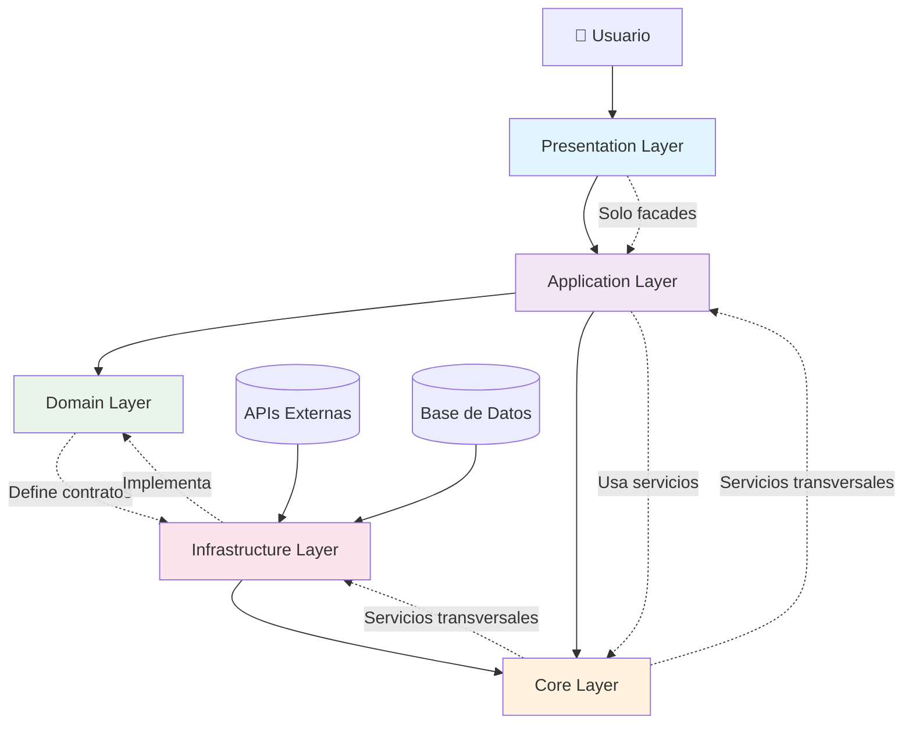

# Diagrama de Flujo de Capas

# Diagrama Detallado de Carpetas por Capa

```mermaid
flowchart TB
    subgraph "👤 User Interface"
        User[Usuario]
    end

    subgraph "🎨 Presentation Layer"
        Pages[pages/]
        Shared[shared/]
        Layouts[layouts/]
        PresentationGuards[guards/]
        PresentationServices[services/]
        PresentationMappers[mappers/]
        Pipes[pipes/]
    end

    subgraph "🚀 Application Layer"
        Facades[facades/]
        UseCases[use-cases/]
        AppTypes[types/]
        AppMappers[mappers/]
        AppErrors[errors/]
    end

    subgraph "🧠 Domain Layer"
        Entities[entities/]
        ValueObjects[value-objects/]
        DomainRepos[repositories/]
        DomainServices[services/]
        Specifications[specifications/]
        Events[events/]
        DomainErrors[errors/]
    end

    subgraph "⚙️ Core Layer"
        CoreServices[services/]
        Decorators[decorators/]
        Interfaces[interfaces/]
    end

    subgraph "🔧 Infrastructure Layer"
        InfraRepos[repositories/]
        HTTP[http/]
        InfraMappers[mappers/]
        DTOs[dtos/]
        InfraGuards[guards/]
        InfraServices[services/]
        InfraErrors[errors/]
    end

    subgraph "🌐 External"
        APIs[APIs Externas]
        DB[Base de Datos]
        FileSystem[Sistema de Archivos]
    end

    %% Flujo principal
    User --> Pages
    User --> Layouts

    %% Presentation interno
    Pages --> Shared
    Pages --> PresentationServices
    Pages --> PresentationMappers
    Shared --> Pipes

    %% Presentation -> Application
    Pages --> Facades
    PresentationGuards --> Facades
    PresentationMappers --> AppTypes

    %% Application interno
    Facades --> UseCases
    UseCases --> AppMappers
    UseCases --> AppErrors
    AppMappers --> AppTypes

    %% Application -> Domain
    UseCases --> Entities
    UseCases --> DomainRepos
    UseCases --> DomainServices
    AppMappers --> ValueObjects
    AppErrors --> DomainErrors

    %% Application -> Core
    UseCases --> CoreServices
    Decorators --> UseCases

    %% Domain interno
    Entities --> ValueObjects
    Entities --> Events
    DomainServices --> Entities
    DomainServices --> Specifications
    DomainRepos --> Entities

    %% Infrastructure -> Domain
    InfraRepos -.->|implementa| DomainRepos
    InfraMappers --> Entities
    InfraMappers --> ValueObjects

    %% Infrastructure interno
    InfraRepos --> HTTP
    InfraRepos --> InfraMappers
    InfraRepos --> DTOs
    HTTP --> DTOs
    InfraGuards --> InfraServices

    %% Infrastructure -> Core
    InfraRepos --> CoreServices
    InfraServices --> CoreServices

    %% Infrastructure -> External
    HTTP --> APIs
    InfraRepos --> DB
    InfraServices --> FileSystem

    %% Core interno
    CoreServices --> Interfaces

    %% Estilos
    classDef presentation fill:#e1f5fe,color:#000
    classDef application fill:#f3e5f5,color:#000
    classDef domain fill:#e8f5e8,color:#000
    classDef core fill:#fff3e0,color:#000
    classDef infrastructure fill:#fce4ec,color:#000
    classDef external fill:#f5f5f5,color:#000

    class Pages,Shared,Layouts,PresentationGuards,PresentationServices,PresentationMappers,Pipes presentation
    class Facades,UseCases,AppTypes,AppMappers,AppErrors application
    class Entities,ValueObjects,DomainRepos,DomainServices,Specifications,Events,DomainErrors domain
    class CoreServices,Decorators,Interfaces core
    class InfraRepos,HTTP,InfraMappers,DTOs,InfraGuards,InfraServices,InfraErrors infrastructure
    class APIs,DB,FileSystem external
```

# Leyenda de Conexiones

**Líneas sólidas (→):** Dependencias directas permitidas
**Líneas punteadas (-.->):** Implementación de contratos o uso indirecto
**Colores:** Cada capa tiene su color distintivo para facilitar la identificación

**Reglas clave visualizadas:**

- Presentation solo habla con Application (facades)
- Application orquesta Domain y usa Core
- Infrastructure implementa contratos de Domain
- Core es utilizado por múltiples capas
- Domain no depende de otras capas internas
