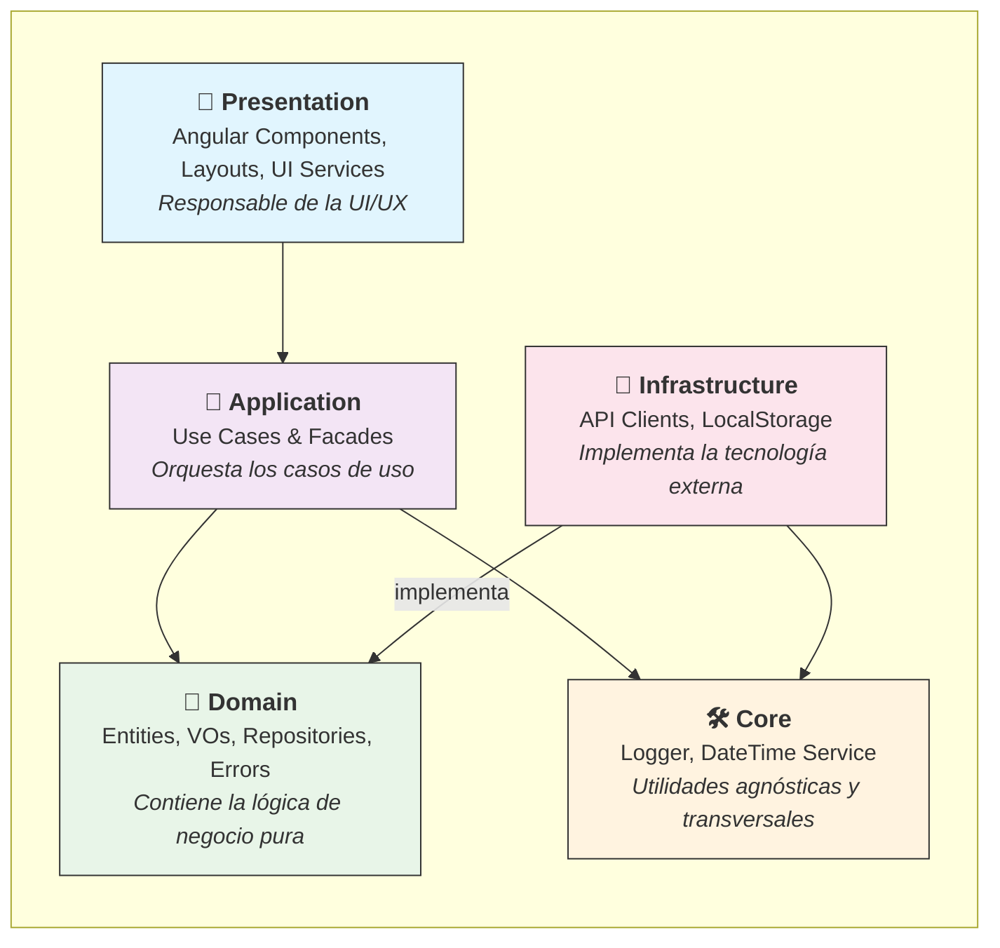
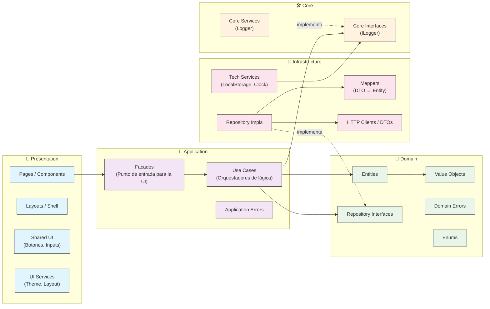

# 🗺️ Diagramas de Arquitectura del Proyecto MAD-AI

**Última actualización:** 10 de septiembre de 2025

Este documento proporciona una representación visual de la arquitectura de 5 capas del proyecto, siguiendo los principios de Clean Architecture y Domain-Driven Design.

## 1. Diagrama de Arquitectura de Alto Nivel

Este diagrama muestra la estructura general de las 5 capas y la **regla de dependencia**: las flechas apuntan desde la capa que depende hacia su dependencia. Las capas externas dependen de las internas, pero nunca al revés.

## 2. Diagrama Detallado de Componentes y Dependencias

Este diagrama desglosa cada capa en sus carpetas y componentes principales, mostrando las interacciones clave y las reglas de dependencia de forma más granular. Las líneas continuas (`-->`) representan una dependencia directa, mientras que las punteadas (`-.->`) indican la implementación de una interfaz.

### Reglas Clave Visualizadas:

- **Aislamiento del Dominio:** La capa `Domain` no tiene flechas que salgan de ella, confirmando que no depende de ninguna otra capa.
- **Punto de Entrada Único:** `Presentation` solo se comunica con la capa `Application` a través de los `Facades`.
- **Inversión de Dependencia:** `Infrastructure` implementa (`-.->`) las interfaces definidas en `Domain`, pero `Domain` no sabe nada de `Infrastructure`.
- **Utilidades Compartidas:** Tanto `Application` como `Infrastructure` pueden depender de las interfaces de `Core` para servicios transversales como el logging.
