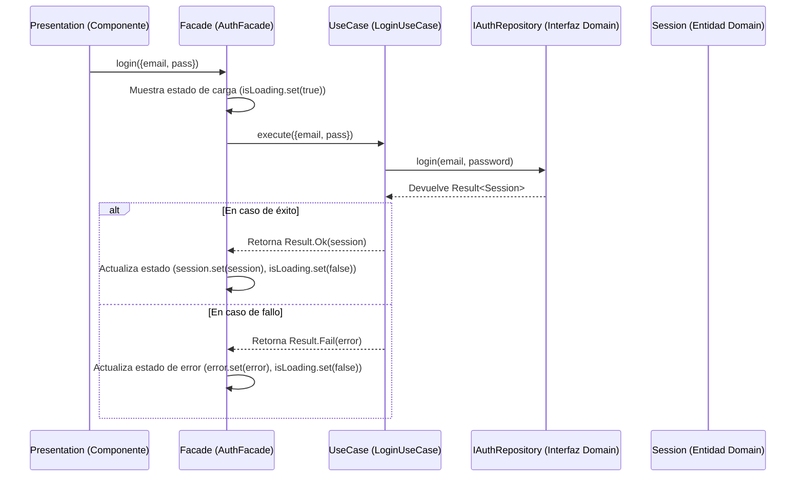

# 🚀 Guía Arquitectónica: Application Layer

**Última actualización:** 10 de septiembre de 2025

## 🎯 Principio Fundamental

La capa **Application** es la **orquestadora**. No contiene lógica de negocio, sino que dirige a las capas `Domain` e `Infrastructure` para ejecutar los casos de uso requeridos por el usuario. Es el intermediario que traduce las acciones del usuario en operaciones de dominio.

**Regla de Oro:** Un caso de uso en `Application` debe leerse como un guion o una receta: "1. Obtener el usuario del repositorio. 2. Pedir al dominio que aplique una regla de negocio. 3. Guardar el usuario actualizado. 4. Notificar el resultado".

## 🏗️ Estructura y Responsabilidades Detalladas

### `/use-cases` - El Corazón de la Orquestación

- **Qué debe contener:**
  - Clases que representan **una única acción o intención** del sistema (ej: `LoginUseCase`, `CreateUserUseCase`, `ActivateRoleUseCase`). Son los "verbos" de tu aplicación.
  - La secuencia de pasos para cumplir un objetivo:
    1. Recuperar una o más entidades del `Domain` usando las interfaces de repositorio.
    2. Invocar métodos en esas entidades para que ejecuten la lógica de negocio.
    3. Persistir las entidades modificadas usando los repositorios.
  - Manejo de la transacción del caso de uso. Si un paso falla, los anteriores deberían revertirse idealmente.
- **Qué NO debe contener:**
  - **Lógica de negocio.** NUNCA debe haber un `if` que represente una regla de negocio (ej: `if (user.age > 18)`). Esa lógica debe estar encapsulada en la entidad: `user.canVote()`.
  - Llamadas HTTP directas o conocimiento de la tecnología de persistencia. Para eso se usan las interfaces de repositorio.
  - Lógica de presentación o formato de datos para la UI.

### `/facades` - La Fachada Pública para la UI (Estructura Escalable)

A medida que una aplicación crece, la cantidad de casos de uso y estado relacionado a un dominio (como `auth` o `users`) puede hacer que un único archivo de facade (`auth.facade.ts`) se vuelva muy grande y difícil de mantener. Para asegurar la escalabilidad, se adopta una **estructura de organización por feature o dominio**.

- **Qué debe contener:**
  - Una **carpeta por cada contexto de negocio principal** (ej: `auth/`, `users/`, `roles/`).
  - Dentro de cada carpeta, uno o más facades que agrupan lógicamente los casos de uso y el estado. Esto permite que si un facade crece mucho, pueda dividirse en archivos más específicos (ej: `session.facade.ts`, `password.facade.ts`).
  - Sigue siendo el **único punto de entrada** para la capa de `Presentation`. La UI importará los facades específicos que necesite desde estas carpetas.
  - **Manejo del estado de la aplicación (State Management).** Cada facade expone `Signals` u `Observables` (`user$`, `rolesList$`, `isLoading$`) para que la UI se suscriba a los cambios de estado de forma reactiva.
- **Estructura Recomendada:**
  ```
  application/
  └── facades/
      ├── auth/
      │   └── auth.facade.ts
      ├── users/
      │   └── users.facade.ts
      └── roles/
          └── roles.facade.ts
  ```
- **Qué NO debe contener:**
  - Lógica de orquestación. Su única tarea es llamar al `UseCase` correcto y actualizar el estado de la aplicación basado en el resultado.

### `/services` - Servicios Específicos de la Aplicación

- **Qué debe contener:**
  - Lógica que no es un caso de uso central, pero que requiere coordinación entre varias partes.
  - Tu `RoleExportReportService` es un ejemplo perfecto: coordina la obtención de datos (`IRoleRepository`), su transformación (`RoleExportMapper`) y la exportación (`IExportRepository`). Es una tarea de la aplicación, no una regla de negocio del dominio.
- **Qué NO debe contener:**
  - Lógica de dominio pura o implementaciones de infraestructura.

### `/mappers` - Transformadores de Dominio a Aplicación

- **Qué debe contener:**
  - Clases que convierten modelos del `Domain` a modelos/DTOs específicos para las necesidades de la capa de `Application` o para el estado que gestiona el `Facade`.
  - Son útiles cuando el modelo de dominio es muy complejo y no quieres exponerlo todo a la UI.
- **Diferencia clave:** Los mappers de `Infrastructure` convierten **DTOs de API ↔️ Entidades de Dominio**. Los mappers de `Application` convierten **Entidades de Dominio ↔️ Modelos de Estado/Vista**.

### `/errors` - Errores y Excepciones de Aplicación

- **Qué debe contener:**
  - Clases de error específicas de esta capa, como `ApplicationError`.
  - Lógica (`ApplicationErrorTransformer`) para "traducir" errores de capas inferiores (`BusinessRuleError` del dominio o `InfrastructureError`) en un error estandarizado que el `Facade` pueda entender y exponer a la UI de forma segura.

### `/types` - Contratos de Datos Internos

- **Qué debe contener:**
  - Interfaces y `types` que definen la forma de los datos que se manejan dentro de la capa de `Application` y que se exponen a través de los `Facades`.
  - Ejemplos: `LoginCredentials`, `UserUpdatePayload`, `RoleState`.

## 🌊 Diagrama de Flujo: Interacción Completa



## ❌ Prohibiciones Absolutas en Application

- **NUNCA** implementar una regla de negocio. Si escribes un `if` sobre una propiedad de una entidad, detente. Esa lógica debe estar en un método dentro de la propia entidad.
- **NUNCA** importar nada de `@angular/common/http` o `localStorage`.
- **NUNCA** importar nada de la capa `Presentation`. `Application` no sabe cómo es la UI.
- **NUNCA** usar implementaciones concretas de `Infrastructure`. Solo sus interfaces, a través de los repositorios del `Domain`.
