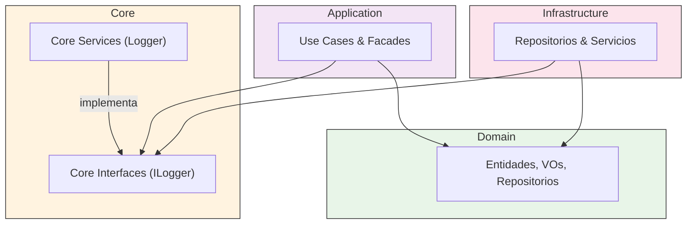

# 🛠️ Guía Arquitectónica: Core Layer

**Última actualización:** 10 de septiembre de 2025

## 🎯 Principio Fundamental

La capa **Core** contiene código que es **técnicamente necesario** para la aplicación, pero que **no es específico de ningún dominio de negocio** y es **completamente independiente del framework de UI (Angular) y de detalles externos (HTTP)**. Son las utilidades transversales y puras de la aplicación.

**Regla de Oro:** Si esta pieza de código podría ser publicada como una librería NPM de utilidades generales para cualquier proyecto TypeScript (no necesariamente Angular) y ser usada tanto en el frontend como en el backend, entonces pertenece a **Core**.

## 🏗️ Estructura y Responsabilidades Detalladas

La capa `Core` debe ser minimalista. Su estructura es sencilla y directa.

### `/services` - Servicios Técnicos Transversales y Agnósticos

- **Qué debe contener:**
  - Implementaciones de servicios que son utilizados por múltiples capas (`Application`, `Infrastructure`) y que no tienen dependencias externas.
  - **Ejemplos en tu proyecto:**
    - `LoggerService`: Proporciona una forma estandarizada de registrar eventos en la aplicación. Puede ser consumido por cualquier capa para depuración o seguimiento.
    - `DateTimeService`: Centraliza operaciones con fechas y horas que no son reglas de negocio, asegurando consistencia.
- **Qué NO debe contener:**
  - Lógica de negocio (eso es de `Domain`).
  - Servicios que dependan de Angular (ej: `TitleService` de Angular, `HttpClient`).
  - Servicios que solo son utilizados por una capa (ej: un servicio de formato para la UI pertenece a `Presentation`).

### `/interfaces` - Contratos para Servicios Técnicos

- **Qué debe contener:**
  - Interfaces (contratos) para los servicios definidos en `/services` (ej: `ILogger`).
  - **Propósito:** Permitir que las implementaciones puedan ser sustituidas fácilmente sin cambiar el código que las consume. Por ejemplo, podrías tener un `ConsoleLoggerService` para desarrollo y un `RemoteLoggerService` (en `Infrastructure`) para producción que envíe logs a un servicio externo, ambos implementando `ILogger`.
- **Qué NO debe contener:**
  - Interfaces de repositorios de negocio (van en `Domain`).
  - Tipos de datos para la UI (van en `Presentation`).

## 🌊 Flujo de Dependencias

El `Core` es una capa fundamental de la que otras dependen, pero ella no depende de ninguna capa de la aplicación.

## ❌ Prohibiciones Absolutas en Core

- **NUNCA** importar nada de `@angular/*`. La capa `Core` no sabe que es una aplicación de Angular.
- **NUNCA** tener conocimiento del `Domain`. El Core no sabe qué es una entidad `User` o un `Role`.
- **NUNCA** contener lógica de UI o de presentación.
- **NUNCA** hacer llamadas HTTP directas ni interactuar con APIs del navegador como `localStorage`.
- **NUNCA** depender de ninguna otra capa del proyecto (`Domain`, `Application`, `Infrastructure`, `Presentation`).

**Conclusión:** El **Core** es el conjunto de herramientas más básico, estable y agnóstico de tu aplicación. Si esta capa empieza a crecer con más de unos pocos servicios muy genéricos, es una fuerte señal de que la lógica está mal ubicada y se están rompiendo los principios de separación de responsabilidades.
