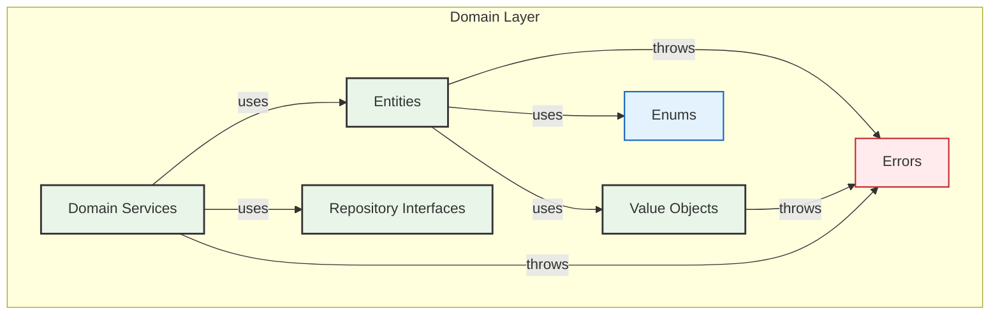

#  🧠 Guía Arquitectónica: Domain Layer

**Última actualización:** 10 de septiembre de 2025

## 🎯 Principio Fundamental

El **Domain Layer** contiene la **lógica y las reglas de negocio puras** de la aplicación. Es el corazón del software, y debe ser completamente independiente de cualquier tecnología externa (frameworks, bases de datos, UI).

**Regla de Oro:** Si tienes que explicar una pieza de código a un experto del negocio que no sabe programar, y lo entiende, esa lógica pertenece al **Domain**.

## 🏗️ Estructura y Responsabilidades Detalladas

### `/entities` - Objetos con Identidad y Ciclo de Vida

- **Qué debe contener:**
  - Los conceptos centrales del negocio que tienen una identidad única y un ciclo de vida (ej: `User`, `Role`, `Session`).
  - Métodos que encapsulan reglas de negocio y transiciones de estado (`user.deactivate()`, `role.changeName()`). Estos métodos deben proteger los **invariantes** (reglas que siempre deben ser verdaderas).
  - Lógica que opera sobre sus propios datos. Una entidad es responsable de mantener su propio estado consistente.
- **Qué NO debe contener:**
  - Dependencias a frameworks (Angular, `HttpClient`).
  - Conocimiento sobre cómo se persiste (no debe saber de SQL o APIs REST).
  - Lógica de formato para la UI (ej: `getFullName()`).

### `/value-objects` - Atributos Inmutables del Dominio

- **Qué debe contener:**
  - Conceptos que describen características, pero no tienen identidad propia (ej: `Email`, `Username`, `ISODateTime`, `LocalTokens`).
  - Son **inmutables**. Una vez creados, no pueden ser modificados. Si se necesita un cambio, se crea una nueva instancia.
  - Deben auto-validarse en su creación. Un `Email` inválido no debería poder ser instanciado, debe lanzar un `ValidationError`.
- **Qué NO debe contener:**
  - Métodos que modifiquen su estado interno (`set...`).
  - Identidad. Se comparan por su valor (`vo1.equals(vo2)`), no por su referencia.

### `/repositories` - Contratos de Persistencia (Interfaces)

- **Qué debe contener:**
  - **Interfaces (contratos)** que definen las operaciones de persistencia desde la perspectiva del dominio (ej: `IUserRepository`, `IRoleRepository`, `ITokenStore`).
  - Métodos con nombres que reflejen el lenguaje ubicuo del dominio (`findUserByEmail`, `getActiveRoles`).
  - Definiciones agnósticas a la tecnología. `save(user: User)` es correcto; `saveUserToHttp(user: User)` es incorrecto.
- **Qué NO debe contener:**
  - **Implementaciones concretas**. Estas van en la capa de `Infrastructure`.
  - Métodos que expongan detalles de la implementación (`getUsersFromEndpointX`).

### `/enums` - Clasificaciones Fijas del Negocio

- **Qué debe contener:**
  - Conjuntos de valores constantes y conocidos que representan clasificaciones dentro del dominio (ej: `UserStatus`, `NotificationChannel`).
  - Son tipos seguros que evitan el uso de "magic strings" o números arbitrarios en el código.
- **Qué NO debe contener:**
  - Valores que puedan cambiar dinámicamente o que provengan de una fuente de datos externa. Si los estados de un usuario pueden ser configurados por un administrador, entonces `Status` debería ser una entidad, no un enum.
  - Lógica compleja. Los enums son para clasificación, no para comportamiento.

### `/errors` - Excepciones y Errores del Negocio

- **Qué debe contener:**
  - Clases de error personalizadas que representan problemas específicos del dominio. Esto permite un manejo de errores más granular en las capas superiores.
  - `ValidationError`: Se lanza cuando la creación de un Value Object falla por un formato inválido (ej: `Email.create('invalido')`).
  - `BusinessRuleError`: Se lanza desde una Entidad cuando una operación viola una regla de negocio (ej: `user.assignRole(role)` cuando el usuario está inactivo).
- **Qué NO debe contener:**
  - Errores de naturaleza técnica como `HttpError`, `DatabaseConnectionError`, etc. Esos pertenecen a `Infrastructure`.
  - Errores relacionados con la UI o el framework.

### `/services` - Lógica de Dominio Transversal (Usar con moderación)

- **Qué debe contener:**
  - Operaciones que coordinan **múltiples entidades o agregados** y que no encajan de forma natural en ninguna de ellas.
  - Debe ser un servicio sin estado (`stateless`).
- **Qué NO debe contener:**
  - Lógica que claramente pertenece a una entidad. Antes de crear un servicio, pregúntate: "¿No podría este método vivir dentro de la entidad `User` o `Role`?".
  - Orquestación de repositorios. Eso es responsabilidad de la capa de `Application`.

## ❌ Prohibiciones Absolutas en Domain

- **NUNCA** importar nada de `@angular/*`.
- **NUNCA** usar `HttpClient` o hacer llamadas a APIs.
- **NUNCA** acceder a `localStorage`, `sessionStorage`, o cualquier API del navegador.
- **NUNCA** definir la lógica de cómo se mostrarán los datos en la UI.
- **NUNCA** depender de ninguna otra capa (`Application`, `Infrastructure`, `Presentation`). El dominio es el centro y no conoce a nadie.

## 🌊 Diagrama de Dependencias Internas del Dominio

Este diagrama muestra cómo los diferentes componentes de la capa de dominio interactúan entre sí.

**Conclusión:** El `Domain` es puro, aislado y estable. Contiene las joyas de la corona de la lógica de negocio, incluyendo no solo las entidades y VOs, sino también el lenguaje del negocio expresado en `Enums` y las posibles fallas de negocio representadas en `Errors`.
