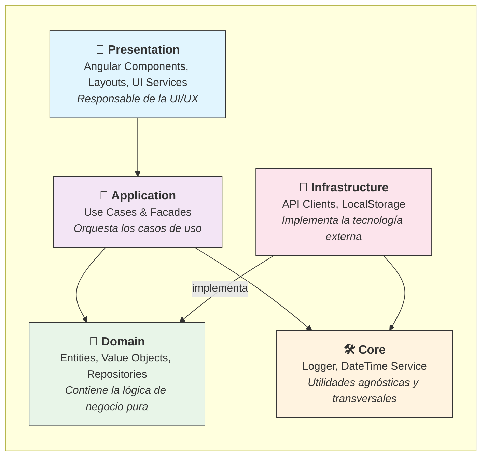

# 📖 Guía de Implementación: Proyecto MAD-AI

**Última actualización:** 10 de septiembre de 2025

Este documento es la **única fuente de verdad** para el desarrollo, arquitectura y mantenimiento del proyecto. Seguir estas directrices no es opcional, es la garantía de que construiremos un software robusto, escalable y fácil de mantener.

## 1. 🎯 Filosofía y Principios

- **Clean Architecture:** Separamos las preocupaciones en capas. La lógica de negocio no sabe nada de la base de datos, la UI o los frameworks. Esto nos da flexibilidad y testabilidad.
- **Domain-Driven Design (DDD):** Modelamos el software en torno al dominio del negocio. Usamos un lenguaje ubicuo (Entidades, Value Objects) que tanto desarrolladores como expertos del negocio pueden entender.
- **Código Explícito y "Tonto":** Cada pieza de código debe tener una única responsabilidad y hacerla de la forma más simple y clara posible. La `Presentation` es tonta sobre el negocio, el `Domain` es tonto sobre la tecnología.

## 2. 🏛️ Arquitectura de 5 Capas

Nuestra arquitectura define un flujo de dependencias estricto, donde las capas externas dependen de las internas, pero nunca al revés.

|                    |                                                   |                                       |
| ------------------ | ------------------------------------------------- | ------------------------------------- |
| **Capa**           | **Responsabilidad Principal**                     | **Regla de Oro**                      |
| **Presentation**   | Mostrar datos y capturar eventos del usuario.     | "Es tonta, solo muestra y delega."    |
| **Application**    | Orquestar los pasos de un caso de uso.            | "Es el guion, no el actor."           |
| **Domain**         | Contener las reglas de negocio puras.             | "Si el negocio lo entiende, va aquí." |
| **Infrastructure** | Implementar la tecnología externa (API, Storage). | "El 'cómo' técnico, no el 'qué'."     |
| **Core**           | Proveer utilidades técnicas agnósticas.           | "Podría ser una librería NPM."        |

### **El Rol de la Capa `Core`**

A diferencia de las otras capas, **`Core` no se modifica durante el desarrollo de features de negocio**. Su propósito es ser una base estable de herramientas técnicas.

¿Cuándo se modifica la capa Core?

Solo se debe tocar Core si se identifica la necesidad de una nueva utilidad transversal y agnóstica, por ejemplo:

- Un nuevo servicio de manejo de configuraciones globales.
- Una utilidad de internacionalización (i18n) que deba ser usada en múltiples capas.

Cualquier cambio en `Core` debe ser revisado con especial atención, ya que afecta a toda la aplicación.

## 3. 🚀 Flujo de Desarrollo de una Nueva Feature

Esta es la guía paso a paso para implementar cualquier nueva funcionalidad. **Ejemplo: "Añadir un botón para desactivar un usuario"**.

### **Paso 1: Definir el Contrato en `Domain` (Si es necesario)**

- **Acción:** La capa de `Domain` ya tiene la entidad `User` con un método `deactivate()` y el repositorio `IUserRepository` con un método `save(user: User)`. Si no existieran, este sería el primer lugar para crearlos.
- **Resultado:** No hay cambios en el `Domain` para esta feature.

### **Paso 2: Implementar la Lógica en `Infrastructure` (Si es necesario)**

- **Acción:** El `HttpUserRepository` ya implementa el método `save`. Si la API requiriera un endpoint específico como `POST /users/{id}/deactivate`, aquí se añadiría esa llamada HTTP.
- **Resultado:** No hay cambios en `Infrastructure`.

### **Paso 3: Orquestar el Caso de Uso en `Application`**

- **Acción:**
  1. Crear el archivo `deactivate-user.usecase.ts` en `/application/use-cases/users/`.
  2. El `UseCase` inyecta `IUserRepository` y `ILogger` (de `Core`).
  3. El método execute(userId) hará:

     a. this.logger.info('Deactivating user', { userId });

     b. const user = await this.userRepository.findById(userId);

     c. user.deactivate();

     d. await this.userRepository.save(user);

     e. return Result.Ok();

### **Paso 4: Exponer la Acción en el `Facade` de `Application`**

- **Acción:**
  1. Abrir `users.facade.ts` en `/application/facades/users/`.
  2. Inyectar el nuevo `DeactivateUserUseCase`.
  3. Añadir un método público `deactivateUser(userId: string)`.
  4. Este método llamará a `this.deactivateUserUseCase.execute(userId)`, manejará el estado de carga (`isLoading.set(true/false)`) y actualizará el estado de la lista de usuarios si es necesario.

### **Paso 5: Construir la UI en `Presentation`**

- **Acción:**
  1. Añadir un botón "Desactivar" en el componente `user-details.component.html` (Dumb Component).
  2. Este botón emite un `@Output() deactivate`.
  3. El componente `user-details-page.component.ts` (Smart Component) escucha el evento.
  4. El manejador del evento llama a `this.usersFacade.deactivateUser(this.userId)`.
  5. El componente se suscribe al `isLoading$` y al `error$` del facade para mostrar feedback al usuario.

### **Paso 6: Escribir los Tests para Cada Capa**

- **Acción:**
  1. **Domain:** Los tests para `user.deactivate()` ya existen. ✅
  2. **Application:** Crear `deactivate-user.usecase.spec.ts`. Mockear `IUserRepository` y `ILogger`, y verificar que se llame a `findById`, `deactivate` en la entidad mock y `save`.
  3. **Presentation:** Crear/actualizar `user-details-page.component.spec.ts`. Mockear `UsersFacade` y verificar que al simular el clic en el botón, se llame a `usersFacade.deactivateUser()`.

## 4. 📋 Checklist de Pull Request

Antes de enviar un PR a revisión, asegúrate de que cumple con lo siguiente:

- **[ ] 1. Sin Violaciones de Arquitectura:**
  - ¿Mi componente de `Presentation` inyecta algo que no sea un `Facade` o un servicio de UI? (❌ Mal)
  - ¿Mi `UseCase` tiene lógica `if/else` que representa una regla de negocio? (❌ Mal)
  - ¿Mi capa de `Domain` o `Core` importa `HttpClient` o cualquier cosa específica de Angular? (❌ Mal)
- **[ ] 2. Código Limpio y Nombrado Correcto:**
  - ¿Los nombres de clases, métodos y variables son claros y siguen las convenciones? (`UseCase`, `Facade`, `Repository`, etc.).
  - ¿Se ha eliminado código comentado, `console.log` de depuración y lógica muerta?
- **[ ] 3. Tests Implementados:**
  - ¿La nueva lógica de `Domain` tiene tests unitarios?
  - ¿El nuevo `UseCase` tiene su test de orquestación con mocks?
  - ¿El nuevo componente de `Presentation` tiene su test de componente con facades mockeados?
- **[ ] 4. Flujo de Datos Reactivo:**
  - ¿El `Facade` expone el estado a través de `Signals` u `Observables`?
  - ¿El componente usa el `async` pipe o `computed` signals para consumir el estado sin suscripciones manuales?
- **[ ] 5. Manejo de Errores y Estado de Carga:**
  - ¿El `Facade` gestiona el estado de `isLoading` y `error`?
  - ¿La UI reacciona a estos estados mostrando un spinner o un mensaje de error?
