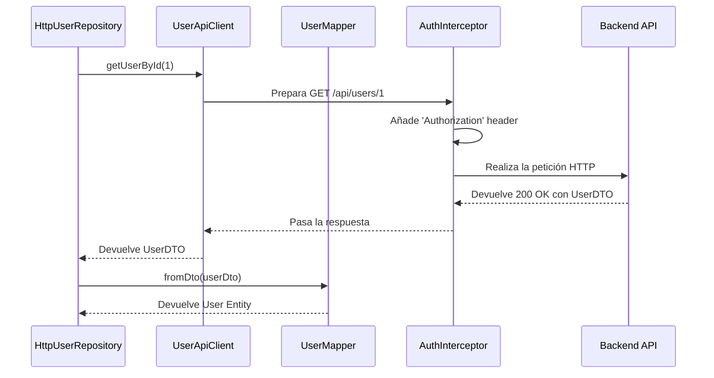

# 🔌 Guía Arquitectónica: Infrastructure Layer

**Última actualización:** 10 de septiembre de 2025

## 🎯 Principio Fundamental

La capa de **Infrastructure** es donde la abstracción se encuentra con la realidad. **Implementa los contratos (interfaces) definidos en el `Domain`** utilizando tecnologías concretas como Angular `HttpClient`, el `localStorage` del navegador y otras APIs externas. Es el "cómo" técnico que hace funcionar a la aplicación.

**Regla de Oro:** Si cambias de una API REST a GraphQL, o de `localStorage` a `IndexedDB`, esta es la **única capa** (además de la configuración de inyección de dependencias) que debería sufrir cambios significativos.

## 🏗️ Estructura y Responsabilidades Detalladas

### `/repositories` - Implementaciones de los Contratos de Dominio

- **Qué debe contener:**
  - Clases concretas que **implementan las interfaces de repositorio** del `Domain` (ej: `HttpUserRepository` implementa `IUserRepository`, `LocalStorageTokenStore` implementa `ITokenStore`).
  - Son el puente principal entre `Application` y `Infrastructure`. La capa de aplicación depende de la interfaz (`IUserRepository`) y recibe la implementación (`HttpUserRepository`) mediante inyección de dependencias.
  - Orquestan los clientes HTTP (`/http/clients`) y los mapeadores (`/mappers`) para cumplir con el contrato del dominio.
- **Qué NO debe contener:**
  - Lógica de `HttpClient` directamente. Esa responsabilidad se delega a los `ApiClient`.
  - Lógica de mapeo. Se delega a los `Mappers`.
  - Lógica de negocio.

### `/http` - Clientes e Interceptores de API

- **/clients**:
  - **Propósito:** Clases especializadas que encapsulan las llamadas `HttpClient` a un conjunto específico de endpoints (ej: `AuthApiClient`, `UserApiClient`). Son los únicos que deben conocer las URLs exactas (usando `/config`).
  - **Responsabilidad:** Construir la petición (URL, body, headers) y ejecutar el método HTTP (`get`, `post`, etc.). Devuelven los DTOs crudos de la API.
- **/interceptors**:
  - **Propósito:** Lógica que se ejecuta para **toda** petición HTTP saliente o entrante.
  - **Responsabilidad:** Tareas transversales como añadir el token JWT de autenticación a las cabeceras (`AuthInterceptor`), loguear peticiones o manejar errores de forma global.

### `/mappers` - Traductores de Datos

- **Qué debe contener:**
  - Clases cuya única responsabilidad es **convertir los DTOs (`/dtos`) en Entidades/VOs del `Domain`, y viceversa**.
  - Ejemplo: `UserMapper.fromDto(userDto: UserDTO): User` y `UserMapper.toDto(user: User): CreateUserDTO`.
  - Son cruciales para mantener el `Domain` aislado de la estructura de la API. Si el backend cambia un campo en el JSON, solo el DTO y el Mapper correspondiente deberían cambiar.
- **Qué NO debe contener:**
  - Reglas de negocio. El mapeador solo transforma, no valida lógicamente ni toma decisiones.

### `/dtos` - Contratos de Datos de la API

- **Qué debe contener:**
  - Interfaces o clases `type` que representan la estructura **exacta** del JSON que se envía o recibe de la API REST (definido en `swagger.json`).
  - Son simples "bolsas de datos" sin métodos ni lógica.
- **Ejemplo:** `Login.dto.ts`, `User.dto.ts`.

### `/services` - Implementaciones de Otros Servicios Técnicos

- **Propósito:** Implementaciones de contratos técnicos que no son repositorios de entidades de negocio.
- **/storage**: Para interactuar con APIs de almacenamiento del navegador (ej: `LocalStorageSessionStore`).
- **/export**: Lógica para generar y descargar archivos en el cliente (ej: `ClientExportService`).
- **/notification**: Gateways a sistemas de notificaciones (ej: `NotificationGatewayService` podría usar WebSockets o Server-Sent Events en el futuro).
- **/system**: Implementaciones de contratos del sistema, como `SystemClockService` que usa el `new Date()` del navegador.

### `/errors` - Manejo de Errores de Infraestructura

- **Qué debe contener:**
  - Clases de error específicas de esta capa (`InfrastructureError`).
  - Transformadores que convierten errores de bajo nivel (como `HttpErrorResponse`) en errores más manejables y estandarizados para que los repositorios los puedan capturar. `HttpErrorTransformer` es un ejemplo perfecto.

### `/config` - Constantes de Configuración

- **Qué debe contener:**
  - Archivos que centralizan la configuración de la infraestructura, como los endpoints de la API (`api-endpoints.config.ts`). Esto evita tener URLs hardcodeadas por todo el código.

## 🌊 Diagrama de Flujo: Desde el Repositorio hasta la API

Este diagrama ilustra cómo colaboran las distintas partes de `Infrastructure` para cumplir un contrato del `Domain`.

## ❌ Prohibiciones Absolutas en Infrastructure

- **NUNCA** definir una interfaz de negocio. Solo se deben **implementar** las que existen en `Domain`.
- **NUNCA** contener lógica de negocio.
- **NUNCA** comunicarse directamente con la capa de `Presentation`. La infraestructura es "ciega" a cómo se muestran los datos.
