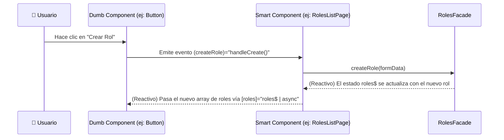

# 🎨 Guía Arquitectónica: Presentation Layer

**Última actualización:** 10 de septiembre de 2025

## 🎯 Principio Fundamental

La capa de **Presentation** es responsable de todo lo que el usuario ve y con lo que interactúa. Su única misión es **mostrar el estado de la aplicación y capturar la intención del usuario**, delegando toda la lógica y las operaciones a la capa de `Application` a través de los `Facades`.

**Regla de Oro:** El código en esta capa debe ser "tonto" en cuanto a lógica de negocio. Si cambias de Angular a React, esta es la capa que se reescribe por completo, demostrando su acoplamiento exclusivo a la tecnología de UI.

## 🏗️ Estructura y Responsabilidades Detalladas

La capa de `Presentation` está organizada por responsabilidades para maximizar la reutilización y la claridad.

### `/pages` - Módulos de Feature y Componentes Inteligentes (Smart Components)

- **Qué debe contener:**
  - Carpetas por cada feature principal de la aplicación (ej: `/auth`, `/roles`, `/dashboard`).
  - **Componentes de Página (Smart Components):** Son los componentes que se cargan en una ruta. Su **única responsabilidad** es conectar el mundo de la UI con la capa de `Application`.
    - Inyectan los `Facades` necesarios.
    - Se suscriben al estado expuesto por los `Facades` (usando `async` pipe o `computed` signals).
    - Llaman a los métodos del `Facade` en respuesta a eventos que vienen de los componentes hijos (Dumb Components).
- **Qué NO debe contener un Smart Component:**
  - Lógica de negocio.
  - Lógica de estado compleja (más allá de un simple "cargando" o "error").
  - Decoración visual compleja (eso va en los Dumb Components).

### `/shared` - Componentes y Utilidades de UI Reutilizables (Dumb Components)

- **/ui**:
  - **Propósito:** La base de tu sistema de diseño. Componentes atómicos, 100% reutilizables y sin estado de aplicación.
  - **Ejemplos:** `Button`, `Input`, `Icon`, `FormField`, `Toggle`.
  - **Regla:** Reciben datos **exclusivamente** a través de `@Input()` y comunican acciones **exclusivamente** a través de `@Output()`. **NUNCA** deben inyectar un Facade o un servicio con estado.
- **/components**:
  - **Propósito:** Componentes más complejos y reutilizables, construidos a partir de los componentes de `/ui`.
  - **Ejemplos:** `ToastContainer`, `ErrorDisplay`, `PageHeader`.
- **/assets**:
  - **Propósito:** Iconos SVG y otros recursos estáticos utilizados por los componentes.

### `/layouts` y `/shell` - Estructura Visual de la Aplicación

- **/layouts**:
  - **Propósito:** Definen la estructura de alto nivel de una página (ej: `MainLayout` con sidebar y header, `AuthLayout` centrado sin navegación). Actúan como el "marco" donde se renderizan las páginas.
- **/shell**:
  - **Propósito:** Son los componentes que viven **dentro** de los layouts y forman la estructura persistente de la aplicación.
  - **Ejemplos:** `MainSidebar`, `AuthHeader`, `NavRail`.

### `/services` - Lógica Específica de la UI

- **Qué debe contener:**
  - Servicios que gestionan el estado o el comportamiento de la UI, no del negocio.
  - **Ejemplos:** `ThemeService`, `LayoutService` (para controlar el sidebar), `BreadcrumbService`, `TitleService`.
- **/guards**:
  - **Propósito:** Guards de rutas de Angular (`AuthGuard`, `RoleGuard`).
  - **Implementación:** Utilizan los `Facades` para obtener el estado de autenticación o los permisos del usuario y decidir si se permite o no la navegación.

### `/models` y `/mappers` - Modelos de Vista (ViewModels)

- **/models**:
  - **Propósito:** Definir la "forma" de los datos que una vista necesita. Un `ViewModel` es un modelo hecho a medida para una o más vistas.
  - **Ejemplo:** `RoleViewModel` podría tener los mismos datos que el `Role` del facade, pero con un campo adicional como `color: string` para la UI.
- **/mappers**:
  - **Propósito:** Transformar los datos que vienen del `Facade` a los `ViewModels` que los componentes necesitan. Esto mantiene los componentes más limpios, ya que no tienen que hacer la lógica de transformación ellos mismos.

## 🌊 Flujo de Datos y Eventos: El Patrón Smart/Dumb

Este es el flujo de comunicación **obligatorio** dentro de la capa de `Presentation`.

## ❌ Prohibiciones Absolutas en Presentation

- **NUNCA** importar nada de las carpetas `domain` o `infrastructure`.
- **NUNCA** inyectar o usar `HttpClient`.
- **NUNCA** escribir una regla de negocio (ej: `if (user.status === 'ACTIVE')`). Esa lógica la debe proveer el `Facade`.
- **NUNCA** un componente "Dumb" debe inyectar un `Facade` o un servicio con estado.
