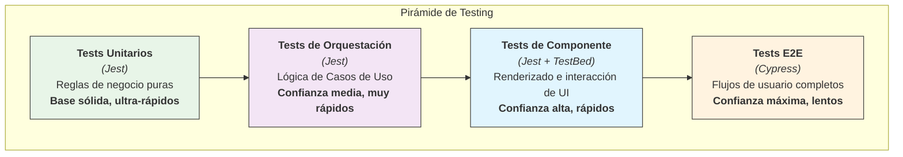

# 🧪 Guía de Testing por Capas - Proyecto MAD-AI

**Última actualización:** 10 de septiembre de 2025

## 1. 🎯 Filosofía y Principios

El testing no es una fase final, es una parte integral del desarrollo que garantiza la robustez y mantenibilidad del código. Nuestra estrategia se basa en la **Pirámide de Testing**, priorizando los tests rápidos y unitarios en la base y reservando los tests más lentos y complejos para la cima.

**Regla de Oro:** **Testea el comportamiento, no la implementación.** Un test debe verificar _qué_ hace el código, no _cómo_ lo hace. Esto te permite refactorizar con confianza.

### La Pirámide de Testing en Nuestro Proyecto



## 2. 🧠 Domain & Core Layers - Tests Unitarios Puros con Jest

- **Estrategia:** Tests unitarios puros. Son la base de la pirámide: rápidos, aislados y sin dependencias externas.
- **Herramientas:** `Jest`.
- **Qué Testear:**
  - **Entidades (`Domain`):** Todas las reglas de negocio, transiciones de estado y validaciones (`user.deactivate()`, `role.hasPermission()`).
  - **Value Objects (`Domain`):** Lógica de creación (casos válidos e inválidos) e inmutabilidad.
  - **Servicios (`Core`):** Lógica de utilidades como `LoggerService` o `DateTimeService`.
- **Cómo:**
  - **CERO MOCKS.** Instancia las clases directamente (`new User(...)`).
  - Cubre todos los caminos: el "happy path", casos de error y valores límite.
- **Ejemplo (`User.entity.spec.ts`):**

  ```
  it('should change status to inactive when deactivate is called', () => {
    // Arrange
    const user = new User(/* initial properties with active status */);

    // Act
    user.deactivate();

    // Assert
    expect(user.properties.status).toBe(UserStatus.Inactive);
  });
  ```

## 3. 🚀 Application Layer - Tests de Orquestación con Jest

- **Estrategia:** Verificar que los `UseCases` y `Facades` orquestan correctamente las dependencias. No se testea la lógica de negocio, sino el **flujo**.
- **Herramientas:** `Jest` (con mocks).
- **Qué Testear:**
  - **Use Cases:** Que se llamen los métodos correctos de los repositorios en el orden correcto.
  - **Facades:** Que al invocar una acción, se llame al `UseCase` correspondiente y que el estado (`Signal`/`Observable`) se actualice como se espera.
- **Cómo:**
  - **MOCK TOTAL.** Mockea todas las dependencias externas (repositorios, otros facades) usando `jest.fn()` o `jest.mock()`.
  - Verifica que los mocks fueron llamados con los parámetros esperados.
- **Ejemplo (`deactivate-user.usecase.spec.ts`):**

  ```
  it('should find user, call deactivate, and save the user', async () => {
    // Arrange
    const mockUser = { deactivate: jest.fn() };
    const mockUserRepository = {
      findById: jest.fn().mockResolvedValue(mockUser),
      save: jest.fn().mockResolvedValue(undefined),
    };
    const useCase = new DeactivateUserUseCase(mockUserRepository);

    // Act
    await useCase.execute('user-id');

    // Assert
    expect(mockUserRepository.findById).toHaveBeenCalledWith('user-id');
    expect(mockUser.deactivate).toHaveBeenCalled();
    expect(mockUserRepository.save).toHaveBeenCalledWith(mockUser);
  });
  ```

## 4. 🔌 Infrastructure Layer - Tests de Integración con Jest

- **Estrategia:** Asegurar que la capa se integra correctamente con las tecnologías externas (APIs, Storage) y que los mappers funcionan.
- **Herramientas:** `Jest` + `HttpClientTestingModule` de Angular.
- **Qué Testear:**
  - **Repositorios HTTP:** Que se construya la URL y el body correctos para la petición HTTP.
  - **Mappers:** Que un DTO de la API se transforme en una Entidad del Dominio (y viceversa) correctamente.
  - **Servicios de Storage:** Que se llame a `localStorage.setItem` con la clave y valor correctos.
- **Cómo:**
  - Usa `HttpTestingController` para simular respuestas de la API sin hacer llamadas de red reales.
  - Usa `spyOn` de Jest para espiar las APIs del navegador como `localStorage`.
- **Ejemplo (`http-user.repository.spec.ts`):**

  ```
  it('should fetch user by ID and map it to a User entity', () => {
    // Arrange
    const dummyUserDto = { id: '1', email: 'test@mail.com', /* ... */ };
    const service: HttpUserRepository = TestBed.inject(HttpUserRepository);

    // Act
    service.findById('1').subscribe(user => {
      expect(user).toBeInstanceOf(User);
      expect(user.properties.email.value).toBe('test@mail.com');
    });

    // Assert
    const req = httpMock.expectOne('api/v1/users/1');
    expect(req.request.method).toBe('GET');
    req.flush(dummyUserDto);
  });
  ```

## 5. 🎨 Presentation Layer - Tests de Componente con Jest + TestBed

- **Estrategia:** Probar los componentes de UI de forma aislada. Verificar que renderizan correctamente el estado y que responden a las interacciones del usuario.
- **Herramientas:** `Jest` + `TestBed` de Angular.
- **Qué Testear:**
  - **Renderizado:** Que el HTML se muestre correctamente basado en las entradas (`@Input`) y el estado.
  - **Interacción:** Que al hacer clic en un botón, se llame al método correcto del `Facade`.
  - **Salidas:** Que un componente emita un evento (`@Output`) cuando sea necesario.
- **Cómo:**
  - **Aísla el componente.** Provee **mocks para todos los `Facades`** y servicios inyectados.
  - Simula eventos de usuario con `button.click()` o `fixture.debugElement.triggerEventHandler`.
  - Verifica el resultado en el DOM o que los mocks hayan sido llamados.
- **Ejemplo (`login.component.spec.ts`):**

  ```
  it('should call authFacade.login when the form is submitted', () => {
    // Arrange
    const mockAuthFacade = { login: jest.fn() };
    // ... configurar TestBed con el mock provider ...
    const component = fixture.componentInstance;
    component.form.setValue({ email: 'test@mail.com', password: '123' });

    // Act
    const loginButton = fixture.nativeElement.querySelector('button[type="submit"]');
    loginButton.click();

    // Assert
    expect(mockAuthFacade.login).toHaveBeenCalledWith({
      email: 'test@mail.com',
      password: '123'
    });
  });
  ```

## 6. 🚗 Flujos Completos - Tests End-to-End (E2E) con Cypress

- **Estrategia:** Simular flujos de usuario completos en un navegador real para garantizar que todas las capas funcionan juntas.
- **Herramientas:** `Cypress`.
- **Qué Testear:**
  - Los "Happy Paths" más críticos: flujo de login, registro, creación de un recurso principal, etc.
  - Navegación entre páginas.
  - Verificación de que los datos correctos se muestran en la UI después de una acción.
- **Cómo:**
  - Escribe los tests en archivos `.cy.ts`.
  - Usa `cy.intercept()` para **mockear las respuestas de la API**. Esto hace los tests mucho más rápidos y fiables, evitando la dependencia de un backend real.
  - Interactúa con la aplicación como un usuario: `cy.visit()`, `cy.get()`, `cy.type()`, `cy.click()`.
  - Usa aserciones como `.should('contain', 'Bienvenido')`.
- **Ejemplo (`login.cy.ts`):**

  ```
  it('should allow a user to log in and redirect to the dashboard', () => {
    // Arrange: Mock the API response
    cy.intercept('POST', '/api/v1/auth/login/', {
      statusCode: 200,
      body: { access: 'fake-token', refresh: 'fake-refresh' },
    }).as('loginRequest');

    // Act
    cy.visit('/login');
    cy.get('input[name="email"]').type('test@mail.com');
    cy.get('input[name="password"]').type('password123');
    cy.get('button[type="submit"]').click();

    // Assert
    cy.wait('@loginRequest');
    cy.url().should('include', '/dashboard');
    cy.get('h1').should('contain', 'Dashboard');
  });
  ```
