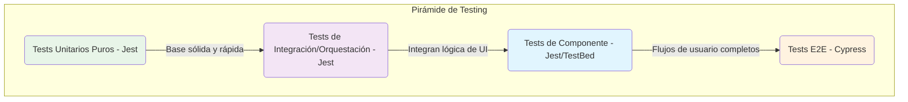
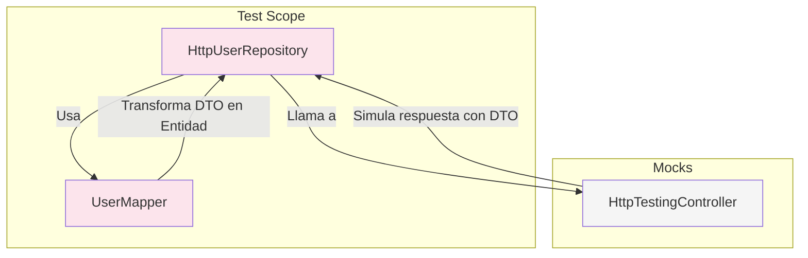

# 🧪 Guía de Testing por Capas (Completa)

**Última actualización:** 10 de septiembre de 2025

## 🎯 Filosofía General

El testing en Clean Architecture no es una opción, es una **necesidad** que garantiza la robustez y mantenibilidad del código. Cada capa tiene un propósito distinto y, por lo tanto, una estrategia de testing diferente, siguiendo la pirámide de testing.

**Regla de Oro:** **Testea el comportamiento, no la implementación.** Un test debe verificar _qué_ hace el código, no _cómo_ lo hace. Esto te permite refactorizar el interior de un método sin romper sus tests.

## 🧠 Domain Layer Testing (100% Cubierto ✅)

- **Estrategia:** **Tests unitarios puros.** Rápidos, sin dependencias externas, sin mocks de clases.
- **Herramientas:** `Jest`.
- **Qué Testear:**
  - **Reglas de negocio en Entidades:** Llama a un método y verifica que el estado de la entidad cambie correctamente o que se lance un `BusinessRuleError` si se viola una regla.
  - **Validación de Value Objects:** Asegúrate de que los VOs no se puedan crear con valores inválidos (`Email`, `Username`) y que la igualdad funcione por valor.
  - **Errores de Dominio:** Verifica que se crean los `ValidationError` y `BusinessRuleError` correctos en cada caso.
- **Cómo:**
  - Instancia las clases directamente: `new User(...)`, `Email.create(...)`.
  - Cubre todos los caminos felices, casos límite y casos de error (valores nulos, formatos incorrectos, violaciones de reglas).
- **Estado Actual:** ¡Excelente! Mantener el 100% de cobertura aquí es **crítico y no negociable**.

## 🔌 Infrastructure Layer Testing (En progreso ⏳)

- **Estrategia:** **Tests de integración en el límite.** Se enfocan en la correcta comunicación con el mundo exterior (API, `localStorage`) y el mapeo de datos, **mockeando el punto final externo**.
- **Herramientas:** `HttpClientTestingModule` y `HttpTestingController` para APIs, `jest.spyOn` para `localStorage`.
- **Qué Testear:**
  - **Implementaciones de Repositorios HTTP:** Que el repositorio construya la petición HTTP correcta (URL, método, body) y maneje correctamente las respuestas de éxito y error.
  - **Mappers:** Que un DTO de la API se transforme correctamente en una Entidad de Dominio y viceversa. Son tests unitarios puros.
  - **Servicios de Storage:** Que el servicio interactúe correctamente con la API del navegador (`localStorage.setItem`, `localStorage.getItem`).
- **Cómo:**
  - Usa el `HttpTestingController` para mockear las respuestas de la API. **No hagas llamadas reales a la red.**
  - Crea un DTO de ejemplo, pásalo por el mapper y verifica que la entidad resultante tenga los valores correctos.
  - Usa `spyOn(localStorage, 'setItem')` y verifica que fue llamado con la clave y el valor serializado correctos.

### Diagrama de Testing para un Repositorio HTTP

## 🚀 Application Layer Testing (Pendiente ❌)

- **Estrategia:** **Tests de orquestación.** No se testea la lógica de negocio, sino el **flujo** y la **interacción** entre las piezas.
- **Herramientas:** `Jest` con mocks.
- **Qué Testear:**
  - **Use Cases:** Que el caso de uso llame a los métodos correctos de sus dependencias (repositorios, etc.) en el orden esperado.
  - **Facades:** Que al llamar a un método del facade, se dispare el `UseCase` correspondiente y que el estado reactivo (`Signal`/`Observable`) se actualice como se espera.
- **Cómo:**
  - **Mockea TODAS las dependencias** del `UseCase` o `Facade` usando `jest.fn()` o `createSpyFromClass`.
  - Llama al método a testear (ej: `loginUseCase.execute(...)` o `authFacade.login(...)`).
  - Verifica que los mocks fueron llamados con los parámetros esperados (`expect(mockRepo.save).toHaveBeenCalledWith(...)`).
  - Verifica que el `Result` devuelto sea el correcto (`Ok` o `Fail`).
  - Para Facades, verifica que el estado (`Signal` o `Observable`) refleja el resultado de la operación.

## 🎨 Presentation Layer Testing (Pendiente ❌)

- **Estrategia:** **Tests de componente.** Se enfocan en la interacción del usuario y el renderizado correcto, aislando el componente del resto de la aplicación.
- **Herramientas:** `TestBed` de Angular y `Jest`.
- **Qué Testear:**
  - **Componentes "Dumb" (`/shared/ui`):**
    - **Renderizado:** Que el componente se renderiza correctamente según sus `@Input()`.
    - **Interacción:** Que emite los `@Output()` correctos cuando el usuario interactúa con él (ej: `click`).
    - **Aislamiento:** **NUNCA** deben tener dependencias inyectadas (salvo servicios de UI muy genéricos).
  - **Componentes "Smart" (`/pages`):**
    - **Conexión con Facade:** Que el componente llama a los métodos del `Facade` cuando se producen eventos.
    - **Suscripción al Estado:** Que el componente renderiza correctamente la información recibida desde los `Signals` u `Observables` del `Facade`.
- **Cómo:**
  - Usa `TestBed` para configurar el componente.
  - **Provee mocks para todos los `Facades` y servicios inyectados.** El componente debe estar completamente aislado de la lógica de la aplicación.
  - Usa `fixture.nativeElement` para consultar el DOM y verificar que el renderizado es correcto.
  - Simula eventos de usuario (`button.click()`) y verifica que se llamó al método del facade mockeado.

### Checklist por Feature

Antes de dar una nueva funcionalidad por terminada, asegúrate de que tiene tests en **todas las capas relevantes**.

- [ ] **Domain:** ¿Están todas las nuevas reglas de negocio cubiertas por tests unitarios puros?
- [ ] **Infrastructure:** ¿El nuevo repositorio/mapper está testeado contra un DTO mock?
- [ ] **Application:** ¿El nuevo `UseCase` tiene un test de orquestación con dependencias mockeadas?
- [ ] **Presentation:** ¿El nuevo componente de UI tiene un test que verifica su renderizado e interacciones con un `Facade` mockeado?
