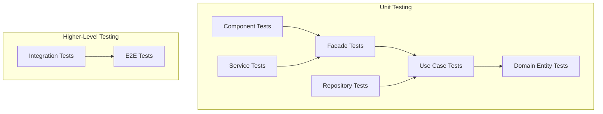

# Testing Patterns Analysis

> **Comprehensive analysis of testing strategies and patterns used in MAD-AI project**

## Summary

This document analyzes the testing architecture and patterns implemented in the MAD-AI project, which follows a structured approach using Jasmine + Karma for unit testing with Angular testing utilities. The project demonstrates consistent testing patterns across all layers of the Clean Architecture.

## Testing Stack and Configuration

### Core Testing Framework

**Technology Stack:**
- **Jasmine Core**: 5.7.0 (BDD testing framework)
- **Karma**: 6.4.0 (test runner)
- **Angular Testing Utilities**: 20.x (TestBed, ComponentFixture)
- **Puppeteer**: 24.16.1 (headless browser automation)

**Karma Configuration:**
```javascript
// karma.conf.cjs
const puppeteer = require('puppeteer');
process.env.CHROME_BIN = puppeteer.executablePath();

module.exports = (config) => {
    config.set({
        frameworks: ['jasmine'],
        plugins: [
            require('karma-jasmine'),
            require('karma-chrome-launcher'),
            require('karma-jasmine-html-reporter'),
            require('karma-coverage'),
        ],
        reporters: ['progress', 'kjhtml'],
        browsers: ['ChromeHeadless'],
        customLaunchers: {
            ChromeHeadlessCI: {
                base: 'ChromeHeadless',
                flags: ['--no-sandbox', '--disable-gpu', '--disable-dev-shm-usage'],
            },
        },
        singleRun: false,
        restartOnFileChange: true,
    });
};
```

**Test Environment Setup:**
```typescript
// src/test.ts
import 'zone.js';
import 'zone.js/testing';

import { getTestBed } from '@angular/core/testing';
import { BrowserTestingModule, platformBrowserTesting } from '@angular/platform-browser/testing';

getTestBed().initTestEnvironment(BrowserTestingModule, platformBrowserTesting());
```

## Testing Architecture Overview

### Layer-Based Testing Strategy



### Test File Naming Convention

**Consistent Pattern:** `{component-name}.spec.ts`

```bash
# Component tests
src/app/presentation/features/auth/pages/login/login.spec.ts
src/app/presentation/features/roles/pages/roles-list/roles-list.spec.ts

# UI component tests
src/app/shared/ui/button/button.spec.ts
src/app/shared/ui/icon/icon.spec.ts

# Layout tests
src/app/presentation/layouts/main-layout/main-layout.spec.ts
src/app/presentation/layouts/auth-layout/auth-layout.spec.ts

# Shell component tests
src/app/presentation/shell/main-sidebar/main-sidebar.spec.ts
src/app/presentation/shell/auth-header/auth-header.spec.ts
```

## Component Testing Patterns

### 1. Basic Component Test Structure

**Standard Component Test Pattern:**
```typescript
import { ComponentFixture, TestBed } from '@angular/core/testing';
import { ComponentName } from './component-name';

describe('ComponentName', () => {
    let component: ComponentName;
    let fixture: ComponentFixture<ComponentName>;

    beforeEach(async () => {
        await TestBed.configureTestingModule({
            imports: [ComponentName], // Standalone component
        }).compileComponents();

        fixture = TestBed.createComponent(ComponentName);
        component = fixture.componentInstance;
        fixture.detectChanges();
    });

    it('should create', () => {
        expect(component).toBeTruthy();
    });
});
```

**Real Example from Project:**
```typescript
// src/app/presentation/features/auth/pages/login/login.spec.ts
import { ComponentFixture, TestBed } from '@angular/core/testing';
import { Login } from './login';

describe('Login', () => {
    let component: Login;
    let fixture: ComponentFixture<Login>;

    beforeEach(async () => {
        await TestBed.configureTestingModule({
            imports: [Login],
        }).compileComponents();

        fixture = TestBed.createComponent(Login);
        component = fixture.componentInstance;
        fixture.detectChanges();
    });

    it('should create', () => {
        expect(component).toBeTruthy();
    });
});
```

### 2. Component Testing with Dependencies

**Facade Dependency Mocking:**
```typescript
describe('Dashboard Component', () => {
    let component: Dashboard;
    let fixture: ComponentFixture<Dashboard>;
    let mockAuthFacade: jasmine.SpyObj<AuthFacade>;

    beforeEach(async () => {
        const authSpy = jasmine.createSpyObj('AuthFacade', ['refreshProfile', 'logout'], {
            user: signal(createMockUser()),
            loading: signal(false),
            error: signal(null)
        });

        await TestBed.configureTestingModule({
            imports: [Dashboard],
            providers: [
                { provide: AuthFacade, useValue: authSpy }
            ]
        }).compileComponents();

        fixture = TestBed.createComponent(Dashboard);
        component = fixture.componentInstance;
        mockAuthFacade = TestBed.inject(AuthFacade) as jasmine.SpyObj<AuthFacade>;
    });

    it('should initialize and refresh profile', async () => {
        await component.ngOnInit();
        expect(mockAuthFacade.refreshProfile).toHaveBeenCalled();
    });
});
```

### 3. Signal-Based Component Testing

**Testing Components with Angular Signals:**
```typescript
describe('SignalComponent', () => {
    let component: SignalComponent;
    let fixture: ComponentFixture<SignalComponent>;
    let mockFacade: jasmine.SpyObj<SomeFacade>;

    beforeEach(() => {
        const spy = jasmine.createSpyObj('SomeFacade', ['updateData'], {
            data: signal([]),
            loading: signal(false),
            error: signal(null)
        });

        TestBed.configureTestingModule({
            imports: [SignalComponent],
            providers: [
                { provide: SomeFacade, useValue: spy }
            ]
        });

        fixture = TestBed.createComponent(SignalComponent);
        component = fixture.componentInstance;
        mockFacade = TestBed.inject(SomeFacade) as jasmine.SpyObj<SomeFacade>;
    });

    it('should react to signal changes', () => {
        // Act - update the signal
        mockFacade.loading.set(true);
        fixture.detectChanges();

        // Assert - component should react
        expect(component.loading()).toBe(true);
    });

    it('should display data when loaded', () => {
        // Arrange
        const testData = [{ id: 1, name: 'Test' }];

        // Act
        mockFacade.data.set(testData);
        fixture.detectChanges();

        // Assert
        expect(component.data()).toEqual(testData);
        const compiled = fixture.nativeElement;
        expect(compiled.textContent).toContain('Test');
    });
});
```

### 4. Host Component Testing Pattern

**Testing Components with Host Wrapper:**
```typescript
// Advanced button component testing
@Component({
    template: `
        <app-button
            [variant]="variant"
            [size]="size"
            [disabled]="disabled"
            [loading]="loading"
            (clicked)="onClicked()">
            Test Button
        </app-button>
    `,
})
class TestHostComponent {
    variant: any = 'primary';
    size: any = 'md';
    disabled = false;
    loading = false;
    onClicked = jasmine.createSpy('onClicked');
}

describe('Button', () => {
    let component: Button;
    let fixture: ComponentFixture<Button>;
    let hostComponent: TestHostComponent;
    let hostFixture: ComponentFixture<TestHostComponent>;

    beforeEach(async () => {
        await TestBed.configureTestingModule({
            imports: [Button],
            declarations: [TestHostComponent],
        }).compileComponents();

        // Test component in isolation
        fixture = TestBed.createComponent(Button);
        component = fixture.componentInstance;
        fixture.detectChanges();

        // Test component with host
        hostFixture = TestBed.createComponent(TestHostComponent);
        hostComponent = hostFixture.componentInstance;
        hostFixture.detectChanges();
    });

    it('should apply correct variant classes', () => {
        hostComponent.variant = 'secondary';
        hostFixture.detectChanges();

        const buttonElement = hostFixture.nativeElement.querySelector('button');
        expect(buttonElement.className).toContain('btn-secondary');
    });

    it('should emit clicked event when clicked and not disabled', () => {
        const buttonElement = hostFixture.nativeElement.querySelector('button');
        buttonElement.click();

        expect(hostComponent.onClicked).toHaveBeenCalled();
    });

    it('should not emit clicked event when disabled', () => {
        hostComponent.disabled = true;
        hostFixture.detectChanges();

        const buttonElement = hostFixture.nativeElement.querySelector('button');
        buttonElement.click();

        expect(hostComponent.onClicked).not.toHaveBeenCalled();
    });
});
```

## Facade Testing Patterns

### 1. Facade Unit Testing

**Testing Application Facades:**
```typescript
describe('AuthFacade', () => {
    let facade: AuthFacade;
    let mockLoginUC: jasmine.SpyObj<LoginWithCredentials>;
    let mockLogoutUC: jasmine.SpyObj<Logout>;
    let mockNotifications: jasmine.SpyObj<NotificationsFacade>;

    beforeEach(() => {
        const loginSpy = jasmine.createSpyObj('LoginWithCredentials', ['execute']);
        const logoutSpy = jasmine.createSpyObj('Logout', ['execute']);
        const notificationsSpy = jasmine.createSpyObj('NotificationsFacade', ['success', 'error']);

        TestBed.configureTestingModule({
            providers: [
                AuthFacade,
                { provide: LoginWithCredentials, useValue: loginSpy },
                { provide: Logout, useValue: logoutSpy },
                { provide: NotificationsFacade, useValue: notificationsSpy },
            ],
        });

        facade = TestBed.inject(AuthFacade);
        mockLoginUC = TestBed.inject(LoginWithCredentials) as jasmine.SpyObj<LoginWithCredentials>;
        mockLogoutUC = TestBed.inject(Logout) as jasmine.SpyObj<Logout>;
        mockNotifications = TestBed.inject(NotificationsFacade) as jasmine.SpyObj<NotificationsFacade>;
    });

    it('should login successfully and update state', async () => {
        // Arrange
        const mockSession = createMockSession();
        const mockUser = createMockUser();
        const loginRequest = { email: 'test@test.com', password: 'password' };
        
        mockLoginUC.execute.and.returnValue(Promise.resolve({
            session: mockSession,
            user: mockUser
        }));

        // Act
        await facade.login(loginRequest);

        // Assert
        expect(mockLoginUC.execute).toHaveBeenCalledWith(loginRequest);
        expect(facade.user()).toEqual(mockUser);
        expect(facade.session()).toEqual(mockSession);
        expect(facade.isAuthenticated()).toBe(true);
        expect(mockNotifications.success).toHaveBeenCalledWith('Login successful');
    });

    it('should handle login errors and update error state', async () => {
        // Arrange
        const loginRequest = { email: 'test@test.com', password: 'wrongpassword' };
        const error = new ApplicationError('login', 'Invalid credentials', 'AUTH_ERROR');
        
        mockLoginUC.execute.and.returnValue(Promise.reject(error));

        // Act & Assert
        await expectAsync(facade.login(loginRequest)).toBeRejected();
        
        expect(facade.error()).toEqual(error);
        expect(facade.isAuthenticated()).toBe(false);
        expect(mockNotifications.error).toHaveBeenCalledWith('Invalid credentials');
    });

    it('should clear error state on successful operations', async () => {
        // Arrange - set initial error state
        facade['_error'].set(new ApplicationError('test', 'Test error', 'TEST'));
        expect(facade.error()).toBeTruthy();
        
        const mockSession = createMockSession();
        const loginRequest = { email: 'test@test.com', password: 'password' };
        mockLoginUC.execute.and.returnValue(Promise.resolve(mockSession));

        // Act
        await facade.login(loginRequest);

        // Assert
        expect(facade.error()).toBeNull();
    });
});
```

### 2. Facade Signal Testing

**Testing Signal-Based State Management:**
```typescript
describe('UsersFacade Signal State', () => {
    let facade: UsersFacade;

    beforeEach(() => {
        TestBed.configureTestingModule({
            providers: [UsersFacade, /* mock dependencies */]
        });
        facade = TestBed.inject(UsersFacade);
    });

    it('should have correct initial state', () => {
        expect(facade.users()).toEqual([]);
        expect(facade.loading()).toBe(false);
        expect(facade.error()).toBeNull();
        expect(facade.selectedUser()).toBeNull();
    });

    it('should update state when creating user', async () => {
        // Arrange
        const newUser = createMockUser();
        const createRequest = { name: 'John', email: 'john@test.com' };
        
        // Mock use case to return the new user
        spyOn(facade['createUserUC'], 'execute').and.returnValue(Promise.resolve(newUser));

        // Act
        await facade.createUser(createRequest);

        // Assert
        expect(facade.users()).toContain(newUser);
        expect(facade.loading()).toBe(false);
        expect(facade.error()).toBeNull();
    });

    it('should compute derived state correctly', () => {
        // Arrange - set users with some active and inactive
        const users = [
            createMockUser({ id: 1, active: true }),
            createMockUser({ id: 2, active: false }),
            createMockUser({ id: 3, active: true })
        ];
        facade['_users'].set(users);

        // Assert computed values
        expect(facade.activeUsers()).toHaveLength(2);
        expect(facade.userCount()).toBe(3);
        expect(facade.hasUsers()).toBe(true);
    });
});
```

## Use Case Testing Patterns

### 1. Use Case Unit Testing

**Testing Business Logic in Isolation:**
```typescript
describe('LoginWithCredentials Use Case', () => {
    let useCase: LoginWithCredentials;
    let mockAuthRepo: jasmine.SpyObj<AuthRepository>;
    let mockSessionStore: jasmine.SpyObj<SessionStorePort>;

    beforeEach(() => {
        const authRepoSpy = jasmine.createSpyObj('AuthRepository', ['authenticate']);
        const sessionStoreSpy = jasmine.createSpyObj('SessionStorePort', ['storeSession']);

        TestBed.configureTestingModule({
            providers: [
                LoginWithCredentials,
                { provide: AUTH_REPOSITORY, useValue: authRepoSpy },
                { provide: SESSION_STORE_PORT, useValue: sessionStoreSpy }
            ]
        });

        useCase = TestBed.inject(LoginWithCredentials);
        mockAuthRepo = TestBed.inject(AUTH_REPOSITORY) as jasmine.SpyObj<AuthRepository>;
        mockSessionStore = TestBed.inject(SESSION_STORE_PORT) as jasmine.SpyObj<SessionStorePort>;
    });

    it('should authenticate user with valid credentials', async () => {
        // Arrange
        const credentials = { email: 'test@test.com', password: 'password123' };
        const mockUser = createMockUser();
        const mockSession = createMockSession();
        
        mockAuthRepo.authenticate.and.returnValue(Promise.resolve({
            user: mockUser,
            session: mockSession
        }));
        mockSessionStore.storeSession.and.returnValue(Promise.resolve());

        // Act
        const result = await useCase.execute(credentials);

        // Assert
        expect(mockAuthRepo.authenticate).toHaveBeenCalledWith(credentials);
        expect(mockSessionStore.storeSession).toHaveBeenCalledWith(mockSession);
        expect(result.user).toEqual(mockUser);
        expect(result.session).toEqual(mockSession);
    });

    it('should throw validation error for invalid credentials', async () => {
        // Arrange
        const invalidCredentials = { email: '', password: '' };

        // Act & Assert
        await expectAsync(useCase.execute(invalidCredentials))
            .toBeRejectedWith(jasmine.any(ValidationError));
    });

    it('should handle authentication failure', async () => {
        // Arrange
        const credentials = { email: 'test@test.com', password: 'wrongpassword' };
        const authError = new DomainError('Authentication failed');
        
        mockAuthRepo.authenticate.and.returnValue(Promise.reject(authError));

        // Act & Assert
        await expectAsync(useCase.execute(credentials))
            .toBeRejectedWith(authError);
    });
});
```

## Domain Entity Testing

### 1. Domain Entity Unit Testing

**Testing Business Rules and Invariants:**
```typescript
describe('User Entity', () => {
    it('should create user with valid data', () => {
        // Arrange
        const userData = {
            id: 1,
            username: 'johndoe',
            email: 'john@example.com',
            firstName: 'John',
            lastName: 'Doe',
            active: true,
            createdAt: new Date()
        };

        // Act
        const user = User.create(userData);

        // Assert
        expect(user.id).toBe(1);
        expect(user.username.toString()).toBe('johndoe');
        expect(user.email.toString()).toBe('john@example.com');
        expect(user.fullName).toBe('John Doe');
        expect(user.isActive).toBe(true);
    });

    it('should validate username constraints', () => {
        const userData = {
            id: 1,
            username: 'a', // Too short
            email: 'john@example.com',
            firstName: 'John',
            lastName: 'Doe',
            active: true,
            createdAt: new Date()
        };

        expect(() => User.create(userData))
            .toThrow(jasmine.any(ValidationError));
    });

    it('should update user profile correctly', () => {
        // Arrange
        const user = createMockUser();
        const updates = {
            firstName: 'Jane',
            lastName: 'Smith'
        };

        // Act
        user.updateProfile(updates);

        // Assert
        expect(user.firstName.toString()).toBe('Jane');
        expect(user.lastName.toString()).toBe('Smith');
        expect(user.fullName).toBe('Jane Smith');
    });

    it('should emit domain events when state changes', () => {
        // Arrange
        const user = createMockUser();
        spyOn(user, 'addDomainEvent');

        // Act
        user.deactivate();

        // Assert
        expect(user.isActive).toBe(false);
        expect(user.addDomainEvent).toHaveBeenCalledWith(
            jasmine.any(UserDeactivatedEvent)
        );
    });
});
```

### 2. Value Object Testing

**Testing Value Objects and Business Logic:**
```typescript
describe('Email Value Object', () => {
    it('should create valid email', () => {
        const email = Email.create('test@example.com');
        expect(email.toString()).toBe('test@example.com');
    });

    it('should validate email format', () => {
        expect(() => Email.create('invalid-email'))
            .toThrow(jasmine.any(ValidationError));
    });

    it('should be equal when values are same', () => {
        const email1 = Email.create('test@example.com');
        const email2 = Email.create('test@example.com');
        
        expect(email1.equals(email2)).toBe(true);
    });

    it('should extract domain from email', () => {
        const email = Email.create('user@company.com');
        expect(email.domain).toBe('company.com');
    });
});
```

## Repository Testing Patterns

### 1. Repository Interface Testing

**Testing Repository Contracts:**
```typescript
describe('UserRepository Implementation', () => {
    let repository: HttpUserRepository;
    let httpClient: jasmine.SpyObj<HttpClient>;
    let mapper: jasmine.SpyObj<UserMapper>;

    beforeEach(() => {
        const httpSpy = jasmine.createSpyObj('HttpClient', ['get', 'post', 'put', 'delete']);
        const mapperSpy = jasmine.createSpyObj('UserMapper', ['toDomain', 'toDTO']);

        TestBed.configureTestingModule({
            providers: [
                HttpUserRepository,
                { provide: HttpClient, useValue: httpSpy },
                { provide: UserMapper, useValue: mapperSpy }
            ]
        });

        repository = TestBed.inject(HttpUserRepository);
        httpClient = TestBed.inject(HttpClient) as jasmine.SpyObj<HttpClient>;
        mapper = TestBed.inject(UserMapper) as jasmine.SpyObj<UserMapper>;
    });

    it('should find user by id', async () => {
        // Arrange
        const userId = 1;
        const userDTO = createMockUserDTO();
        const domainUser = createMockUser();
        
        httpClient.get.and.returnValue(of(userDTO));
        mapper.toDomain.and.returnValue(domainUser);

        // Act
        const result = await repository.findById(userId);

        // Assert
        expect(httpClient.get).toHaveBeenCalledWith(`/api/users/${userId}`);
        expect(mapper.toDomain).toHaveBeenCalledWith(userDTO);
        expect(result).toEqual(domainUser);
    });

    it('should save new user', async () => {
        // Arrange
        const newUser = createMockUser({ id: 0 }); // New user without ID
        const userDTO = createMockUserDTO();
        
        mapper.toDTO.and.returnValue(userDTO);
        httpClient.post.and.returnValue(of({}));

        // Act
        await repository.save(newUser);

        // Assert
        expect(mapper.toDTO).toHaveBeenCalledWith(newUser);
        expect(httpClient.post).toHaveBeenCalledWith('/api/users', userDTO);
    });

    it('should update existing user', async () => {
        // Arrange
        const existingUser = createMockUser({ id: 1 });
        const userDTO = createMockUserDTO();
        
        mapper.toDTO.and.returnValue(userDTO);
        httpClient.put.and.returnValue(of({}));

        // Act
        await repository.save(existingUser);

        // Assert
        expect(mapper.toDTO).toHaveBeenCalledWith(existingUser);
        expect(httpClient.put).toHaveBeenCalledWith('/api/users/1', userDTO);
    });
});
```

## Mock and Test Data Patterns

### 1. Test Builder Pattern

**Creating Consistent Test Data:**
```typescript
export class UserTestBuilder {
    private id = 1;
    private username = 'testuser';
    private email = 'test@example.com';
    private firstName = 'Test';
    private lastName = 'User';
    private active = true;
    private createdAt = new Date();

    withId(id: number): UserTestBuilder {
        this.id = id;
        return this;
    }

    withUsername(username: string): UserTestBuilder {
        this.username = username;
        return this;
    }

    withEmail(email: string): UserTestBuilder {
        this.email = email;
        return this;
    }

    withName(firstName: string, lastName: string): UserTestBuilder {
        this.firstName = firstName;
        this.lastName = lastName;
        return this;
    }

    inactive(): UserTestBuilder {
        this.active = false;
        return this;
    }

    build(): User {
        return User.create({
            id: this.id,
            username: this.username,
            email: this.email,
            firstName: this.firstName,
            lastName: this.lastName,
            active: this.active,
            createdAt: this.createdAt
        });
    }
}

// Usage in tests
const testUser = new UserTestBuilder()
    .withId(1)
    .withUsername('johndoe')
    .withEmail('john@test.com')
    .withName('John', 'Doe')
    .build();
```

### 2. Mock Factory Functions

**Creating Mock Objects Consistently:**
```typescript
// Mock factory functions
export function createMockUser(overrides: Partial<UserData> = {}): User {
    const defaultData: UserData = {
        id: 1,
        username: 'testuser',
        email: 'test@example.com',
        firstName: 'Test',
        lastName: 'User',
        active: true,
        createdAt: new Date(),
        ...overrides
    };
    
    return User.create(defaultData);
}

export function createMockSession(overrides: Partial<SessionData> = {}): Session {
    const defaultData: SessionData = {
        token: 'mock-token',
        userId: 1,
        expiresAt: new Date(Date.now() + 3600000), // 1 hour from now
        createdAt: new Date(),
        ...overrides
    };
    
    return Session.create(defaultData);
}

export function createMockUserDTO(overrides: Partial<UserDTO> = {}): UserDTO {
    return {
        id: 1,
        username: 'testuser',
        email: 'test@example.com',
        first_name: 'Test',
        last_name: 'User',
        active: true,
        created_at: new Date().toISOString(),
        ...overrides
    };
}
```

### 3. Jasmine Spy Object Patterns

**Creating Sophisticated Mocks:**
```typescript
// Complete facade mock with signals
function createMockAuthFacade(): jasmine.SpyObj<AuthFacade> & {
    user: WritableSignal<User | null>;
    loading: WritableSignal<boolean>;
    error: WritableSignal<ApplicationError | null>;
} {
    const spy = jasmine.createSpyObj('AuthFacade', [
        'login',
        'logout',
        'refreshProfile',
        'clearError'
    ]) as jasmine.SpyObj<AuthFacade>;

    // Add signals as properties
    (spy as any).user = signal<User | null>(null);
    (spy as any).loading = signal<boolean>(false);
    (spy as any).error = signal<ApplicationError | null>(null);
    (spy as any).isAuthenticated = computed(() => !!(spy as any).user());

    return spy as any;
}

// Repository mock with common methods
function createMockUserRepository(): jasmine.SpyObj<UserRepository> {
    return jasmine.createSpyObj('UserRepository', {
        findById: Promise.resolve(createMockUser()),
        findByEmail: Promise.resolve(createMockUser()),
        save: Promise.resolve(),
        delete: Promise.resolve(),
        findAll: Promise.resolve([createMockUser()])
    });
}
```

## Integration Testing Patterns

### 1. Component-Facade Integration

**Testing Component and Facade Together:**
```typescript
describe('UserManagement Integration', () => {
    let component: UserManagementComponent;
    let fixture: ComponentFixture<UserManagementComponent>;
    let facade: UsersFacade;

    beforeEach(async () => {
        // Use real facade with mocked dependencies
        const mockUserRepo = createMockUserRepository();
        const mockNotifications = createMockNotificationsFacade();

        await TestBed.configureTestingModule({
            imports: [UserManagementComponent],
            providers: [
                UsersFacade,
                { provide: USER_REPOSITORY, useValue: mockUserRepo },
                { provide: NotificationsFacade, useValue: mockNotifications },
                // Other use case and service dependencies
            ]
        }).compileComponents();

        fixture = TestBed.createComponent(UserManagementComponent);
        component = fixture.componentInstance;
        facade = TestBed.inject(UsersFacade);
    });

    it('should load users on init and display them', async () => {
        // Arrange
        const mockUsers = [createMockUser(), createMockUser({ id: 2 })];
        spyOn(facade, 'loadUsers').and.callFake(async () => {
            facade['_users'].set(mockUsers);
        });

        // Act
        fixture.detectChanges();
        await fixture.whenStable();

        // Assert
        expect(facade.loadUsers).toHaveBeenCalled();
        expect(component.users()).toEqual(mockUsers);
        
        const userElements = fixture.nativeElement.querySelectorAll('.user-item');
        expect(userElements.length).toBe(2);
    });
});
```

### 2. Use Case Integration Testing

**Testing Use Case with Real Dependencies:**
```typescript
describe('CreateUser Integration', () => {
    let useCase: CreateUser;
    let repository: jasmine.SpyObj<UserRepository>;
    let eventProcessor: jasmine.SpyObj<DomainEventProcessor>;

    beforeEach(() => {
        const repoSpy = createMockUserRepository();
        const eventSpy = jasmine.createSpyObj('DomainEventProcessor', ['processEntityEvents']);

        TestBed.configureTestingModule({
            providers: [
                CreateUser,
                { provide: USER_REPOSITORY, useValue: repoSpy },
                { provide: DomainEventProcessor, useValue: eventSpy }
            ]
        });

        useCase = TestBed.inject(CreateUser);
        repository = TestBed.inject(USER_REPOSITORY) as jasmine.SpyObj<UserRepository>;
        eventProcessor = TestBed.inject(DomainEventProcessor) as jasmine.SpyObj<DomainEventProcessor>;
    });

    it('should create user and process domain events', async () => {
        // Arrange
        const createRequest = {
            username: 'newuser',
            email: 'new@test.com',
            firstName: 'New',
            lastName: 'User'
        };

        repository.save.and.returnValue(Promise.resolve());
        eventProcessor.processEntityEvents.and.returnValue(Promise.resolve());

        // Act
        const result = await useCase.execute(createRequest);

        // Assert
        expect(repository.save).toHaveBeenCalledWith(jasmine.any(User));
        expect(eventProcessor.processEntityEvents).toHaveBeenCalledWith(jasmine.any(User));
        expect(result.username.toString()).toBe('newuser');
        expect(result.email.toString()).toBe('new@test.com');
    });
});
```

## Error Testing Patterns

### 1. Error Handling Testing

**Testing Error Scenarios:**
```typescript
describe('Error Handling', () => {
    it('should handle facade errors gracefully', async () => {
        // Arrange
        const error = new ApplicationError('create-user', 'Validation failed', 'VALIDATION_ERROR');
        spyOn(facade, 'createUser').and.returnValue(Promise.reject(error));

        // Act
        await component.createUser(validUserData);

        // Assert
        expect(component.error()).toEqual(error);
        expect(component.hasError()).toBe(true);
    });

    it('should clear errors on successful operations', async () => {
        // Arrange - set initial error state
        facade['_error'].set(new ApplicationError('test', 'Test error', 'TEST'));
        expect(component.error()).toBeTruthy();

        // Act - perform successful operation
        spyOn(facade, 'createUser').and.returnValue(Promise.resolve(createMockUser()));
        await component.createUser(validUserData);

        // Assert
        expect(component.error()).toBeNull();
    });

    it('should display appropriate error messages', () => {
        // Arrange
        const validationError = new ValidationError([
            { field: 'email', message: 'Invalid email format', code: ValidationErrorCode.EMAIL_INVALID }
        ]);
        facade['_error'].set(ApplicationError.fromDomainError('create-user', validationError));

        // Act
        fixture.detectChanges();

        // Assert
        const errorElement = fixture.nativeElement.querySelector('.error-message');
        expect(errorElement.textContent).toContain('Invalid email format');
    });
});
```

## Performance Testing Patterns

### 1. Component Performance Testing

**Testing Component Performance:**
```typescript
describe('Component Performance', () => {
    it('should handle large data sets efficiently', () => {
        // Arrange
        const largeDataSet = Array.from({ length: 1000 }, (_, i) => createMockUser({ id: i }));
        
        // Act
        const startTime = performance.now();
        component.processUsers(largeDataSet);
        fixture.detectChanges();
        const endTime = performance.now();

        // Assert
        expect(endTime - startTime).toBeLessThan(100); // Should complete within 100ms
        expect(component.users().length).toBe(1000);
    });

    it('should not cause memory leaks with subscriptions', () => {
        // Arrange
        const initialMemory = (performance as any).memory?.usedJSHeapSize || 0;
        
        // Act - create and destroy component multiple times
        for (let i = 0; i < 100; i++) {
            const testFixture = TestBed.createComponent(ComponentUnderTest);
            testFixture.detectChanges();
            testFixture.destroy();
        }

        // Assert - memory usage should not grow significantly
        const finalMemory = (performance as any).memory?.usedJSHeapSize || 0;
        const memoryGrowth = finalMemory - initialMemory;
        expect(memoryGrowth).toBeLessThan(10000000); // Less than 10MB growth
    });
});
```

## Testing Best Practices Summary

### 1. Test Organization

| Aspect | Pattern | Example |
|--------|---------|---------|
| **File Naming** | `{component}.spec.ts` | `login.spec.ts` |
| **Test Structure** | `describe` -> `beforeEach` -> `it` | Jasmine BDD pattern |
| **Mock Naming** | `mock{Service}` | `mockAuthFacade` |
| **Test Data** | Builder pattern or factory functions | `createMockUser()` |

### 2. Angular-Specific Patterns

| Feature | Pattern | Purpose |
|---------|---------|---------|
| **Standalone Components** | `imports: [Component]` | Test modern Angular components |
| **Signal Testing** | Mock signals with `signal()` | Test reactive state management |
| **Dependency Injection** | `jasmine.createSpyObj()` | Mock services and facades |
| **Change Detection** | `fixture.detectChanges()` | Trigger Angular change detection |

### 3. Clean Architecture Testing

| Layer | Testing Focus | Dependencies |
|-------|---------------|-------------|
| **Domain** | Business rules, entities, value objects | No external dependencies |
| **Application** | Use cases, facades, orchestration | Mock repositories and ports |
| **Infrastructure** | Data mapping, HTTP clients | Mock HTTP and external services |
| **Presentation** | UI logic, user interactions | Mock facades and services |

### 4. Key Testing Principles

1. **Test in Isolation**: Each layer tested independently with mocked dependencies
2. **Signal-Based Reactive Testing**: Test Angular signals and computed values
3. **Behavior Testing**: Focus on business behavior rather than implementation
4. **Error Scenario Coverage**: Test error paths and edge cases
5. **Performance Considerations**: Test component efficiency and memory usage
6. **Mock Strategy**: Use consistent mocking patterns across all tests
7. **Test Data Management**: Centralized test data creation and management

This comprehensive testing strategy ensures robust, maintainable tests that validate both technical implementation and business requirements while maintaining clean architectural boundaries.
